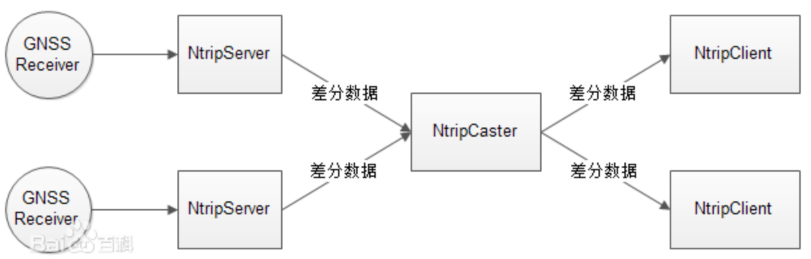

Ntrip(Networked Transport of RTCM via Internet Protocol)是在互联网上进行RTK数据传输的协议，所有的RTK数据格式(NCT、RTCM、CMR、CMR+)都可以传输。Ntrip是一个应用层协议。

通过它的 MOUNTPOINT 识别每一个 NtripServer（RTK参考站），这个识别码是唯一的。这是一个由 4 个字符组成的识别码，在第一次连接到 NtripCaster时由参考站的“所有者”定义。所有涉及到单独的 NtripCaster的挂载点都被NtripCaster存储在资源表。

可以通过 NtripClient（野外的测量员）提供的，需要使用的，单独的NtripServer信息下载资源表。这个平台包含的信息有参考站的坐标，使用的 RTK 格式，使用参考站需要的密码和 ID ，使用参考站产生的费用，等等。测量员能够决定希望使用哪个挂载点，有效的决定从他希望的那个参考站接收 RTK 数据（通常是离他当前工作最近的地方）。

通过互联网使用 RTK 数据代替了电台连接或者 “直接的”GSM/CDMA 通讯，并且变得越来越普遍。使用互联网的优点包括没有范围限制，多个 RTK流动站用户能够同时进入到独立的参考站和少的连接费用。 使用 Ntrip允许通过使用已注册的用户名和密码控制从参考站播发 RTK 数据到流动站用户。

Ntrip与以往的RTK直接传输方式不同，它将多个参考站端的观测数据首先经Internet网络发送至控制中心，进一步处理后再由移动通讯网，如GPRS，CDMA网播发出去。图2是它的一种工程流程。控制中心的差分数据由中心服务器传送到移动网络，再通过该网络发送给众多的客户。客户在接收设备中装有可以接收来自系统控制中心数据的特定客户端软件，用户利用移动网卡登录互联网可以实现对中心的访问。客户在进行RTK工作时，首先需要发送访问参数(用户账号和密码)到控制中心。系统对其认证通过后，可端收到RTK数据。同时，客户端还要将其接收数据设置点(源)的信息传给控制中心。无论是客户端，还是参考站端，它在系统中的识别码是唯一的，在第一次连接到控制中心时进行定义，所有识别码都由控制中心存储在系统的D表中。这保证了系统的安全性，可以预防非注册用户进入到控制中心发送或者接收RTK数据。控制中心可以实时知道哪一个流动站已经登陆和在线时长，能根据流动站用户收到的数据进行计费管理等。

## 主要流程

* 拉取挂载点列表数据
* 连接挂载点
* 收发差分数据