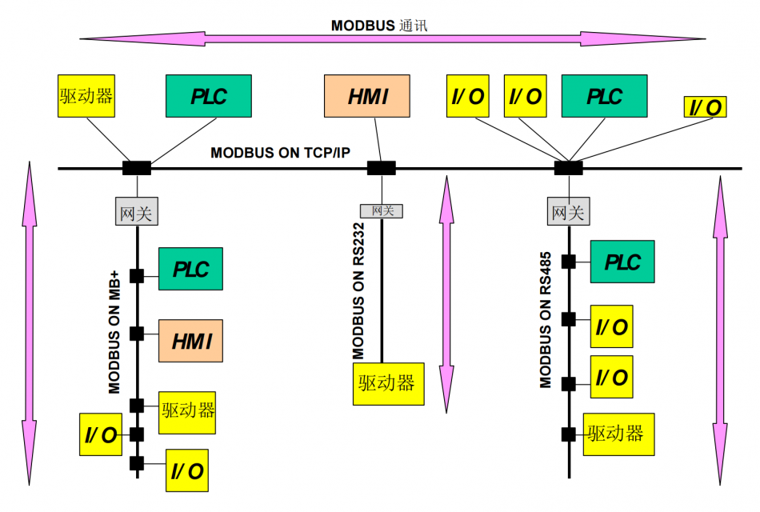
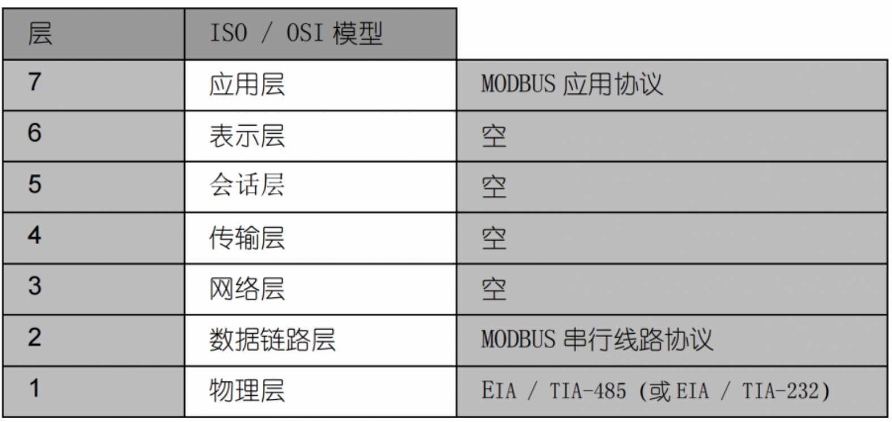
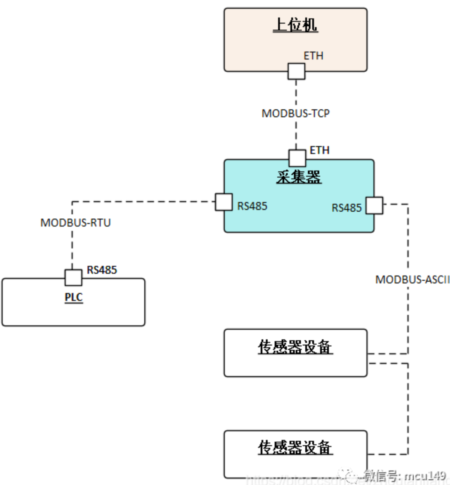
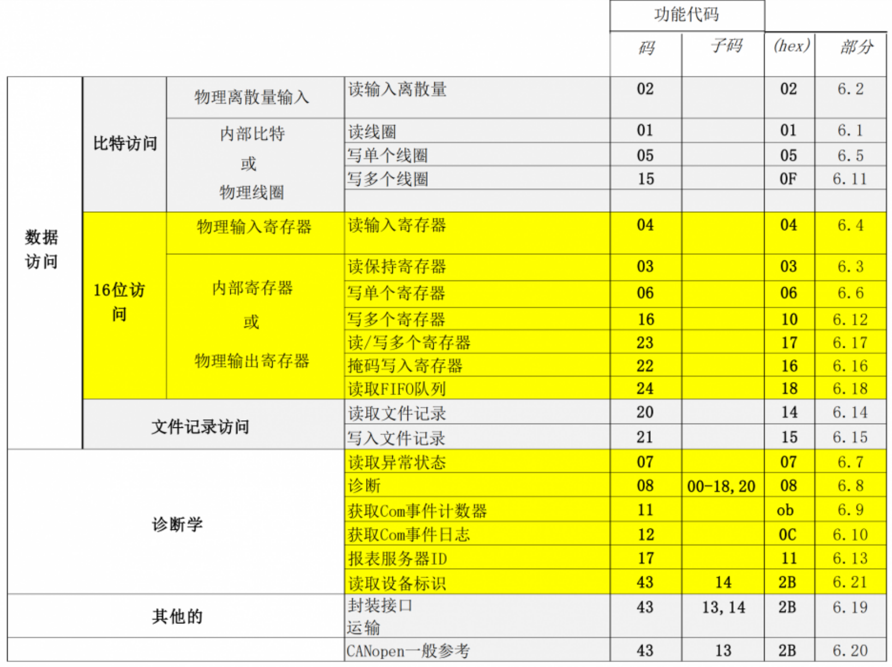
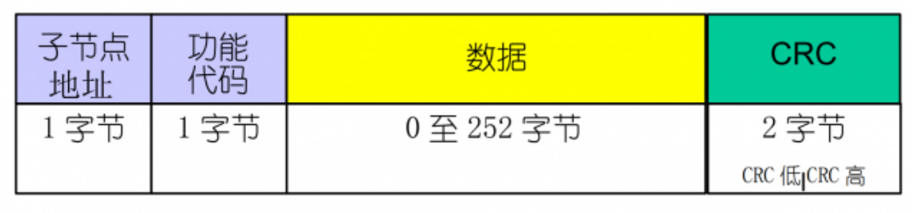
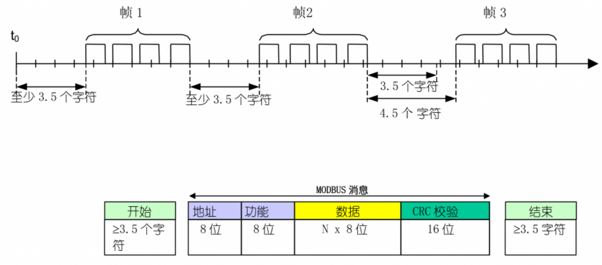

Modbus协议，从字面理解它包括Mod和Bus两部分，首先它是一种bus，即总线协议，和I2C、SPI类似，总线就意味着有主机，有从机，这些设备在同一条总线上。


Modbus协议最初由Modicon公司开发出来，在1979年末该公司成为施耐德自动化部门的一部分，现在Modbus已经是工业领域全球最流行的协议。此协议支持传统的RS-232、RS-422、RS-485和以太网设备。

　　由于modbus协议是完全公开透明的，所需的软硬件又非常简单，这就使它成为了一种通用的工业标准。许多工业设备，包括PLC，DCS，智能仪表等都在使用Modbus协议作为他们之间的通讯标准。有了它，不同厂商生产的控制设备可以连成工业网络，进行集中监控。

　　特点
　　Modbus 协议是应用于电子控制器上的一种通用语言。通过此协议，控制器相互之间、控制器经由网络（例如以太网）和其它设备之间可以通信。它已经成为一通用工业标准。此协议定义了一个控制器能认识使用的消息结构，而不管它们是经过何种网络进行通信的。

　　modbus通讯协议是一种主从式异步半双工通信协议，采用主从式通讯结构，可以使一个主站对应多个从站进行双向通信。它描述了一控制器请求访问其它设备的过程，如何回应来自其它设备的请求，以及怎样侦测错误并记录。它制定了消息域格局和内容的公共格式。

　　Modbus协议包括ASCII、RTU等通讯方式，并没有规定物理层。此协议定义了控制器能够认识和使用的消息结构，而不管它们是经过何种网络进行通信的。标准的Modicon控制器使用RS232C实现串行的Modbus。Modbus的ASCII、RTU协议规定了消息、数据的结构、命令和就答的方式，数据通讯采用主-从方式，主站发出数据请求消息，从站接收到正确消息后就可以发送数据到主站以响应请求；主站也可以直接发消息修改从站的数据，实现双向读写。


Modbus协议需要对数据进行校验，串行协议中除有奇偶校验外，ASCII模式采用LRC校验，RTU模式采用16位CRC校验。另外，Modbus采用主从方式定时收发数据，在实际使用中如果某从站点断开后（如故障或关机），主端可以诊断出来，而当故障修复后，网络又可自动接通。因此，Modbus协议的可靠性较好。


Modbus支持单主机，多个从机，最多支持247个从机设备。关于Mod，因为这种协议最早被用在PLC控制器中，准确的说是Modicon公司的PLC控制器，这也是Mod-Bus名称的由来。后来Modicon被施耐德（Schneider）收购，Modbus协议广泛应用在工业控制器、HMI和传感器上，逐渐被其他厂商所接受，成为了一种主流的通讯协议，用于和外围设备进行通讯。Modbus协议是一种请求/应答方式的交互过程，主机主动发起通讯请求，从机响应主机的请求，从机在没有收到主机的请求时，不会主动发送数据，从机之间不会进行通讯。

Modbus网络体系

Modbus在7层OSI参考模型中属于第七层应用层，数据链路层有两种：基于标准串口协议和TCP协议，物理层可使用3线232、2线485、4线422，或光纤、网线、无线等多种传输介质。


#### 四种数据类型
Modbus协议规定，进行读写操作的数据类型，按照读写属性和类型可分为以下4种：
* 离散量输入(Discretes Input)：1位，只读，I/O系统提供
* 线圈(Coils)：1位，读写
* 输入寄存器(input registers)：16位只读，I/O系统提供
* 保持寄存器(Holding registers)：16位，读写

#### 三种转输模式
1979年，Modicon 首先推出了串行Modbus标准，后来由于网络的普及，需要更高的传输速度，1997年制定了基于TCP网络的Modbus标准。所以总的可分为两个传输模式：基于串行链路的和基于以太网TCP/IP的。
* modbus-rut：数据按照标准串口协议进行编码，是使用最广泛的一种Modbus协议，采用CRC-16_Modbus校验算法。
* modbus-ascii：所有数据都是ASCII格式，一个字节的原始数据需要两个字符来表示，效率低，采用LRC校验算法。
* modbus-tcp：基于TCP/IP协议，占用502端口，数据帧主要包括两部分：MBAP（报文头）+PDU（帧结构），数据块与串行链路是一致的。
有些设备支持多种Modbus模式，有些设备只支持其中一种，比如最常用的PLC S7-200只支持Modbus RTU协议，不支持Modbus ASCII协议，Modbus总线上所有的设备传输模式必须相同。


#### 三类功能码
Modbus功能码，是写在主机请求数据帧中的，决定主机进行读还是写操作，是读线圈、离散量还是寄存器，是写单个寄存器还是多个寄存器等等，决定主机请求什么类型的数据。公共功能码、用户定义功能码和保留功能码。
因为PLC主要控制的是继电器触点，所以在PLC上还会经常对线圈（Coils）进行读写。这里需要特别注意的一点是：写保持寄存器，需要区分0x06写单个寄存器和0x10写多个寄存器，而读保持寄存器不区分读单个和读多个，当需要读单个保持寄存器时，也是使用0x03指令，指定读取数量为1。


|功能码 | 描述 | PLC地址 | 寄存器地址 | 位/字操作 | 操作数量 |
|01H | 读线圈寄存器 | 00001-09999 | 0000H-FFFFH | 位操作 | 单个或多个 |
|02H | 读离散输入寄存器 | 10001-19999 | 0000H-FFFFH | 位操作 | 单个或多个 |
|03H | 读保持寄存器 | 40001-49999 | 0000H-FFFFH | 字操作 | 单个或多个 |
|04H | 读输入寄存器 | 30001-39999 | 0000H-FFFFH | 字操作 | 单个或多个 |
|05H | 写单个线圈寄存器 | 00001-09999 | 0000H-FFFFH | 位操作 | 单个 |
|06H | 写单个保持寄存器 | 40001-49999 | 0000H-FFFFH | 字操作 | 单个 |
|0FH | 写多个线圈寄存器 | 00001-09999 | 0000H-FFFFH | 位操作 | 多个 |
|0H | 写多个保持寄存器 | 40001-49999 | 0000H-FFFFH | 字操作 | 多个 |

01 读保持线圈状态（Read coil status）   读取逻辑线圈组状态
02 读输入线圈状态（Read input status）  读取离散量线圈组状态
03 读保持寄存器（Read holding register）    读取一个或多个保持寄存器的二进制值
04 读输入寄存器（Read input register）  读取一个或多个输入寄存器的二进制值
05 写单个线圈（Force single coil）  改变逻辑线圈状态
06 写单个寄存器（Preset single register）   改变单个寄存器的二进制值
15 写多个线圈（Force multiple coils）   改变多个寄存器的二进制值
16 写多个寄存器（Preset multiple registers）    指定多个操持寄存器的二进制值

### 数据帧格式

* 地址域：1字节，即从机设备地址，通常1-247为有效地址，0为广播地址
* 功能码：1字节，表明主机请求数据的类型。
* 数据：N字节，包含寄存器地址和寄存器数据等。
* 差错校验：对数据进行冗余校验的结果，CRC或LRC

#### Modbus-RTU数据帧

Modbus-RTU数据帧，帧长度最大为256字节，由以下4部分构成：
* 子节点地址：1字节，范围0-247
* 功能代码：1字节
* 数据块：0-252字节
* CRC校验值：2字节，低8位在前
Modbus-RTU帧间隔，Modbus-RTU要求两个RTU报文帧间隔要大于3.5个字节时间：

Modbus-RTU采用循环冗余校验 (CRC - Cyclical Redundancy Checking) 算法对报文帧全部数据进行计算，得到的校验值附加在报文帧末尾，低位在前。CRC-16_Modbus计算方法可以参考：CRC-16_Modbus校验算法。

* 写单个寄存器
```
主机发送： 01 06 01 05 01 90 99 CB
从机回复： 01 06 01 05 01 90 99 CB

#向01地址设备0x0105保持寄存器写入1个数据：0x0190
#01表示从机地址，06功能码表示写单个保持寄存器，0105表示寄存器地址，0190表示写入寄存器的数值，99CB为CRC校验值。可以看出，当写1个寄存器数据时，从机响应的数据帧和主机发送的数据帧完成一致。
```
* 写多个寄存器
```
主机发送：01 10 01 05 00 03 06 11 02 03 04 05 66 4a 12
从机回复：01 10 01 05 00 03 91 f5
#写多个寄存器。向01地址设备0x0105、0x0106、0x0107地址保持寄存器，写入3个寄存器数据：0x1102, 0x0304, 0x0566
#同理，01从机地址，10功能码表示写多个保持寄存器，0105表示起始地址，0003表示写3个寄存器，06表示数据量为6个字节，1102/0304/0566分别表示写入3个寄存器的数值，4a12表示CRC校验数值。
```
* 读寄存器
```
主机发送：01 03 01 05 00 01 95 f7
从机回复：01 03 02 56 78 87 c6
#读01地址设备0x0105保持寄存器数据。
#03表示读多个寄存器，0105表示起始地址，0001表示读1个寄存器
#02表示2个字节，56 78表示寄存器的数据。
```
* 读多个寄存器
```
主机发送：01 03 01 05 00 03 14 36
从机回复：01 03 06 11 22 33 44 55 66 2a 18
#读01地址设备0x0105、0x0106、0x0107地址保持寄存器，共3个寄存器数据。
#03表示读多个寄存器，0105表示起始地址，0003表示读3个寄存器
#06表示6个字节，11 22 33 44 55 66表示寄存器的数据。
```

#### Modbus-ASCII数据帧


Modbus-ASCII传输模式中，每个字节均以ASCII编码，实际报文中1个字节会以两个ASCII字符发送，因此这种模式比Modbus-RTU模式效率要低。
例如报文数据0x5B = "5" + "B" = 0X35 + 0X42。


从ASCII报文帧可以看出，ASCII模式增加了帧起始（“：”）和帧结束标志（回车&换行），由于报文数据每个字节在ASCII模式下需要2个字符进行编码，为了保证ASCII模式和RTU模式在应用级兼容，ASCII模式数据块最大长度为252x2，所以可以计算出报文帧最大长度为1+2+2+2x252+2+2=513字符，报文帧内的字符间隔时间可以达1秒钟。
Modbus-ASCII模式校验方法采用的是纵向冗余校验 (LRC - Longitudinal Redundancy Checking) 算法，校验内容不包括帧起始和帧结束字符。
计算方法也比较简单，对校验内容进行累加和计算，忽略进位，并转换为二进制补码：

写入数据0x1234
```
010604051234AA<CR><LF>
01 06 04 05 12 34 AA <CR><LF>
可以看到01表示设备地址，06表示写单个保持寄存器。地址为0x0405，数据为0x1234，LRC校验值为0xAA。实际进行校验的数据不包含帧头和帧尾。
```

手动LRC计算方法：把原始数据两个字符组成一个字节，并进行二进制加法计算：01+06+04+05+12+34=0x56，计算二进制补码。
```
0x56 = 0101 0110
  取反：1010 1001
  加1： 1010 1010 = 0xAA
或者：0x100-0x56 = 0xAA
```

#### Modbus-TCP数据帧


Modbus协议中主机可以以两种模式对从机设备发出请求：单播和广播。
**单播模式**
在单播模式下，从机地址必须唯一，地址范围1-247。主机以特定地址访问指定的某个从机，发出一个请求数据帧，这个数据帧功能可以是读取或写入数据，从机接收到并处理完成后，会回报一个应答数据帧，以表示读取或写入成功。

**广播模式**
在广播模式下，主机向所有的从机发出请求数据帧，所有的从机都会处理这条命令，对于广播请求，所有的从机无需做出应答操作。一般地址0表示广播地址。


### Modbus扩展版本
Modbus 是使用异步传输的方式，速度较慢，应用上有其限制，尤其当两台 PLC 要互相交换资料，其传输资料量大，异步方式已经无法满足整体系统反应时间的要求。所以就有 Modbus Plus 出现，使用同步传输的技术，资料格式与 Modbus 一样，此协议是Modicon专有的，和Modbus不同，它需要一个专门的协处理器来处理类似HDLC的高速令牌旋转。它使用1Mbit/s的双绞线，并且每个节点都有转换隔离设备，是一种采用边沿触发而不是电平触发的设备。连接Modbus Plus到计算机需要特别的接口，通常是支持ISA（SA85），PCI或者PCMCIA总线的板卡。