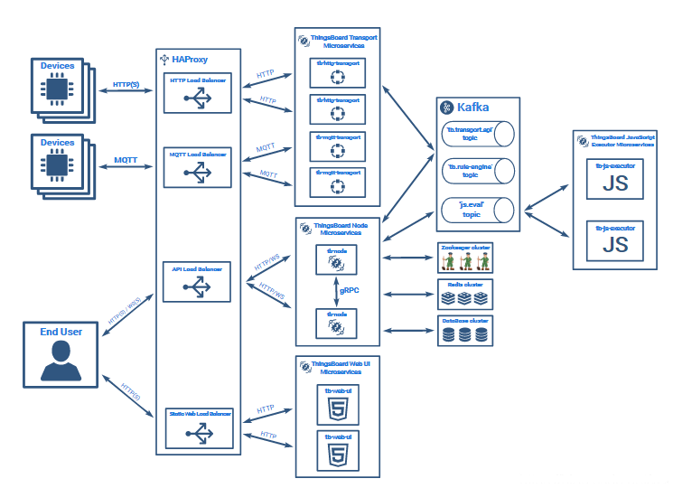
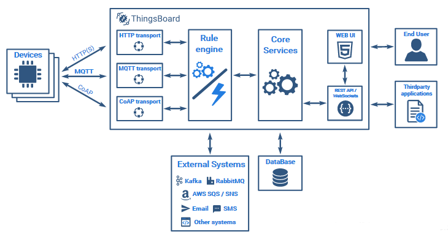
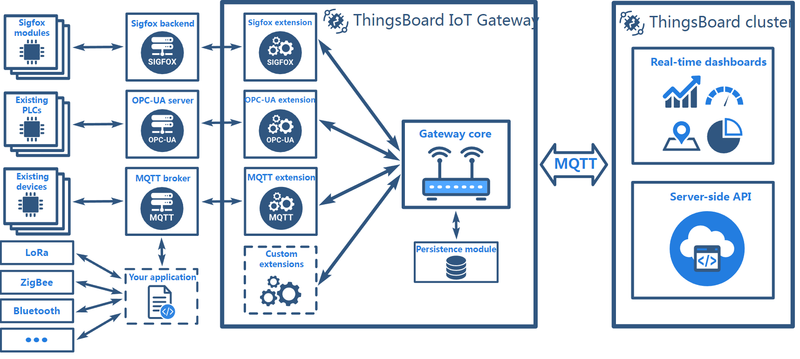
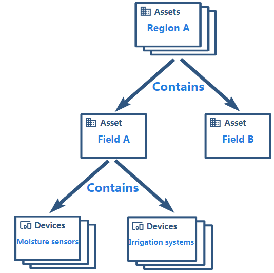

Thingsboard提供了两种架构，微服务架构和Monolithic价格

微服务架构

Monolithic架构

IOT网关
在所有的物联网中，IOT网关是非常重要的一环，大部分（60%-80%）设备都属于哑终端设备（不支持IP），这些设备都需要通过网关才能够接入到云平台。因此Thingsboard支持通过IOT网关进入到平台，下面是IOT网关的整体架构图，

目前网关支持：

* MQTT扩展，用于控制，配置和收集使用现有协议连接到外部MQTT代理的IoT设备的数据。
* OPC-UA扩展，用于从连接到OPC-UA服务器的IoT设备收集数据。
* Sigfox扩展，用于从连接到Sigfox Backend的IoT设备收集数据。
* Modbus扩展，用于从通过Modbus协议连接的物联网设备收集数据

####  Thingsboard概念
对于物联网非常熟悉的读者可以跳过该部分。

##### 组织和用户
组织
平台/系统

这个组织容易被人忽略，尽管大家都指导它的存在。

租户Tenant

租户可以被视为独立的业务实体：拥有或生产设备和资产的个人或组织; 租户可能拥有多个租户管理员用户和数百万客户;

客户

客户也可以被视为独立的业务实体，他购买或使用租户设备和/或资产的个人或组织; 客户可能拥有多个用户和数百万设备和/或资产

三者的关系是：平台-->租户-->客户

以智慧小区为例（集群），每个小区都可以看做是一个租户

用户
用户的定义是平台的使用者，他的身份可以是平台/系统管理员、租户管理员和客户用户，分别对应相应的组织

平台-->平台管理员

租户-->租户管理员

客户-->客户用户

平台管理员可以创建租户，并为该租户创建租户管理员；租户管理员创建客户，并为客户创建用户账号。客户用户能查看设备、资产和控制设备，但是无法对它们进行编辑、增加。

 

##### 设备和资产
设备

可能产生遥测数据和处理RPC命令的基本物联网实体。例如传感器，开关

资产

可能与其他设备和资产相关的抽象物联网实体。例如工厂，油田，车辆

