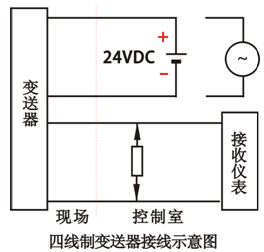
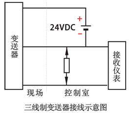
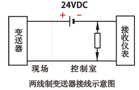

“仪表线制”是指仪表供电和标准信号传输采用的导线数。几线制的称谓，是在两线制变送器诞生后才有的。这是电子放大器在仪表中广泛应用的结果， 放大的本质就是一种能量转换过程，这就离不开供电。因此最先出现的是四线制的变送器，即两根线负责电源的供应，另外两根线负责输出被转换放大的信号(如电压、电流等)。

◆AC220V供电的仪表一定是四线制
四线制信号的仪表是指：供电回路和信号回路各自独立，采用隔离电路分开，用于隔离的4-20mA标准信号。所以信号一定是隔离的，通常不接地。电源可以是DC24V，也可以是AC220V。

◆当用两线制提供的功率不足以给仪表供电时，采用三线制方式，信号为4-20mA标准信号
三线制的三根线是：一根为电源线(通常为DC24V+)，一根为信号线，一根为电源与信号的公共线，用于电压参考点和电流回路。

◆非4-20mA标准信号不称为两线制
二线制是两根导线供电的同时传输4-20mA标准信号。非此标准信号不称为两线制。两线制最少供电能力为：4mA×24V-接收仪表功耗-线路损耗。

◆在实际现场操作中，四线制，三线制，二线制主要供电方式是？
①四线制供电大多为AC220V，也有供电为DC24V的
四线制变送器如下图所示，其供电大多为AC220V，也有供电为DC24V的。输出信号有4-20mA/负载电阻为250Ω，或者0-10mA/负载电阻为0-1.5KΩ；有的还有mA和mV信号，但负载电阻或输入电阻，因输出电路形式不同而数值有所不同。

②三线制供电大多为DC24V。
三线制变送器如下图所示，所谓三线制就是电源正端用一根线，信号输出正端用一根线，电源负端和信号负端共用一根线。其供电大多为DC24V，输出信号有4-20mADC，负载电阻为250Ω或者0-10mA，负载电阻为0-1.5KΩ；有的还有mA和mV信号，但负载电阻或输入电阻，因输出电路形式不同而数值有所不同。

③二线制供电为DC24V
二线制变送器如下图所示，其供电为DC24V，输出信号为DC4-20mA，负载电阻为250Ω，24V电源的负线电位最低，它就是信号公共线，对于智能变送器还可在4-20mA信号上加载HART协议的FSK键控信号。
由于各种变送器的工作原理和结构不同，从而出现了不同的产品，也就决定了变送器的两线制、三线制、四线制接线形式。

◆如何选用四线制、三线制、二线制仪表
①功率大于10W，精度要求较高时，一般选用四线制仪表。
四线制仪表的应用，最早始于DDZ-II型电动单元组合仪表的出现，供电为AC220V，后续输出信号为0-10mA的四线制变送器得到了广泛的应用。由于转换电路复杂、功耗大等原因，现在很多仪表仍优先选用四线制，最常见的像科氏力质量流量计和电磁流量计，到现在还是四线制，因为质量流量计需要振动功耗，电磁流量计需要励磁功耗，2个表的功率都到了10W以上，所以得四线制。

②减少非安全电压供电，一般选用三线制仪表。
三线制的应用，为了满足仪表需要的供电功率设计，把变送器的供电由AC220V改为低压直流供电，如电源从DC24V电源箱取用，减少非安全电压供电。这样就有了三线制的变送器产品。

③功率较小且经济实惠，一般选用二线制。
二线制仪表的应用，采用4-20mA信号，现场仪表就可实现二线制，现在国内二线制变送器的产品应用非常广泛。

综上所述，对于用户而言，选型时应根据本单位的实际情况，如信号制的统一、防爆要求、接收设备的要求、投资等问题来综合考虑选择。

要指出的是三线制和四线制变送器输出的4-20mA信号，由于其输出电路原理及结构与二线制的是不一样的，因此在应用中其输出负端能否和24V电源的负线相接能否共地这是要注意的，必要时可采取隔离措施，如用配电器、安全栅等，以便和其它仪表共电、共地及避免附加干扰的产生。