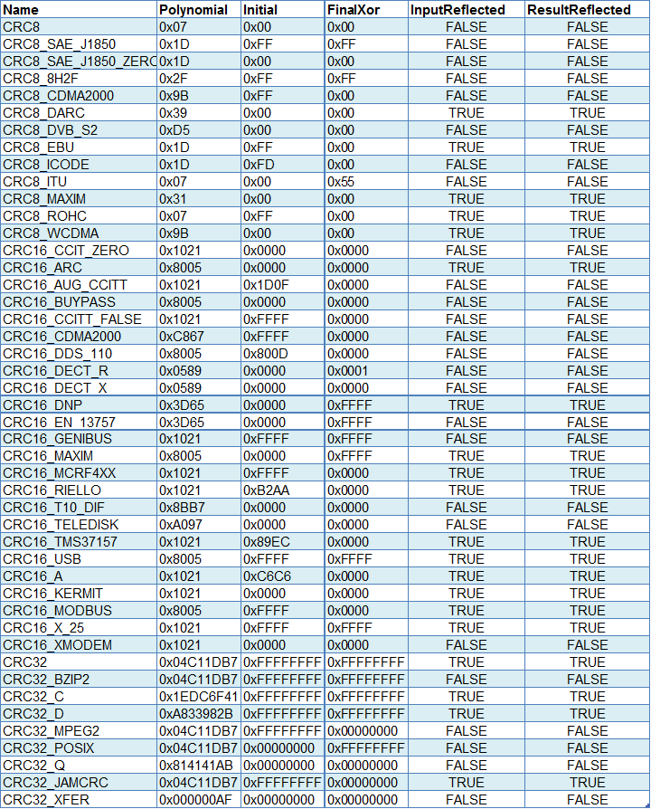
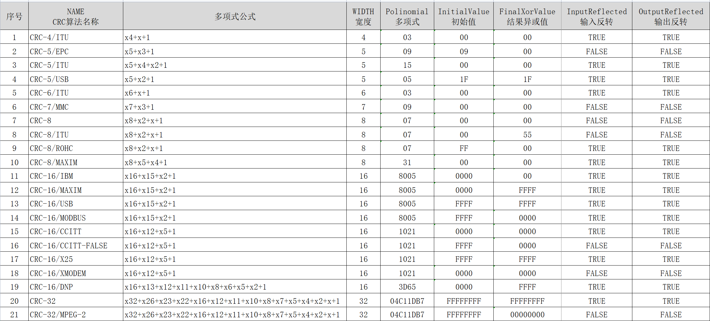
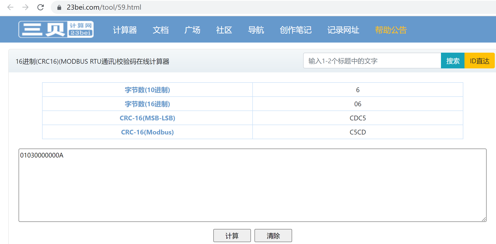

CRC校验的基本思想是利用线性编码理论，在发送端根据要传送的k位二进制码序列，以一定的规则产生一个校验用的监督码（既CRC码）r位，并附在信息后边，构成一个新的二进制码序列数共(k+r)位，最后发送出去。在接收端，则根据信息码和CRC码之间所遵循的规则进行检验，以确定传送中是否出错。16位的CRC码产生的规则是先将要发送的二进制序列数左移16位后，再除以一个多项式，最后所得到的余数既是CRC码，

求CRC码所采用模2加减运算法则，既是不带进位和借位的按位加减，这种加减运算实际上就是逻辑上的异或运算，加法和减法等价，乘法和除法运算与普通代数式的乘除法运算是一样，符合同样的规律。生成CRC码的多项式如下，其中CRC-16和CRC-CCITT产生16位的CRC码，而CRC-32则产生的是32位的CRC码。本文不讨论32位的CRC算法，有兴趣的朋友可以根据本文的思路自己去推导计算方法。

CRC-16：（美国二进制同步系统中采用）CRC-CCITT：（由欧洲CCITT推荐）CRC-32：接收方将接收到的二进制序列数（包括信息码和CRC码）除以多项式，如果余数为0，则说明传输中无错误发生，否则说明传输有误，关于其原理这里不再多述。用软件计算CRC码时，接收方可以将接收到的信息码求CRC码，比较结果和接收到的CRC码是否相同。

当数据帧长度在8bits-128bits范围内时，推荐CRC-8(CRC-8能够减少额外比特的开销，且有更好的性能表现)

当数据帧长度在128bits-2048bits范围内时，推荐CRC-12，CRC-16，CRC-CCITT(CRC-12额外比特的开销更小，且用于6bit字符流的传输；对于16bits的标准，更推荐美国标准CRC-16，性能略优于CRC-CCITT)；

当因数据帧长度更长、信道不稳定等情况而需要更高的性能时，CRC-32、CRC-32C将是更好的选择；

## CRC的概念

* Length: CRC的长度(按bit算，如8,16,32)
* Name: CRC的名字，让人一看就知道这是哪种CRC
* Polinomial: 多项式，通过该多项式来计算CRC
* InitialValue: CRC的初始值
* FinalXorValue: CRC结果做异或运算的值
* InputReflected: 指示输出是否需要翻转
* OutputReflected: 指示输出是否需要翻转

### CRC标准分类

http://www.ip33.com/crc.html 该平台的modbus校验码好像大小端反了

https://www.23bei.com/tool/59.html 该平台modbus正常 

