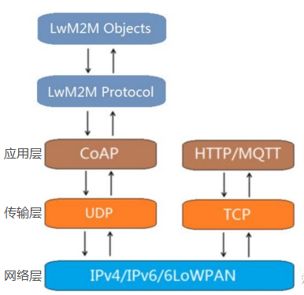

CoAP（Constrained Application Protocol）受限制的应用协议，是一种类web协议，使用在资源限的物联网设备上。CoAP是一种应用层协议，它运行于UDP协议之上，而区别于HTTP运行在TCP之上，CoAP协议非常小巧，最小的数据包仅有4字节。

CoAP是一种面向网络的协议，采用了与HTTP类似的特片，核心内容为资源抽象，REST式交互可扩展的头选项。

### CoAP协议特点
* 传输层协议是UDP。
* 基于Rest模式，server的资源地址和互联网一样也有类似的url格式，客户端有可以通过四种请求方式GET、PUT、POST、DELETE.
* 基于消息的双向通信（M2M)，客户端和服务端都可以独立的向对向请求双方即可当client或server角色。
* CoAP是二进制格式，http是文本格式，CoAP比HTTP更加紧凑。
* 轻量化，CoAP最小长度为4字节，Http的头部就有十几个字节。
* 支持可靠传输，数据重传，块传输，确保数据可靠送达。
* 支持IP多播，即可以同时向多个设备发送请求。
* 非长连接通信，适用于低功耗物联网设备。
* 

### CoAP消息类型
CoAP采用和HTTP协议相同的请求响应工作模式
* CON：需要被确认的请求，如果CON请求被发送，对方必须做出响应。用以可靠消息传输。
* NON：不需要被确认的请求，如果NON请求发送，对方不必做出响应。用于消息会重复频繁的发送，丢包不影响正常操作。用以不可靠消息传输。
* ACK：应答消息，对应的是CON消息的应答。
* RST：复位消息，可靠传输时候接收的消息不认识或错误时，不能回ACK消息，必须回RST消息。

### CoAP消息格式
* 消息头 Head
    第一行消息头，必须有固定4个字节。
    Ver：2字节，版本信息。
    T：2字节，消息类型，包括CON，NON，ACK,RST四种。
    TKL：4字节，token长度，当前支持0-8B长度，其他长度保留将来扩展。
    Code：8字节，分成前3位代表类型，0代表空消息或请求码。2开头代表响应码。
    Message ID：16bit， 代表消息MID，每个消息都有一个ID ，重发的消息MID不变
* token 用于将响应与请求匹配，token值为0-8字节的序列，每条消息必须带一个标记，即使它的长度为零。每个请求都带一个客户端生成的token。

* option 请求消息与回应消息都可以0-多个，主要用于描述请求或者响应对应的各个属性，类似参数或者特征描述。

* payload 实际携带的数据内容

### CoAP的请求码（requests）和响应码(responses)

* 0.01 GET方法——用于获得某资源
* 0.02 POST方法——用于创建某资源
* 0.03 PUT方法——用于更新某资源
* 0.04 DELETE方法——用于删除某资源

coap的默认端口是udp 5683（coaps是5684）
coap://xxxxx.com:5683/xxx

COAP的安全性
COAP的安全性是用DTLS加密实现的。DTLS的实现需要的资源和带宽较多，如果是资源非常少的终端和极有限的带宽下可能会跑不起来。DTLS仅仅在单播情况下适用。

