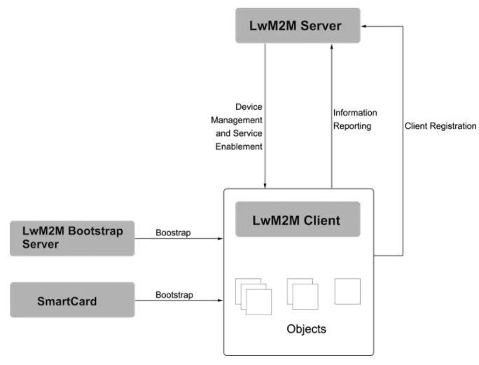
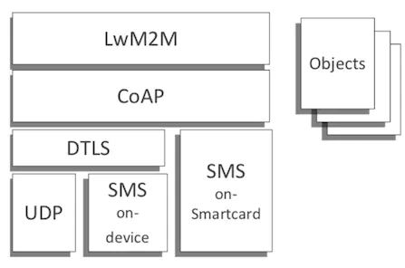

LWM2M Lightweight M2M，轻量级M2M 是开发移动联盟OMA组织制定的轻量化的M2M协议，主要面向基于蜂窝的窄带物联网（NB-IOT)场景下物联网应用。聚焦于低功耗广覆盖(LPWA)和物联网应用。提供了轻便小巧安全的通信接口及高效的数据模型，以实现M2M设备服务支持。

LwM2M协议是由OMA提并定义的，该组织专注于移动通讯以及物联网产业的标准开发。LwM2M适用于资源有限的终端设备管理的轻量级物联网协议。L2M2M是基于REST架构，协议的消息传递是通过Coap协议来达成的，协议定义了一个紧凑高效的数据模型。由于协议的服务对象是资源有限的终端设备，传统的HTTP数据传输方式显得过于笨重，难以支持受限资源，因此选择了具备REST风格的CoAP来完成消息和数据传递，一方面CoAP基于UDP，与TCP相比，在网络资源有限及无法确保设备始终在线的环境里更加游刃有余。另一方面CoAP消息结构简单，报文压缩，主要部份可以做到物别小巧，无需占过多资源。
出于类似的考虑，协议的数据结构必须足够简单，LwM2M协议定义了一个以资源为基本单位的模型，每个资源可以携带数值，以表示LwM2M客户端中每一项可用的信息，资源都存在于对角实例中。

### 主要特点
* 基于资源模型的简单对象
* 资源操作：创建、检索、更新、删除、属性配置
* 资源的观察和通知
* 支持的数据格式：TLV、JSON、TEXT、Opaeue
* 传输层协议：UDP、SMS
* 安全协议：DTLS
* NAT防火墙应对方案queue模式
* 支持多Lwm2m2 server
* 基于M2M功能 访问控制、设备网络连接监测、固件更新、位置和定位服务、统计。
* 协议基于REST架构，消息传递通过CoAP协议来达成。
* 协议定义了一个紧凑高效又不乏扩展性的数据模型。

由于协议的服务对象是资源有限的终端设备，传统的HTTP数据传输方式显得过分笨重，难以支持受限资源，因此选择了具备REST风格的CoAP来完成消息和数据传递。一方面CoAP基于UDP，与TCP相比，在网络资源有限及无法确保设备始终在线的环境里更加游刃有余（出于安全性考虑，使用了基于UDP的DTLS安全传输协议）。另一方面CoAP本身的消息结构非常简单，报文压缩，主要部分可以做到特别小巧，无需占用过多资源。

### 标准对象
* LwM2M Security：0 server的URI，payload的安全模式，一些算法/密钥。
* LwM2M server： 1 server的短ID，注册的生命周期，observe的最小/大周期，绑定模型等。
* Access Control： 2 每个Object的访问控制权限。
* Device： 3 设备的制造商、型号、序列号、电量、内存等信息。
* Connectivity Monitoring： 4 网络制式，链路质量，IP地址等信息。
* Fiemware： 5  固件包，包的URI，状态，更新结果等。
* Location： 6 经纬度，海拨，时间等
* Connectivity statistics：7 收集期间的收发数据量，包大小等信息。
* LwM2M AppData：19 此LwM2M对象提供LwM2M服务器相关的应用业务数据。

* 引导接口(BootStrap)向LwM2M客户端提供注册到LwM2M服务器的必要信息，例如服务器访问信息、客户端支持的资源信息等。这些引导信息可以是生产厂家预先存储在设备中，也可以通过引导服务器或者智能卡提前写入设备。

* 设备管理与服务实现接口(Device Management and Service Enablement) 设备管理与服务实现接口的主控方为LwM2M服务器，服务器向客户端发送指令，客户端对指令做出回应并将回应消息发送给服务器

* 信息上报接口(Information Reporting) 信息上报接口允许LwM2M服务器向客户端订阅资源信息，客户端接收订阅后按照约定的模式向服务器端报告自已的资源变化情况。

### 逻辑接口

* LWM2M Server：接入机，平台服务器接口。
* LVM2M Client：客户端，负责执行服务器的命令和上报执行结果。
* BootStrap Server：引导机，负责配置LWM2M客户端。

根据需要还可以加入LwM2M引导服务器(BootStrap Server)或智能卡对客户端完成初始化引导。

* 引导接口(BootStrap)

  引导接口的目的是向LwM2M客户端提供注册到LwM2M服务器的必要信息，例如服务器访问信息、客户端支持的资源信息等。这些引导信息可以是由生产厂家预先存储在设备中，也可以通过上文提到的LwM2M引导服务器或者智能卡提前写入设备。

* 客户端注册接口(Client Registration)

  注册接口的目的是使LwM2M客户端与LwM2M服务器互联，将LwM2M客户端的相关信息存储在LwM2M服务器上。只有完成注册后，LwM2M客户端与服务器端之间的通信与管理才成为可能。

* 设备管理与服务实现接口(Device Management and Service Enablement)

  设备管理与服务实现接口的主控方为LwM2M服务器，服务器向客户端发送指令，客户端对指令做出回应并将回应消息发送给服务器。

* 信息上报接口(Information Reporting)

  信息上报接口允许LwM2M服务器端向客户端订阅资源信息，客户端接收订阅后按照约定的模式向服务器端报告自己的资源变化情况。

#### 协议对象

协议的数据结构必须足够简单。LwM2M协议定义了一个以资源（Resource）为基本单位的模型，每个资源可以携带数值，可以指向地址，以表示LwM2M客户端中每一项可用的信息。资源都存在于对象实例中（Object Instance），即对象（Object）的实例化。LwM2M协议预定义了8种对象（Object）来满足基本的需求，分别是：

Object	Object ID

* Security（安全对象）	0
* Server（服务器对象）	1
* Access Control（访问控制对象）	2
* Device（设备对象）	3
* Connectivity Monitoring（连通性监控对象）	4
* Firmware（固件对象）	5
* Location（位置对象）	6
* Connectivity Statistics（连通性统计对象）	7

考虑到扩展性，协议也允许根据实际需要自定义更多的对象。在这样的数据模型中，资源、对象实例以及对象都是用数字对应的ID来表示的，以实现最大程度的压缩，因此任何资源都可以用最多3级的简洁方式表示，例如/1/0/1表示服务器对象（Server Object）第1个实例中的服务器短ID资源。 在注册阶段，LwM2M客户端把携带了资源信息的对象实例传递给LwM2M服务器，以通知服务器自身设备所具备的能力。

 

#### 协议实现

LwM2M协议的主要开源实现有以下几个：

* OMA LwM2M DevKit：提供可视化界面与LwM2M服务器交互。
* Eclipse Leshan：基于Java，提供了LwM2M服务器与LwM2M客户端的实现。
* Eclipse Wakaama：基于C，提供了LwM2M服务器与LwM2M客户端的实现。
* AVSystem Anjay：基于C，提供了LwM2M客户端的实现。

