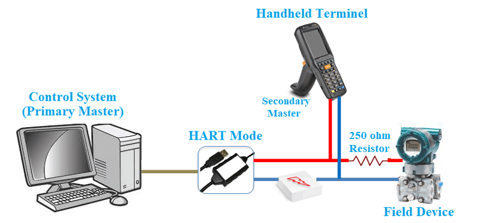

HART协议使用基于Bell 202标准的1200波特频移键控(FSK)将数字信息叠加到传统的4到2OmA模拟信号上。HART协议由一个独立的组织HART通信基金会维护，它是一个工业标准，用于定义智能现场设备与控制系统之间的通信协议。

HART是流程工业中应用最广泛的数字通信协议，在全世界超过10万家工厂安装了800多万HART现场仪器，Fluke说。哈特，得到了流程领域仪器的所有主要供应商的支持。保留现有的控制策略，允许传统的四到二十毫安信号在现有的双线回路上与数字通信共存。与传统的模拟设备兼容提供安装和维护的重要信息，如标记id、测量值、范围和跨度数据、产品信息和诊断信息，可以通过使用多路拖放网络来支持布线节省。通过改进智能仪表网络的管理和使用，降低运营成本。

此协议不是一个真正意义上开放的标准，要加入他的基金会才能拿到协议，加入基金会要一部分的费用。技术主要被国外几家大公司垄断，近两年国内也有公司再做，但还没有达到国外公司的水平。现在有很大一部分的智能仪表都带有HART圆卡，都具备HART通讯功能。但从国内来看还没有真正利用其这部分功能，最多只是利用手操器对其进行参数设定，没有发挥出HART智能仪表应有的功能，没有联网进行设备监控。从长远来看由于HART通信速率低组网困难等原因，HART仪表的采购量会程下滑趋势，但由于HART仪表已经有十多年的历史现在在装数量非常的大，对于一些系统集成商来说还有很大的可利用空间。

高速公路可寻址远程传感器（HART）协议是工业自动化中最流行的开放式通信协议之一，用于通过智能设备和控制系统之间的模拟接线发送和接收数字信息。该协议是对RS485等串行通信协议的改进，也是业界普遍使用的事件。

它是艾默生在1980年代开发的一种专有通信协议，旨在解决现有4-20mA通信协议中只能传输一个参数或测量值的缺陷。借助HART，工业自动化工作可以实现双向通信，解决了4-20mA的缺点，但也保留了其基础设施，因为HART协议可以通过将数字信号叠加在模拟信号上来发送数字信号，而不会失真或干扰。

上述效果是创建了两个同时通信通道：4-20mA模拟信号和数字信号。这种组合就是该协议被称为混合协议的原因。仪表设备等典型应用可以使用4-20mA信号发送一次测量值，并使用叠加的数字信号发送信息。

对基于4-20mA的设备的支持意味着公司可以继续使用他们的旧硬件。这一点，随着协议变得“开放”，推动了协议的采用水平很高，直到它成为业界事实上的标准

HART通讯协议的工作

HART通信发生在两个支持HART的设备之间，通常是智能现场设备和控制或监视系统。如前所述，基于协议的设备使用现有的4-20mA方法传输模拟信号，并使用Bell202频移键控（FSK）标准。

FSK过程涉及叠加两个频率的正弦波，通常为1200Hz和2200Hz，它们代表正在发送的数据的位（分别为1和0）。FSK的使用保证了两个频率的平均值始终为零，保证了模拟信号不受数字信号的影响。

网络配置模式

为满足各种应用的需要，HART协议下的设备可以配置为两种主要的运行模式；

点对点模式

多点模式

1. 点对点网络模式

在点对点模式中，数字信号覆盖在4–20mA回路电流上，这样4–20mA电流和数字信号都可以用于在主机和从机之间传送信息。这代表了协议的典型应用，具有辅助变量和数据，可用于监控、维护和诊断目的，通过数字信号交换，而控制信号通过协议的模拟部分发送。下图提供了点对点网络配置的图示。

2. 多点网络模式

Multi-Drop网络配置模式使多个设备能够以类似于i2c等基于地址的协议的方式连接在同一对电线上。多点模式下的通信完全是数字化的，因为通过模拟回路电流的通信被禁用，因为通过每个设备的电流都固定在刚好足以让设备运行的最小值（通常为4mA）。多点网络配置通常用于像油罐区和管道等间距较大的监控应用。多点网络配置如下图所示。

通讯方式

通常，对于HART协议下的通信，需要将网络中的一个设备（通常是分布式控制系统或PLC）指定为主站，而将其他设备（通常是传感器或执行器等现场设备）指定为从站。

但是，从设备与主设备通信的方式取决于网络配置的通信模式。可以设置符合HART协议的设备网络以两种模式进行通信，即：

请求-响应通信模式

突发模式

1. 请求-响应通信模式
在请求-响应通信模式下，从设备仅在主设备发出请求时才传输信息。虽然这种模式有其缺点，特别是降低了通信速度（每秒2-3次数据更新），但它有助于保持协议简单、有效、易于实施。

2. 突发模式
为了给应用需求的变化腾出空间，该协议有另一种通信模式，称为“突发”模式。在这种模式下，从设备可以连续发送一条信息，而不需要来自主设备的重复请求。此模式提供更快的通信速度，每秒最多更新3-4次，通常用于需要多个HART设备来侦听来自HART回路的通信的情况。

为了允许大多数工业应用所需的外部监控，两种通信模式都支持最多两个定义为主要和次要的主机。如上图所示，主要主机通常是主控制/监控系统，而次要主机通常是手持终端（又名HART通讯器）之类的设备，它仅在短时间内连接到HART回路。

HART协议相对于同类协议的一些优势包括：

1. 双向通信
例如，使用4-20mA模拟信号允许信息仅在一个方向上流动（发射器到接收器）。通过HART通信，数据可以双向传输。

2. 新型信息
像4-20mA这样的传统通信通道只允许对单个过程变量进行通信，没有验证空间，但使用HART，您可以获得多达40个附加信息以及过程变量。

* 可以从基于HART的设备中收集到的附加信息的一些示例包括：
* 设备状态和诊断警报
* 过程变量和单位
* 回路电流和百分比范围
* 基本配置参数
* 制造商和设备标签

使用这些额外信息的组合，HART设备可以自行向主站/主机设备报告其配置或操作问题。这有助于减少对例行检查的需求，并且对于预测性维护非常有用。

3. 多变量设备
在数字模式下，一对电线可以处理多个变量。例如，一台变送器可以处理来自多个传感器的输入

4. 供应商独立性
与HART相关的所有内容都由艾默生移交给HART通信基金会，因此这些标准是开放的，并不特定于某个供应商。这意味着没有被锁定在有限的供应商特定或区域“标准”中的危险。

5. 供应广度
HART目前被认为是全球过程工业中支持最广泛的协议。它是如此受欢迎，以至于工业设备兼容HART的概率几乎为1。

6. 互操作性
无论供应商、型号和其他困扰网络的兼容性/互操作性问题如何，符合HART的设备和主机系统都可以协同工作。即使不是为处理来自HART设备的数字信息而设计的主机设备，仍将通过4-20mA模拟信号与通信具有一定程度的互操作性。

### 无线HART

HART协议多年来随着技术的进步和用例的日益复杂而不断发展。其发展的最新产品之一是一项名为WirelessHART的新技术，它通过无线传输HART信息提供了全新的可能性。

它是过程自动化领域第一个标准化（IEC62591）无线通信协议。与常规HART协议不同，它在此阶段仅支持通过数字信号进行的通信，因为没有使用连接电缆，因此不提供模拟通信。

目前，有两种不同的WirelessHART解决方案，包括：用于增强现有HART设备的WirelessHART适配器一个自供电的WirelessHART发射器。
WirelessHART可用于现有的有线仪器，以收集以前滞留在仪器中的大量信息，并且还提供了一种经济高效、简单且可靠的方式来部署新的测量和控制点，而无需布线成本。