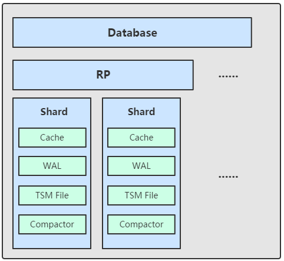

InfluxDB是一个由InfluxData开发的开源时序型数据，由GO语言开发，着力于高性能地查询与存储时序型数据。被广泛的应用于存储系统的监控数据，IOT行业的实时数据等场景。

优点

* 专为时间序列数据编写的自定义高性能数据存储，STM引擎允许高速取和数据压缩。
* 完全用Go语言编写，编译成单个二进制文件，没有外部依赖。
* 标签允许对系统进行索引以实现快速有效的查询。
* 保留策略有效地自动过期数据。

缺点

* influxdb开源版本只支持一个节点




database->database

table->measurement

column-> tag(带索引) 、field（不带索引） timestemp（唯一主键）


#### 数据模型

Measurement（表）

Tages（维度列）


Series：时序时间线是一个数据采集的一个指标随着时间流逝而形成的一条数据线。

​	=Measurement+Tags

SeriesKey：实际上是measurement+datasource(tags)


```
insert measurement_name , tag1_name=tag_value,tag2_name=tag_value field1=value,field2=value time
```


```
> show retention policies on iot_db
name    duration shardGroupDuration replicaN default
----    -------- ------------------ -------- -------
autogen 0s       168h0m0s           1        true
> 

```


#### retention policy 保存策略

retention policy 保存策略描述了influxdb中的数据会保留多长时间，数据保留几个副本（开源版只能保一个副本），

* name：名称。
* duration：保留多久的数据
* shard：实际存储数据的单元，每个shard保留一个时间片的数据，默认7天。如果需要保存1年的数据，那么influxdb会把连续7天的数据放到shard中，使用多个shard来保存数据。
* shard duration：描述每个shard存放多数据的时间片是多大，默认7天，当数据超过保留策略后，influxdb并不是按照数据点的时间一点点的删除，而是会删除整个shard group。
* shard group：一个shard group包含多个shard，对于开源版来说一个shard group只包含一个shard，但对于企业版的多节点集群模式来说，一个shard group可以包含不同节点上的不同shard，这使得influxdb可以保存更多的数据。
* shard replication：每个shard有几个副本，对于开源版来说，只有一个副本。
* replicaN：副本数量。
* default：是否是默认策略。

当你创建一个database的时候，InfluxDB会自动创建一个叫做`autogen`的retention policy，其duration为永远，replication factor为1，shard group的duration设为的七天。

```
CREATE RETENTION POLICY <retention_policy_name> ON <database_name> DURATION <duration> REPLICATION <n> [SHARD DURATION <duration>] [DEFAULT]

retention_policy_name：策略名
database_name：数据库名
duration：定义数据保存时音，最低1h，如果设置为0，表示永不失效(默认)。
REPLICATION：定义每个point保存的副本数。
default：表示这个创建的保存策略

#创建一个保存1年的策略
create retention policy '1Y' on test duration 366d replication 1

#查看策略
show retention policies on db_name

#修改策略
ALTER RETENTION POLICY <retention_policy_name> ON <database_name> DURATION <duration> REPLICATION <n> SHARD DURATION <duration> DEFAULT

#删除策略
drop retention policy policy_name on db_name

```


```sql
CREATE RETENTION POLICY "a_year" ON "food_data" DURATION 52w REPLICATION 1 SHARD DURATION 1h
上述语句可以创建一个保存周期为52周的RP。REPLICATION 1 表示副本数量为1。 ”SHARD DURATION”指定每个Shard Group对应多长时间。
```


#### 常用命令

```
#查看状态
show stats

#创建数据库
create database db_name

#显示所有数据库
show databases

#删除数据库
drop database db_name

#使用数据库
use db_name

#查看表
show measurements

#创建表
insert measurement_name , tag1_name=tag_value,tag2_name=tag_value field1=value,field2=value time

#删除表
drop measurement measurement_name

#查询表
select * from measurement_name 

#查看series
show series from measurement_name

#查看保存策略
show retention policies on db_name


# 数据中的时间字段默认显示的是一个纳秒时间戳，改成可读格式
precision rfc3339; -- 之后再查询，时间就是rfc3339标准格式

# 或可以在连接数据库的时候，直接带该参数
influx -precision rfc3339

# 查看一个measurement中所有的tag key 
show tag keys

# 查看一个measurement中所有的field key 
show field keys

#设置时间格式 precision "nso". Please use rfc3339, h, m, s, ms, u or ns.
> precision ms
```


百度TSDB

https://cloud.baidu.com/doc/TSDB/s/Kjwvxs9na
