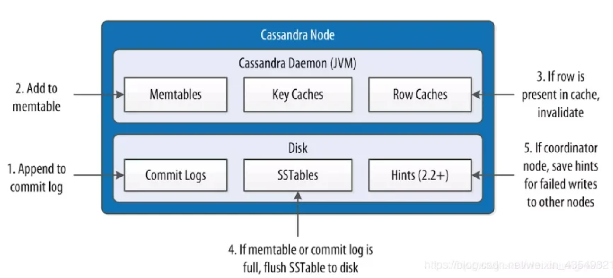

擅长领域不一样，Cassandra适合在线实时性业务，既要求随机读写又要求实时更新这种实时在线的场景，对于分析场景需要借助spark。ck是olap的，对静态数据的极速查询场景。

### 问题点

1. 分页特殊性

2. 查询条件特殊性

### 数据文件
* filter.db：SSTable 的 Bloom 过滤器
* summary.db：是索引的抽样，用来加速读取的。
* CompressionInfo.db 提供有关 Data.db 文件压缩的元数据。
* Data.db 是存储实际数据的文件
* Digest.adler32 是 Data.db 校验用的。
* Statistics.db 存储 nodetool tablehistograms 命令使用的有关 SSTable 的统计信息。
* TOC.txt 列出此 SSTable 的文件组件。

create table devices(
    dev_id text,
    ts timestamp,
    dev_name text,
    press float,
    primary key (dev_id,ts)
);

insert into devices(dev_id,ts,dev_name,press) values('0002',1669443006960,'dev0002',0.1);
