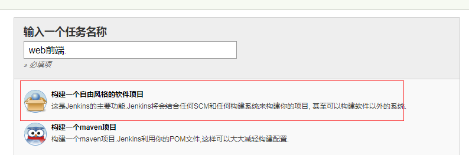
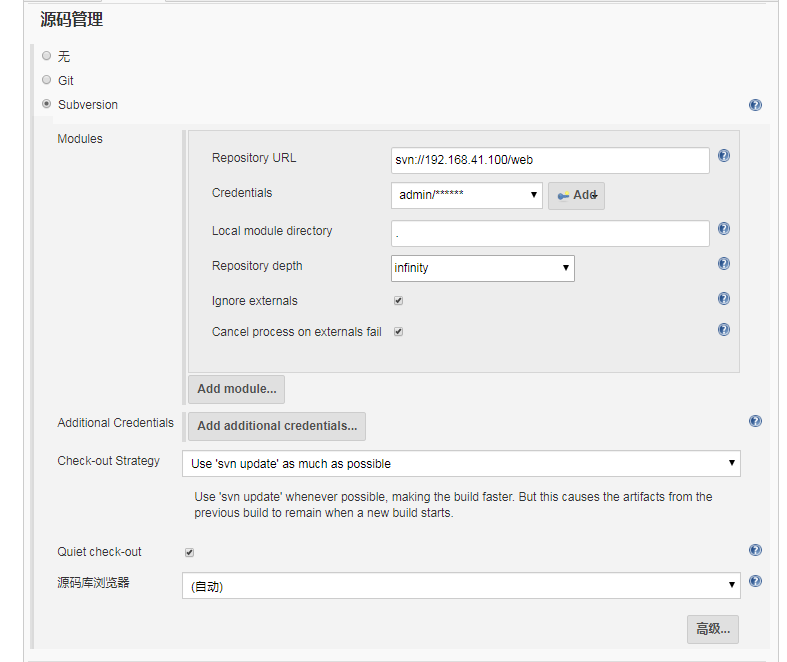
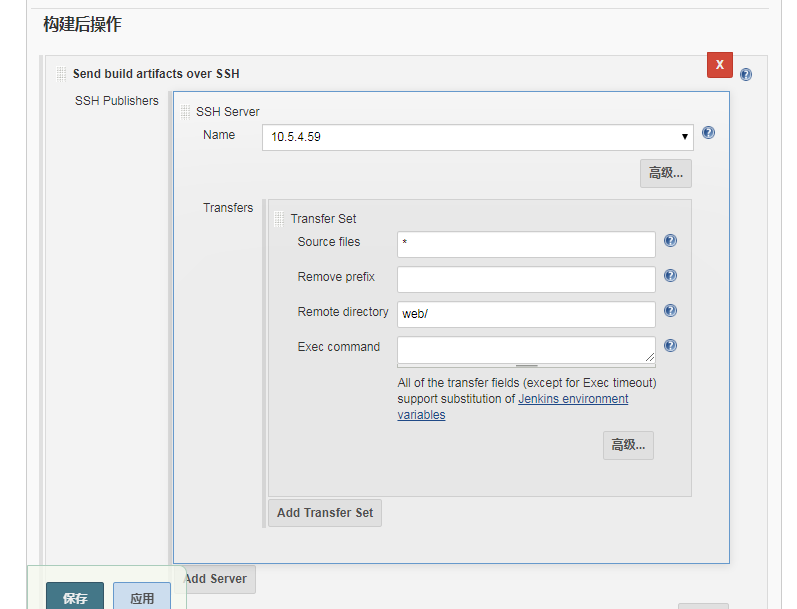

### 新建web前端任务
[新建任务]-[构建一个自由风格的软件项目]


### 获取源码



### 构建后操作
* Source files：需要布署的代码包相对路径，支持通配符。
* Remove prefix：去除的前缀。
* Remote directory：远程目录。
* Exec command：需要执行的shell命令。可以关联nginx服务重启




```
Updating svn://192.168.41.100/web at revision '2019-06-24T20:36:38.240 +0800' --quiet
Using sole credentials admin/****** in realm ‘<svn://192.168.41.100:3690> /home/svn’
At revision 26

No changes for svn://192.168.41.100/web since the previous build
SSH: Connecting from host [localhost.localdomain]
SSH: Connecting with configuration [10.5.4.59] ...
SSH: Disconnecting configuration [10.5.4.59] ...
SSH: Transferred 1 file(s)
Finished: SUCCESS
```