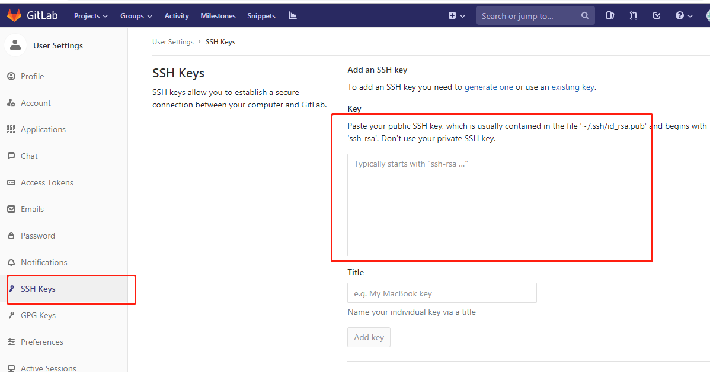

```
    git config --global user.name "xx"
    git config --global user.email "xx"
    ssh-keygen -t rsa -C 'xxx@xxx.com'
    clip < ~/.ssh/id_rsa.pub
```
经过如上操作，再次拉取代码和提取代码应无需再输密码，若还需输入密码
输入 git config --global credential.helper store  命令
然后操作pull/push 会让输入用户名密码，第一次输入进去。下次再操作pull/push时就不需要输入用户名密码了。




```
    克隆远程项目 git clone
    git clone http://XXX.XXX/XXX.git

    查看远程分支

    git branch -r


    提交代码
    git add . 全部文件或指定文件
    git commit -m 'xxxx' 提交
    git push 提交
    git pull 更新

```