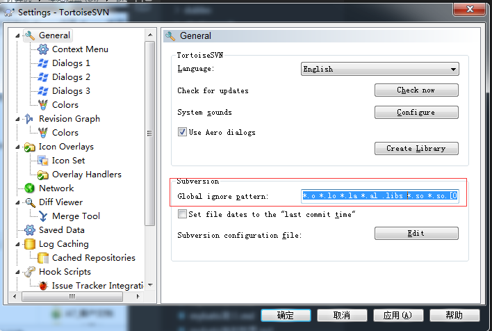

```
svn根目录：
鼠标右键,TortoiseSVN-- >Settings -->Subversion-->Global ignore pattern

*.o *.lo *.la *.al .libs *.so *.so.[0-9]* *.a *.pyc *.pyo __pycache__ *.rej *~ #*# .#* .*.swp .DS_Store [Tt]humbs.db target  *.settings  .classpath  .project node_modules .*


```

