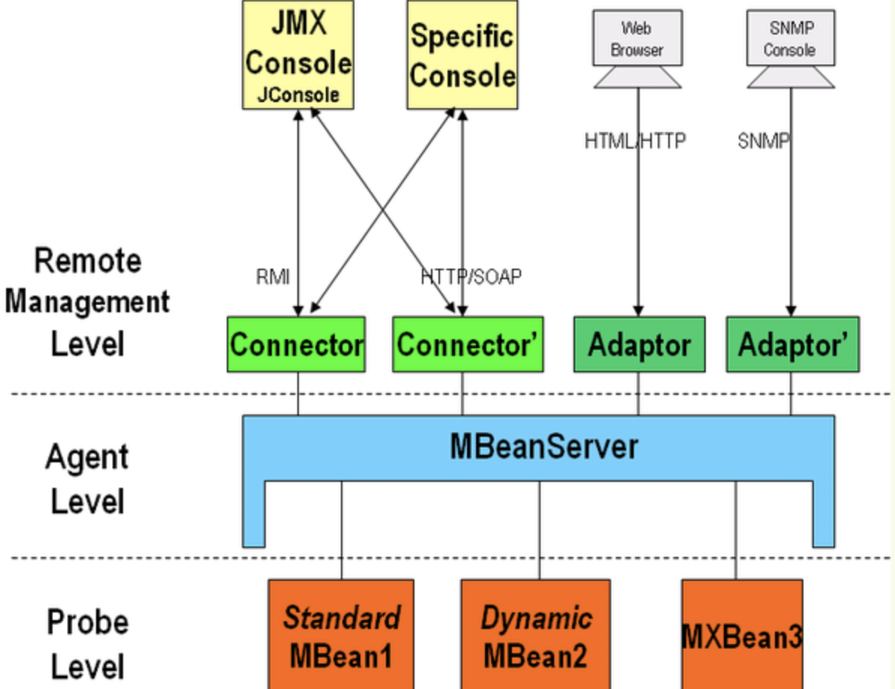

JMX是java Management Extensions的缩写，是java的一种管理扩展工具，JMX是一套标准的代码和服务，用户可以在任何java应用程序中使用这些代理和服务实现管理。可以通过jdk工具jconsole、客户端与jmx服务器进行交互，从而管理或获取程序的状态。中间件软件tomcat、jboss等都是基于jmx开发的。

#### 简介

JMX在Java编程语言中定义了应用程序以及网络管理和监控的体系结构、设计模式、应用程序接口以及服务。通常使用JMX来监控系统的运行状态或管理系统的某些方面，比如清空缓存、重新加载配置文件等。
　　优点是可以非常容易的使应用程序被管理
　　伸缩性的架构使每个JMX Agent服务可以很容易的放入到Agent中，每个JMX的实现都提供几个核心的Agent服务，你也可以自己编写服务，服务可以很容易的部署，取消部署。

　　主要作用是提供接口，允许有不同的实现

* 设备层：Instrumentation level 主要定义了信息模型，在jmx中各种管理对象以管理构件的形式存在，需要管理时向MBean服务进行注册，该层定义了通知机制以及一些辅助的元数据类。
* 代理层：Agent level 主要定义了各种服务以及通信模型，该层的核心是一个MBean服务器，所有的管理构件都需要向它注册，才能被管理。包含JMX Agent以及它们包含的MBean Servers。Agent layer的主要组件是MBean server，作为JMX Agents的核心，它充当MBeans的注册中心。该层提供了4个Agent 服务来使对MBean的管理更容易：计时器（Timer）、监控（monitoring）、动态加载MBean（dynamic MBean loading ）、关系服务（relationship services ）
* 分布服务层：Distributed Service Level 主要定义了能对代理层进行操作的管理接口和构件，这样管理者就可以操作代理，然而当前的jmx规范并没有给出这一层的具体规范。
* 附加管理协议API：定义的api主要用来支持当前已存在的网络管理协议，如SNMP、TMN、CIM、WBEM等

##### MBean

是Managed Bean的简称，在JMX中MBean代表一个被管理的资源实例，通过MBean中暴露的方法和属性，外界可以获取被管理的资源状态和操作MBean的行为。MBean就是一个 Java Object 同javaBean模型一样。

##### MBeanServer

MBean生存在一个MBeanServer中，MBeanServer管理这些MBean，并且代理外界对它的访问，并且MbeanServer提供了一种注册机制。外界可以通过名字来得到相应的MBean实例。

##### JMX Agent

Agent只是一个java进程，它包括这个MBeanServer和一系列附加的MbeanService。

##### **Protocol Adapters and Connectors** 

JMX Agent通过各种各样的Adapter和Connector来与外界(JVM之外)进行通信。同样外界（JVM之外）也必须通过某个Adapter和Connector来向JMX Agent发送管理或控制请求。 
Adapter和Connector的区别在于：Adapter是使用某种Internet协议来与JMX Agent获得联系，Agent端会有一个对象(Adapter)来处理有关协议的细节。比如SNMP Adapter和HTTP Adapter。而Connector则是使用类似RPC的方式来访问Agent，在Agent端和客户端都必须有这样一个对象来处理相应的请求与应答。比如RMI Connector。 JMX Agent可以带有任意多个Adapter，因此可以使用多种不同的方式访问Agent。 

https://www.cnblogs.com/h--d/p/14876310.html