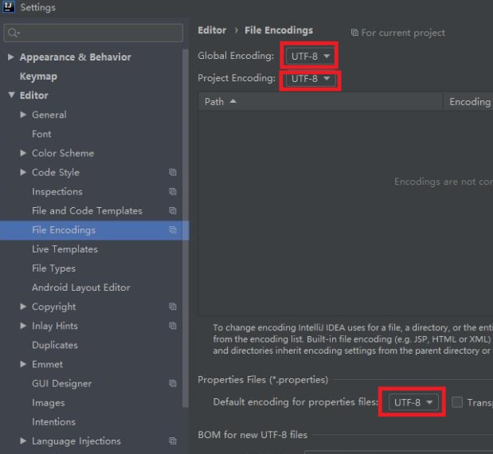

```
C:\Program Files\JetBrains\IntelliJ IDEA 2020.1.1\bin
idea.exe.vmoptions和idea64.exe.vmoptions文件

-Dfile.encoding=UTF-8
```


```
点击idea标题栏help按钮，找到Edit Custom VM Options,

双击Edit Custom VM Options,在文件的最后加上 -Dfile.encoding=utf-8
```

