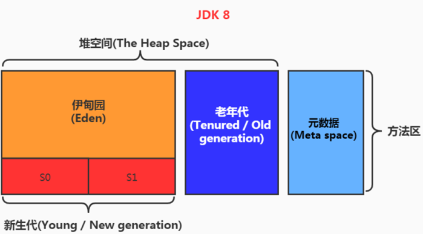

一个jvm实例只存在一个堆内存，堆是jvm内存管理的核心区域。堆在jvm启动时就被创建，其空间大小也就确定了，是jvm管理的最大一块内存空间。堆可以处理物理上不连续的内存空间中，但在逻辑上应该被视为连续的。所有的线程共享java堆，还可以划分线程私有缓冲区。

堆在内存逻上可分为在部份：新生区、老年区、元空间

* Young Generation Space 新生区，又细分为Eden区和Survivor区（S0和S1）
* Tenure Generation Space  养老区
* Meta Space 元空间

存储在jvm中的java对象可以划分为两类，一类是生命周期较短的瞬时对，这类对象的创建和消亡非常迅速。另一类对象的生命周期非常长，甚至和jvm的生命周期保持一致。
1. Java堆区进一步细分的话，可以划分为年轻代（YoungGen）和老年代（OldGen）。
1. 其中年轻代又可以划分为Eden空间、Survivora空间和Survivor1空间（也叫做from区、to区）。
1. 几乎所有的Java对象都是在Eden区被new出来的。大对象直接在老年代中创建。
1. 绝大部分的Java对象的销毁都在新生代进行了。

#### 设置堆内存大小
* java堆内存存储java对象实例，在jvm启动时就已经设定好了。-Xms -Xmx
* 一旦堆区内的内存大小超过-Xmx时，就会抛出OOM异常
* 通常会将-Xms和-Xmx两个参数配置成相同的，目的是为了能够在java垃圾回收清理完成后不需要重新分别计算堆区的大小，从而提高性能。
    * heap默认最大值计算方式：如果物理内存少于192M，那么heap最大值为物理内存的一半。如果物理内存大于等于1G，那么heap的最大值为物理内存的1/4
    * heap默认最小值计算方式：最少不得少于8M，如果物理内存大于等于1G，heap默认最小值为物理内存的1/64，即1024/64=16M。最小堆内存在jvm启动的时候就会被初始化。

#### MinorGC、MajorGC、FullGC
jvm进行GC时，并非每次都对上面的三个内存（新生代、老年代、方法区）区域一起回收，大部份时候回收的都是新生代。按GC回收敬域分为两种类型：
* 部份收集(Partial GC)，不是完整收集整个java堆的垃圾回收。
    * 新生代收集（Minor GC / Young GC）：只是新生代（Eden\s0，s1）的垃圾收集
    * 老年代收集（Major GC / Old GC）：只是老年代的垃圾收集。目前，只有CMS GC会有单独收集老年代的行为。
    * 混合收集（MixedGc）：收集整个新生代以及部分老年代的垃圾收集。目前，只有G1 GC会有这种行为
* 整堆收集(Full GC)，收集整个java堆和方法区。

#### OOM如何解决
要解决OOM异常或heap space的异常，一般的手段是首先通过内存映像分析工具对dump出来的堆转储快照进行分析，重点是确认内存中的对象是否是必的，也就是要先分清楚到底是出现了内存泄漏（Memory Leak）还是内存溢出（Memory Overflow）
1. 如果是内存泄漏，可进一步通过工具查看泄漏对象到GC Roots的引用链。于是就能找到泄漏对象是通过怎样的路径与GC Roots相关联并导致垃圾收集器无法自动回收它们的。掌握了泄漏对象的类型信息，以及GC Roots引用链的信息，就可以比较准确地定位出泄漏代码的位置。
2. 如果不存在内存泄漏，换句话说就是内存中的对象确实都还必须存活着，那就应当检查虚拟机的堆参数（-Xmx与-Xms），与机器物理内存对比看是否还可以调大，从代码上检查是否存在某些对象生命周期过长、持有状态时间过长的情况，尝试减少程序运行期的内存消耗。
#### 堆空间分代
不分代也可以工作，分代是为了更好的优化GC性能，如果没有分代那所有的对象都在一块，GC的时候要找到哪些没用的对象，会增加扫描的成本，而且很多对象都的生命周期极短，把这些对象集中放在一个地方进行回收。另外频繁的触发STW，会影响用户线程。 