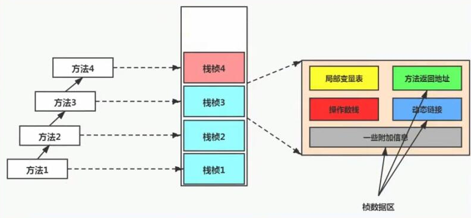

栈主要管理java程序的运行，它保存方法的局部变量（8种基本数据类型、对象的引用地址）部分结果，并参与方法的调用和返回。
```
#一般默认512k-1024k，设置的栈空间值过大，会导致系统可以用于创建线程的数量减少。一般一个进程中通常有3000-5000个线程。
-Xss size
```

* 栈是一种快速有效的分配存储方式，访问速度仅次于PC寄存器
* 栈的优点是跨平台、指令集小、编译器容易实现，缺点是性能下降、实现同样的功能需要更多的指令
* jvm直接对栈的操作只有两个，方法执行入栈、执行结束出栈。
* jvm栈不存在垃圾回收的问题，但会有OOM溢出的问题。


栈的单位：栈帧
栈中的数据是以栈帧（Stack Frame）的格式存在，在这个线程正在执行的每个方法都对应各自的一个栈帧，栈帧是一个内存区块，是一个数据集，保存着方法执行过程中的各种数据信息。

* 在一条活动线程中，同一时刻只会有一个活动栈帧，即只有当前正在执行的方法栈帧是有效的。
* 执行引擎运行的所有字节码指令只针对当前栈帧进行操作 
* 如果当前方法中调用了其它方法，对应的新的栈帧会被创建出来，放在栈的顶端，成为新的当前栈帧。
* 如果当前方法执行结束，方法返回之际，当前栈帧会传回此方法的执行结果给前一栈帧，虚拟机会丢弃当前栈帧，使得前一个栈帧重新成为当前栈帧
* java方法有两种函数返回的方式： 正常返回( return指令 )、异常返回( 抛出异常 )，不管使用哪种方式，都会导致栈帧被弹出


#### 栈的内存结构
##### 局部变量表
* 局部变量表也称之局部变量数组或本地变量表，主要用于存储方法参数和定义方法体内的局部变量，这些数据类型包括基本数据类型、对象引用、returnAddress类型
* 局部变量表所需的容量大小是在编译基确定下来的，并保存在方法的Code属性的maximum local variables数据项中。在方法运行期间是不会改变局部变量表的大小的。
* 方法嵌套调用的次数由栈的大小决定。一般来说，栈越大，方法嵌套调用次数越多。对一个函数而言，它的参数和局部变量越多，使得局部变量表膨胀，它的栈帧就越大，以满足方法调用所需传递的信息增大的需求。进而函数调用就会占用更多的栈空间，导致其嵌套调用次数就会减少。
* 局部变量表中的变量只在当前方法调用中有效。在方法执行时，虚拟机通过使用局部变量表完成参数值到参数变量列表的传递过程。当方法调用结束后，随着方法栈帧的销毁，局部变量表也会随之销毁。


##### 操作数栈
主要用于保存计算过程的中间结果，同时作为计算过程中变量临时的存储空间。jvm解释引擎是基于栈的执行引擎，其中的栈指的就是操作数栈。
每一个独立的栈帧中除了包含局部变量表以外，还包含一个后进先出(Last-In-First-Out）的操作数栈，也可以称之为表达式栈（Expression Stack）。
操作数栈就是JVM执行引擎的一个工作区，当一个方法刚开始执行的时候，一个新的栈帧也会随之被创建出来，这个方法的操作数栈是空的。
每一个操作数栈都会拥有一个明确的栈深度用于存储数值，其所需的最大深度在编译期就定义好了，保存在方法的Code属性中，为max_stack的值。
栈中的任何一个元素都是可以任意的Java数据类型。32bit的类型占用一个栈单位深度，64bit的类型占用两个栈单位深度。
操作数栈，在方法执行过程中，根据字节码指令，并非采用访问索引的方式来进行数据访问的，而是只能通过标准的入栈（push）和出栈（pop）操作，往栈中写入数据或提取数据来完成一次数据访问。某些字节码指令将值压入操作数栈，其余的字节码指令将操作数取出栈。使用它们后再把结果压入栈。比如：执行复制、交换、求和等操作
如果被调用的方法带有返回值的话，其返回值将会被压入当前栈顿的操作数栈中，并更新PC寄存器中下一条需要执行的字节码指令。 

##### 动态链接
指向运行时常量池的方法引用
* 每个栈帧内部都有一个指向运行时常量池中该栈帧所属方法的引用，包含这个引用的目的就是为了支持当前方法的代码能够实现动态接.
* 在java源文件被编译到字节码文件中时，所有的变量和方法引用都作为符号引用保存在class文件的常量池中。

##### 方法返回地址
存放调用该方法的pc寄存器的值，一个方法的结束，有两种方式：正常执行完成；出现未处理的异常，非正常退出。
无论通过哪种方式退出，在方法退出后都返回到该方法被调用的位置。方法正常退出时，调用者的pc计数器的值作为返回地址，即调用该方法的指令的下一条指令的地址。而通过异常退出的，返回地址是要通过异常表来确定，栈帧中一般不会保存这部分信息。

#### 常见问题
* 问题一：栈溢出的情况
    举个简单的例子：在main方法中调用main方法，就会不断压栈执行，直到栈溢出；
    栈的大小可以是固定大小的，也可以是动态变化（动态扩展）的。
    如果是固定的，可以通过-Xss设置栈的大小；
    如果是动态变化的，当栈大小到达了整个内存空间不足了，就是抛出outofMemory异常（java.lang.OutofMemoryError）
* 问题二：调整栈大小，就能保证不出现溢出吗？ 
    不能。因为调整栈大小，只会减少出现溢出的可能，栈大小不是可以无限扩大的，所有不能保证不出现溢出。
* 问题三：分配的栈内存越多越好吗？
    不是，因为增加栈大小，会造成每个线程的栈都变的很大，使得一定的栈空间下，能创建的线程数量会变小。
* 问题四：垃圾回收是否会涉及到虚拟机栈？
    不会，垃圾回收只会涉及到方法区和堆，程序计数器只记录运行的下一地址，不会溢出。虚拟机栈和本地方法栈，都只涉及压栈和出栈，可能存在栈溢出，但不存在垃圾回收。
* 问题五：栈和堆的区别？
    * 大小：栈的大小为512k-1024k，堆默认是内存的1/4
    * 执行效率，栈的执行效率快，截堆的执行效率慢
    * 存放在的内容不一样，栈存放的基本数据类型和对象的引用，堆存放数组和对象实例
    * 栈没有垃圾回收，堆是有垃圾回收的