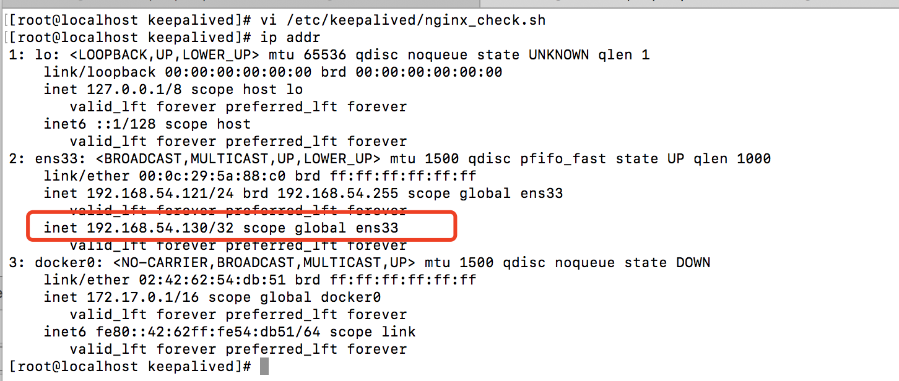
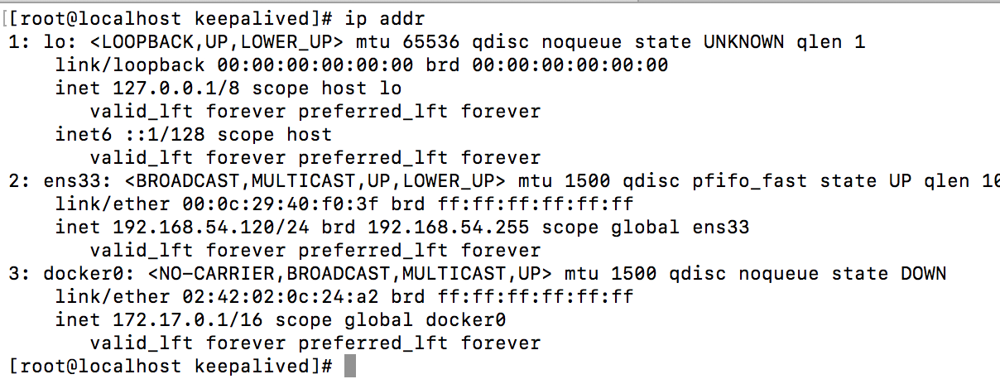
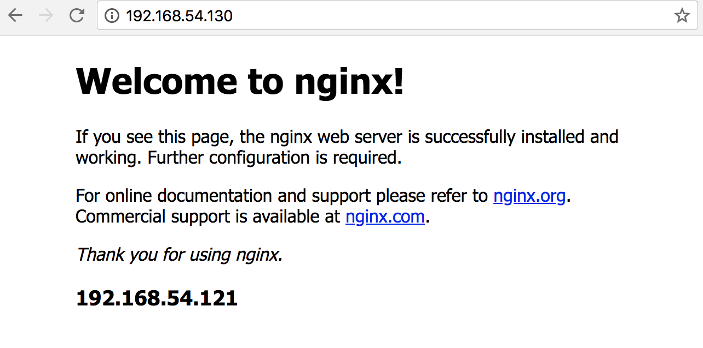

keepalived是一个类似于layer3.4.5交换机制的软件，自动完成不需要人工涉。自动检测服务器状态，如果有一台web服务器出现宕机，keepalived将检测，并将有故障的服务器从系统中删除。同时使用其它服务器代替服务器的工作。当服务器工作正常后keepalived自动将服务器加入到服务群中。

## Layer3.4.5
是工作在TCP/IP协议栈的IP层、TCP层、应用层。
### Layer3：
keepalived会定期向服务器群中的服务器发送一个ICMP数据包(ping命令)，如果发现某台服务器的IP地址没有激活，keepalived便报告这个服务器失败。layer3的方式是以服务器的IP地址是否有效作为服务器工作正常与否的标准。
### Layer4：
主要以TCP端口状态来决定服务器工作正常与否。如web server服务端口是80，keepalived检测到80端口没有启动，则keepalived将把这台服务器从服务器集群中剔除。
### Layer5：
Layer5对指定的URL执行Http get，然后使用md5算法对结果进行求和。如果这个总数与预期值不符，则测试错误，将剔除。SSL_GET与HTTP_GET相同。

## keepalived主要功能
keepalived主要通过VRRP协议实现高可用。Virtual Router RedundanceyProtocal(虚拟路由器冗余协议)。VRRP的目的是为了解决静态路由单点故障问题，它能够保证当个别节点宕机时，整个网络可以不间断地运行。      
keepalived正常工作时，主节点会不断地向备节点发送（多播）的心跳消息，用以告诉Backup节点自己还活着，当主节点发生故障时备节点也就因此无法继续检测到主节点的心跳，于是调用自身的接管程序，接管主节点的IP资源和服务。而当主节点恢复时，备节点又会释放IP资源和服务。恢复到原来的备用角色。


## keepalived+nginx高可用
keepalived的HA分为抢占模式和非抢占模式
* 抢占模式即在master在故障中恢复后，会将VIP从backup节点抢占过来。
* 非抢占模式即master在故障恢复后，不抢占backup节点。backup节点自动升级为master的VIP。

    mater: 192.168.54.120
    backup: 192.168.54.121
    vip: 192.168.54.130
    nginx两台机器都是80端口

### 安装nginx
参考nginx安装手册
### 安装keepalived
1. 下载keepalived 

    wget http://www.keepalived.org/software/keepalived-1.2.2.tar.gz
2. 安装相关前置依赖
    * 安装gcc gcc-c++
    * 安装Perl
        wget http://www.cpan.org/src/5.0/perl-5.16.1.tar.gz
        tar -xzf perl-5.16.1.tar.gz
        cd perl-5.16.1
        ./Configure -des -Dprefix=/usr/local/perl
        make
        make test
        make install
        #如果系统以前已安装了旧版本的perl的话，替换系统原有的版本。
        mv /usr/bin/perl /usr/bin/perl.bak
        ln -s /usr/local/perl/bin/perl /usr/bin/perl
        perl -v
    * 安装openssl-devel   
        wget https://www.openssl.org/source/openssl-1.0.2h.tar.gz
        tar zxf openssl-1.0.2h.tar.gz 
        ./config shared zlib
    * 安装ipvsadm
        yum -y install ipvsadm
    * 安装popt-devel
        yum -y install popt-devel 
3. 安装
    tar -zxvf keepalived-1.2.2.tar.gz
    cd keepalived-1.2.2
    ./configure 
    make && make install
4. 安装到系统，默认的启动脚本里写的是系统路径，所以需要拷贝一些文件到系统目录下
    $ cp /home/wangpl/mine/soft/keepalived-1.2.2/etc/rc.d/init.d/keepalived /etc/init.d/
    $ cp /home/wangpl/mine/soft/keepalived-1.2.2/sbin/keepalived /usr/sbin/
    $ cp /home/wangpl/mine/soft/keepalived-1.2.2/etc/sysconfig/keepalived /etc/sysconfig/
    $ mkdir -p /etc/keepalived/
    $ cp /home/wangpl/mine/soft/keepalived-1.2.2/etc/keepalived/keepalived.conf /etc/keepalived/keepalived.conf

5. 常用命令
    启动：service keepalived start
    停止：service keepalived stop
    重启：service keepalived restart

### keepalived配置
1. master节点(192.168.54.120)配置
    ```
    global_defs {
        router_id localhost.localdomain.120
    }
    vrrp_script chk_nginx {
        script "/etc/keepalived/nginx_check.sh"
        interval 2
        weight -20
    }
    vrrp_instance VI_1 {
        state MASTER
        interface ens33
        virtual_router_id 33
        mcast_src_ip 192.168.54.120
        priority 100
        advert_int 1
        authentication {
            auth_type PASS
            auth_pass 1111
        }
        track_script {
            chk_nginx
        }
        virtual_ipaddress {
            192.168.54.130
        }
        virtual_routes {
        default via 192.168.54.2
        }
    }

2. backup节点(192.168.54.121)配置
    ```
    global_defs {
        router_id localhost.localdomain.121
    }
    vrrp_script chk_nginx {
        script "/etc/keepalived/nginx_check.sh"
        interval 2
        weight -20
    }
    vrrp_instance VI_1 {
        state BACKUP
        interface ens33
        virtual_router_id 33
        mcast_src_ip 192.168.54.121
        priority 90
        advert_int 1
        authentication {
            auth_type PASS
            auth_pass 1111
        }
        track_script {
            chk_nginx
        }
        virtual_ipaddress {
            192.168.54.130
        }
        virtual_routes {
        default via 192.168.54.2    # 设置默认网关为 123.123.123.1
        }
    }
3. nginx_check服务检测脚本
master、backup节点都要配置

    vi /etc/keepalived/nginx_check.sh
    chmod +x /etc/keepalived/nginx_check.sh

    =`ps -C nginx –no-header |wc -l`
    if [ $A -eq 0 ];then
    /usr/local/nginx/sbin/nginx
    sleep 2
    if [ `ps -C nginx --no-header |wc -l` -eq 0 ];then
        killall keepalived
    fi
    fi  
4. 启动keepalived服务，同时启动两个节点

    service keepalived start
    ps -ef | grep keepalived
分别在两台机器上查看vip状态,输出命令 ip addr，其中有一台会绑定192.168.54.130的vip。 




5.  测试故障转移
停掉两台服务器中的任一台，服务仍然可用，则安装成功。




参考：
keepalived与nginx配置
https://blog.csdn.net/xyang81/article/details/52556886

linux添加虚拟ip
https://blog.csdn.net/huoyuanshen/article/details/68483188
 
https://www.cnblogs.com/xiaoit/p/4499703.html