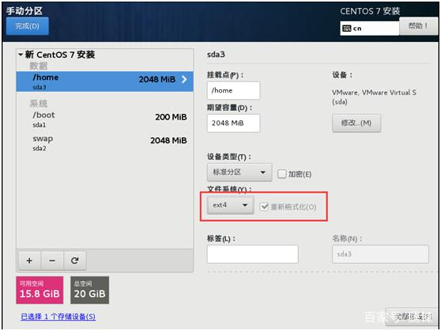
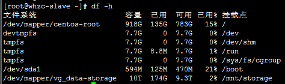
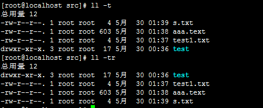

### linux磁盘分区

#### boot分区
引导分区，存放引导文件和Linux内核。它只需要启动系统所须的文件和系统配置文件。对于大多数系统，100MB到300MB的根分区就够用了，建议分区500MB。 

#### swap分区
作为虚拟内存使用。在系统的物理内存不够用的时候，把硬盘空间中的一部分空间释放出来，以供当前运行的程序使用。
分区时一般设定：内存大小的1到1.5倍.
#### var分区
用于存放运行时需要改变数据的文件，如日志文件、动态程序文件等。不需要分太大，一般根据具体实用场景分配2GB或默认。

#### home分区。
这是用户的home目录所在地; 它的大小取决于你的Linux系统有多少用户。

#### /根分区
作为文件系统的根目录，剩余的给根分区。但不要在根分区存储大量文件。

#### /data
数据分区用于存放大量文件，将系统分区和数据分区分离，便于后期扩容。



### linux目录
* /bin：存放二进制可执行文件(ls,cat,mkdir等)，常用命令一般都在这里。
* /etc：存放系统管理和配置文件
* /home：存放所有用户文件的根目录，以用户名为目录文件名。 
* /usr：用于存放系统应用程序，比较重要的目录/usr/local 本地系统管理员软件安装目录（安装系统级的应用）。这是最庞大的目录，要用到的应用程序和文件几乎都在这个目录。是Unix Software Resource的缩写
    * /usr/x11r6： 存放x window的目录
    * /usr/bin： 众多的应用程序  
    * /usr/sbin： 超级用户的一些管理程序  
    * /usr/doc： linux文档  
    * /usr/include： linux下开发和编译应用程序所需要的头文件  
    * /usr/lib： 常用的动态链接库和软件包的配置文件  
    * /usr/man： 帮助文档  
    * /usr/src： 源代码，linux内核的源代码就放在/usr/src/linux里  
    * /usr/local/bin： 本地增加的命令  
    * /usr/local/lib： 本地增加的库
* /opt：额外安装的可选应用程序包所放置的位置。一般情况下，我们可以把tomcat等都安装到这里。
* /proc：虚拟文件系统目录，是系统内存的映射。可直接访问这个目录来获取系统信息。
* /root：系统管理员的主目录
* /sbin：存放二进制可执行文件，只有root才能访问。这里存放的是系统管理员使用的系统级别的管理命令和程序。如ifconfig等。
* /dev：用于存放设备文件。
* /mnt：系统管理员安装临时文件系统的安装点，系统提供这个目录是让用户临时挂载其他的文件系统。
* /boot：存放用于系统引导时使用的各种文件
* /lib：存放跟文件系统中的程序运行所需要的共享库及内核模块。共享库又叫动态链接共享库，作用类似windows里的.dll文件，存放了根文件系统程序运行所需的共享文件。
* /tmp：用于存放各种临时文件，是公用的临时文件存储点。
* /var：用于存放运行时需要改变数据的文件，也是某些大文件的溢出区，比方说各种服务的日志文件。


### 常用文件命令
#### 目录操作
* cd：进入目录
    * cd 目录名：进入指定目录
    * cd ./：进入当前目录
    * cd ../：进入父目录
    * cd ~：进入当前用户根目录
    * cd -：返回上次目录
* pwd：查看当前目录
* mkdir：创建目录
    * mkdir d1 d2 ：同时创建多个目录
    * mkdir -p /tmp/dir1/dir2：创建一个目录树 

#### 查看文件属性
* ls：查看文件和目录
    * ls -a：显示隐藏文件 
    * ls -l：显详细信息
    * ls |grep test*：通配符查看
    * ll -S：按文件大小降序显示
    * ll -Sr：按文件大小升序显示
    * ll -t：按文件修改时间降序显示
    * ll -tr：按文件修改时间升序显示
    * ll -h：



* ll：查看详细信息


1. 文件类型
    * -:普通文件 就是一般存取的文件
    * d:目录文件（directory）文件夹。
    * l:连接文件（link）：类似Windows下面的快捷方式。
    * b:块设备文件常见的有硬盘。
    * c:字符设备文件，例如键盘、鼠标等等。
2. 文件权限：
    * r:读权限，值等于4
    * w:写权限，值等于2
    * x:执行权限，值等于1
    * -：无权限
    * 2.1：Owner当前用户权限
    * 2.2：Group当前用户组权限
    * 2.3：Other其它用户权限
3. 文件个数：如果是文件个数是1，如果是目录就是该目录中的文件个数，默认目录会有两个隐藏的文件。
4. 所属用户
5. 所属用户组
6. 文件大小：-h可以自动适配置合适的文件大小单位
7. 最后一次修改时间
8. 文件名
    ```
    #统计当前目录文件个数
    [root@localhost src]# ls -l|grep '^-'|wc -l
    #统计当前目录文件夹个数
    [root@localhost src]# ls -l|grep '^d'|wc -l
    #统计当前目录及子目录文件个数
    [root@localhost src]# ls -lR|grep '^-'|wc -l
    ```

#### 查看文件内容
* cat： 由第一行开始显示内容，并将所有内容输出
* tac：从最后一行倒序显示内容，并将所有内容输出
* more：根据窗口大小，一页一页的现实文件内容
* head：只显示头几行
* tail：只显示最后几行
    ```
    #动态显示文件尾100行的信息，常用于日志查看
    [root@localhost src]# tail -fn100 log.log 
    #动态显示文件尾100行包含关键字前后10行的信息，常用于日志查看
    [root@localhost src]# tail -fn100 log.log |grep '关键字' -C10
    grep -A 5 显示后5行
    grep -B 5 显示前5行
    grep -C 5 显示前后5行
    ```

#### 修改文件内容
* vi 文件名
* vim 文件名
* echo 'xxx'>文件名
#### 删除文件
* rm：删除文件
* -f：force强制删除，无任何提示
* -i：interactive进行交互式地删除
* -r：recursive递归式地删除列出的目录下的所有目录和文件
* -v：verbose详细显示进行的步骤
#### 复制剪切文件
* cp：复制文件
* scp：远程复制文件 scp /文件名 root@远程IP:/目录
* mv：移动或重命名文件
#### 查找文件
* find：从磁盘查找文件，较慢，find /指定查找目录 -name 关键字
    * find ./ -name "my*"搜索当前目录含子目录，所有文件名以my开头的文件。
    * find / -name "my*" -ll：搜索根目录，所有文件名以my开头的文件，并显示它们的详细信息。
    * find ./ -type f -mmin -10：搜索当前目录，所有过去10分钟更新过的普通文件，不加-type f参数，则搜索普通文件+特殊文件+目录。
* locate：从文件数据库查找文件，较快。/var/lib/locatedb
* which：在PATH变量指定的路径中，搜索某个系统命令的位置，并且返回第一个搜索结果。
* whereis：只能用于程序名的搜索
```
    #locate默认不存在，需要安装，先运行 'updatedb' 命令 
    [root@localhost src]# locate 'mysql'
    -bash: locate: 未找到命令
    [root@localhost src]# yum install mlocate
    #更新数据
    [root@localhost src]# updatedb
    [root@localhost src]# locate java

    [root@localhost src]# whereis ps
    ps: /usr/bin/ps /usr/share/man/man1/ps.1.gz
    [root@localhost src]# whereis top
    top: /usr/bin/top /usr/share/man/man1/top.1.gz
    [root@localhost src]# 

    [root@localhost src]# which java
    /usr/bin/which: no java in (/usr/local/sbin:/usr/local/bin:/usr/sbin:/usr/bin:/root/bin)

```
#### 文件权限
* chmod 控制文件或目录的访问权限
    chmod ［u|g|o|a］ ［+|–|=］ ［r|w|x］ 文件名
    * u：用户（user），即文件或目录的所有者。
    * g：同组（group）用户，即与文件属主有相同组ID的所有用户。
    * o：其他（others）用户。
    * a：所有（all）用户。
    * +：添加某个权限。
    * –：取消某个权限。
    * =：指定定权限并取消其他所有权限。
    * r：读权限，值等于4。
    * w：写权限，值等于2。
    * x：执行权限，值等于1。
    * R：递归所有子文件。 
* chown 将指定文件的拥有者改为指定的用户或组
    chown ［-选项］ 用户或组 文件
    * R：递归所有子文件。 
* chgrp 改变文件或目录所属的组
    chgrp ［选项］ group filename
    * R：递归所有子文件。
```
    [root@localhost src]# ll
    -rw-r--r--. 1 root root 624 5月  30 01:57 aaa.text
    -rw-r--r--. 1 root root   4 5月  30 02:02 ab.txt
    [root@localhost src]# chmod g+w aaa.text 
    [root@localhost src]# chmod 777 ab.text 
    [root@localhost src]# chown mysql:mysql aaa.text 
    [root@localhost src]# ll
    -rw-rw-r--. 1 mysql mysql 624 5月  30 01:57 aaa.text
    -rwxrwxrwx. 1 root root   4 5月  30 02:02 ab.txt
```
#### 解压缩文件
* tar [-选项] 文件：解压文件。
    -c: 建立压缩档案
    -x：解压
    -t：查看内容
    -r：向压缩归档文件末尾追加文件
    -u：更新原压缩包中的文件
    -z：有gzip属性的
    -j：有bz2属性的
    -Z：有compress属性的
    -v：显示所有过程
    -O：将文件解开到标准输出
    -f: 使用档案名字，切记，这个参数是最后一个参数，后面只能接档案名。
* tar [-选项]  file1.tar.gz file1：压缩文件。
* unzip file1.zip：解压文件
* zip file1.zip file1 ：压缩文件。

    ```
    [root@localhost src]# yum install zip unzip
    //将目录里所有jpg文件打包成tar.jpg 
    [root@localhost src]# tar -cvf file.tar file
    [root@localhost src]# tar -czf file.tar.gz file
    [root@localhost src]# zip file.zip file
    #解压 tar文件
    [root@localhost src]# tar -xvf file.tar
    #解压tar.gz文件
    [root@localhost src]# tar -xzvf file.tar.gz
    #解压tar.gz文件到指定目录
    [root@localhost src]# tar -xzvf file.tar.gz -C /usr/local/src
    #解压 tar.bz2文件
    [root@localhost src]# tar -xjvf file.tar.bz2
    #解压tar.Z文件
    [root@localhost src]# tar -xZvf file.tar.Z
    #解压rar文件
    [root@localhost src]# unrar e file.rar
    #解压zip文件
    [root@localhost src]# unzip file.zip
    ```

### 用户管理
* useradd [-选项] 用户名：添加用户。
    * c：comment 指定一段注释性描述。
    * d：目录 指定用户主目录。
    * g：用户组 指定用户所属的用户组。
    * G：用户组，用户组 指定用户所属的附加组。
    * s：Shell文件 指定用户的登录Shell。
    * u：用户号 指定用户的用户号，如果同时有-o选项，则可以重复使用其他用户的标识号。
* userdel [-选项] 用户名：删除用户。
    * r：把用户的主目录一起删除。
* usermod [-选项] 用户名：修改用户。选项与useradd命令中的选项一样，可以修改用户选项。
* passwd [-选项] 用户名：设置密码。刚创建的用户没有口令，被系统锁定，无法使用，必须为其指定口令后才可以使用。
    * l：锁定口令，即禁用账号。
    * u：口令解锁。
    * d：使账号无口令。
    * f：强迫用户下次登录时修改口令。
* groupadd 选项 用户组：添加用户组。
* groupdel 选项 用户组：删除用户组。
* groupmod 选项 用户组：修改用户组。
    ```
    [root@localhost src]# groupadd mysql
    [root@localhost src]# useradd mysql -g mysql
    #创建一个ftp账号，指定主目录和用户组，且该账号不能ssh登录。
    [root@localhost src]# groupadd ftp
    [root@localhost src]# useradd -d /var/www/ftp -g ftp -s /sbin/nologin ftpuser
    [root@localhost src]# passwd ftpuser
    ```
### 安装软件
#### rpm安装
软件已经编译打包，所以传输和安装方便，让用户免除编译，软件包安装的环境必须与打包时的环境一致。需要手动安装依赖
* rpm -ivh：安装
* rpm -e：删除
* rpm -qa：查询
#### yum在线安装
可以自动处理依赖性关系，并且一次安装所有依赖的软体包。
* yum install
* yum list
* yum list installed：已安装
* yum search 关键字
* yum remove 包名
参考：配置光盘镜像源
#### 源码安装
源码安装一般下载源码，通过gcc编译安装，所以安装前一定要安装gcc环境，进入源码包目录执行以下命令
* ./configure：软件配置检查
* make：编译
* make install：编译安装
* make clean：清除makeFile
参考：nginx安装

### 磁盘管理
* df：显示磁盘分区上可以使用的磁盘空间。
* du：显示每个文件和目录的磁盘使用空间~的大小。
* fdisk -l：查看磁盘详细信息。
* lsblk：查看分区。
```
[root@localhost src]# df -h
文件系统                 容量  已用  可用 已用% 挂载点
/dev/mapper/centos-root   10G  915M  9.1G    9% /
devtmpfs                 481M     0  481M    0% /dev
tmpfs                    490M     0  490M    0% /dev/shm
tmpfs                    490M  6.6M  484M    2% /run
tmpfs                    490M     0  490M    0% /sys/fs/cgroup
/dev/sr0                 4.1G  4.1G     0  100% /mnt/cdrom
/dev/mapper/centos-home  2.0G   33M  2.0G    2% /home
/dev/sda1                497M  120M  378M   25% /boot
[root@localhost src]# du -h --max-dept=1
15M	./test
34M	.
[root@localhost src]# lsblk
NAME            MAJ:MIN RM  SIZE RO TYPE MOUNTPOINT
sda               8:0    0   20G  0 disk 
├─sda1            8:1    0  500M  0 part /boot
└─sda2            8:2    0   14G  0 part 
  ├─centos-root 253:0    0   10G  0 lvm  /
  ├─centos-swap 253:1    0    2G  0 lvm  [SWAP]
  └─centos-home 253:2    0    2G  0 lvm  /home
sr0              11:0    1    4G  0 rom  /mnt/cdrom
```
* fdisk /dev/xx：格式化硬盘。
* mount：挂载硬盘。

参考：挂载数据盘

### 内存、CPU、网络
#### 内存
free命令显示系统使用和空闲的内存情况，包括物理内存、交互区内存(swap)和内核缓冲区内存
* -s：指定刷新时间，单位秒。
* -h：自动加上单位方便读取。
    ```
    [root@localhost src]# free -h
                total        used        free      shared  buff/cache   available
    Mem:           979M        132M        574M        6.6M        272M        664M
    Swap:          2.0G          0B        2.0G
    ```
* total：总计物理内存的大小。
* used：已使用多大。
* free：可用有多少。
* Shared：被程序之间可以共享使用内存。
* Buffers/cached：块设备估做的缓冲内存。
* available：可用内存。
#### CPU
```
[root@localhost src]# top
top - 04:14:40 up  4:18,  1 user,  load average: 0.00, 0.01, 0.05
Tasks: 343 total,   2 running, 341 sleeping,   0 stopped,   0 zombie
%Cpu(s):  0.3 us,  0.3 sy,  0.0 ni, 99.3 id,  0.0 wa,  0.0 hi,  0.0 si,  0.0 st
KiB Mem :  1003164 total,   587664 free,   135732 used,   279768 buff/cache
KiB Swap:  2097148 total,  2097148 free,        0 used.   679608 avail Mem 
   PID USER      PR  NI    VIRT    RES    SHR S %CPU %MEM     TIME+ COMMAND
  5509 root      20   0  130156   2036   1268 R  0.7  0.2   0:00.17 top
     1 root      20   0   57580   7468   2616 S  0.0  0.7   0:02.71 systemd  
     2 root      20   0       0      0      0 S  0.0  0.0   0:00.05 kthreadd
     3 root      20   0       0      0      0 S  0.0  0.0   0:00.10 ksoftirqd/0 

#查找java进程
[root@localhost src]# ps -aux|grep java 
#强制杀死进程   
[root@localhost src]# kill -9 PID
```

#### 网络
* ip addr
* ifconfig eth0 显示一个以太网卡的配置 
* ifup eth0 启用一个 'eth0' 网络设备 
* ifdown eth0 禁用一个 'eth0' 网络设备 
* vim /etc/sysconfig/network-script/ifcfgxxx：配置IP
* ping
* traceroute 路由跟踪 
* lsof -i:端口号：查看端口号
* netstat -tunlp|grep 查看端口号
* service network start|stop|restart：网络服务启动、关闭、重启。
* systemctl stop firewalld ：关闭防火墙服务
* systemctl start firewalld ：开启防火墙服务
* systemctl disable firewalld：开机禁用
* systemctl enable firewalld：开机启用
* firewall-cmd --state：查看防火墙状态

配置静态IP
```
    #查看当前哪块网块正在使用
    [root@localhost network-scripts]# ip addr
    1: lo: <LOOPBACK,UP,LOWER_UP> mtu 65536 qdisc noqueue state UNKNOWN group default qlen 1000
        link/loopback 00:00:00:00:00:00 brd 00:00:00:00:00:00
        inet 127.0.0.1/8 scope host lo
        valid_lft forever preferred_lft forever
        inet6 ::1/128 scope host 
        valid_lft forever preferred_lft forever
    2: ens33: <BROADCAST,MULTICAST,UP,LOWER_UP> mtu 1500 qdisc pfifo_fast state UP group default qlen 1000
        link/ether 00:0c:29:9d:e9:1b brd ff:ff:ff:ff:ff:ff
        inet 192.168.41.101/24 brd 192.168.41.255 scope global noprefixroute ens33
        valid_lft forever preferred_lft forever
        inet6 fe80::9dce:6b87:e901:e24c/64 scope link noprefixroute 
        valid_lft forever preferred_lft forever
    #ens33在使用
```

    ```
    [root@localhost ]# cd /etc/sysconfig/network-scripts
    [root@localhost network-scripts]# ls
    ifcfg-ens33  ifdown-eth   ifdown-post    ifdown-Team      ifup-aliases  ifup-ipv6   ifup-post    ifup-Team      init.ipv6-global
    ifcfg-lo     ifdown-ippp  ifdown-ppp     ifdown-TeamPort  ifup-bnep     ifup-isdn   ifup-ppp     ifup-TeamPort  network-functions
    ifdown       ifdown-ipv6  ifdown-routes  ifdown-tunnel    ifup-eth      ifup-plip   ifup-routes  ifup-tunnel    network-functions-ipv6
    ifdown-bnep  ifdown-isdn  ifdown-sit     ifup             ifup-ippp     ifup-plusb  ifup-sit     ifup-wireless
    #修改网卡配置
    [root@localhost network-scripts]# vi ifcfg-ens33
        TYPE=Ethernet
        PROXY_METHOD=none
        BROWSER_ONLY=no
        BOOTPROTO=STATIC
        DEFROUTE=yes
        IPV4_FAILURE_FATAL=no
        IPV6INIT=yes
        IPV6_AUTOCONF=yes
        IPV6_DEFROUTE=yes
        IPV6_FAILURE_FATAL=no
        IPV6_ADDR_GEN_MODE=stable-privacy
        NAME=ens33
        UUID=59358f39-e8a2-4e1f-8fcf-6a492fc3dde9
        DEVICE=ens33
        ONBOOT=yes
        IPADDR=192.168.41.101
        NETMASK=255.255.255.0
        GATEWAY=192.168.41.2
    #重启生效 
    [root@localhost network-scripts]# service network restart
        Restarting network (via systemctl):                        [  OK  ]
    ```

### 日期时间配置
```
    #设置日期时间
    [root@localhost src]# date -s 20190501
    [root@localhost src]# date -s 12:00:00
    #安装ntp时间同步服务软件， 同步时间且写入硬件
    [root@localhost src]# yum install -y ntp
    [root@localhost src]# ntpdate ntp.ntsc.ac.cn && hwclock -w

    #先ntpdate检查能否和以上ntp服务器通信。
    [root@localhost src]# ntpdate -q ntp.ntsc.ac.cn
        server 114.118.7.163, stratum 2, offset 7.578599, delay 0.04713
        server 114.118.7.161, stratum 2, offset 7.508745, delay 0.04659
        5 Jun 17:08:58 ntpdate[15558]: step time server 114.118.7.161 offset 7.508745 sec

```

阿里云ntp服务器列表：
* time1.aliyun.com
* time2.aliyun.com
* time3.aliyun.com
* time4.aliyun.com
* time5.aliyun.com
* time6.aliyun.com
* time7.aliyun.com

### 查看linux版本
```
#查看内核版本
[root@localhost ~]# cat /proc/version 
    Linux version 3.10.0-229.el7.x86_64 (builder@kbuilder.dev.centos.org) (gcc version 4.8.2 20140120 (Red Hat 4.8.2-16) (GCC) ) #1 SMP Fri Mar 6 11:36:42 UTC 2015
#查看发行版本
[root@localhost ~]# cat /etc/redhat-release
    CentOS Linux release 7.1.1503 (Core) 
[root@localhost ~]# uname -a
    Linux localhost.localdomain 3.10.0-229.el7.x86_64 #1 SMP Fri Mar 6 11:36:42 UTC 2015 x86_64 x86_64 x86_64 GNU/Linux

```

### 关闭SELinux
```
1.查看命令
　　getenforce
2.临时关闭
　　setenforce 0
3.永久关闭
　　vim /etc/selinux/config
　　将SELINUX=enforcing改为SELINUX=disabled；设置后保存，需要重启才能生效。
```

### crontab定时任务
* 启动服务 service crond start
* 关闭服务 service crond stop
* 重启服务 service crond restart
* 重新载入配置 service crond reload
* 查看状态 service crond status
```
crontab [-u username]　　　　//省略用户表表示操作当前用户的crontab
    -e      (编辑工作表)
    -l      (列出工作表里的命令)
    -r      (删除工作作)
```

#### 实例

* 实例1：每1分钟执行一次myCommand
    | * * * * * myCommand
* 实例2：每小时的第3和第15分钟执行
    3,15 * * * * myCommand
* 实例3：在上午8点到11点的第3和第15分钟执行
    3,15 8-11 * * * myCommand
* 实例4：每隔两天的上午8点到11点的第3和第15分钟执行
    3,15 8-11 */2  *  * myCommand
* 实例5：每周一上午8点到11点的第3和第15分钟执行
    3,15 8-11 * * 1 myCommand
* 实例6：每晚的21:30重启smb
    30 21 * * * /etc/init.d/smb restart
* 实例7：每月1、10、22日的4 : 45重启smb
    45 4 1,10,22 * * /etc/init.d/smb restart
* 实例8：每周六、周日的1 : 10重启smb
    10 1 * * 6,0 /etc/init.d/smb restart
* 实例9：每天18 : 00至23 : 00之间每隔30分钟重启smb
    0,30 18-23 * * * /etc/init.d/smb restart
* 实例10：每星期六的晚上11 : 00 pm重启smb
    0 23 * * 6 /etc/init.d/smb restart
* 实例11：每一小时重启smb
    * */1 * * * /etc/init.d/smb restart
* 实例12：晚上11点到早上7点之间，每隔一小时重启smb
    * 23-7/1 * * * /etc/init.d/smb restart


### 防火墙配置


```
#查看防火墙运行状态
firewall-cmd --state

#查看防火墙规则
firewall-cmd --list-all

#查询端口是否开放
firewall-cmd --query-port=8000/tcp

#开放指定端口
firewall-cmd --permanent --add-port=8000/tcp

#移除开放端口
firewall-cmd --permanent --remove-port=8000/tcp

#重启防火墙
firewall-cmd -
```


### 查看hostname
    ```
    [root@centos7 ~]$vim /etc/hosts     
    [root@centos7 ~]$cat /etc/hosts
    [root@centos7 ~]$hostname               
    ```


### shell工具
windows：Xshell+Xftp
mac：SecureCRT+SecureFx

