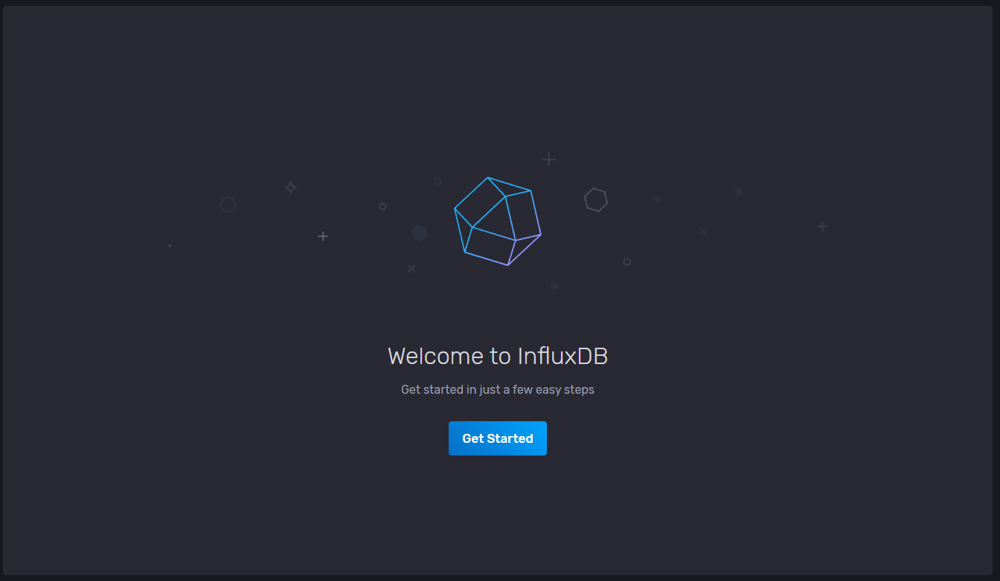

```
[root@ src]# rpm -ivh influxdb2-2.0.4.x86_64.rpm 
准备中...                          ################################# [100%]
正在升级/安装...
   1:influxdb2-0:2.0.4-1              ################################# [100%]
Created symlink from /etc/systemd/system/influxd.service to /usr/lib/systemd/system/influxdb.service.
Created symlink from /etc/systemd/system/multi-user.target.wants/influxdb.service to /usr/lib/systemd/system/influxdb.service.

```


```
查看安装程序
rpm -qa | grep influxdb
卸载
rpm -e
```


```
systemctl start influxdb
systemctl enable influxdb 
systemctl status influxdb


influxd          influxdb服务器 启动
influx           influxdb命令行客户端
influx_inspect   查看工具
influx_stress    压力测试工具
influx_tsm       数据库转换工具（将数据库从b1或bz1格式转换为tsm1格式）
```

* TCP端口`8086`用作InfluxDB的客户端和服务端的http api通信
* TCP端口`8088`给备份和恢复数据的RPC服务使用


##### influx客户端

influx2-2.1.1客户端从influxdb的安装包中分离了，需要单独下载安装。

```
[root@localhost src]# rpm -ivh influxdb2-client-2.2.1.x86_64.rpm 
warning: influxdb2-client-2.2.1.x86_64.rpm: Header V4 RSA/SHA256 Signature, key ID 2582e0c5: NOKEY
Preparing...                          ################################# [100%]
Updating / installing...
   1:influxdb2-cli-0:2.2.1-1          ################################# [100%]

```


http://localhost:8086/docs

#### 初始化配置

##### 1.命令行模式

```
[root@iot169 src]# influx setup
#如果web方已经配置则提示
Error: instance at "http://localhost:8086" has already been setup
See 'influx setup -h' for help

[root@iot169 src]# influx setup
	Welcome to InfluxDB 2.0!
	Please type your primary username: xxxx
	Please type your password:
	Please type your password again:
	Please type your primary organization name: xxxxx
	Please type your primary bucket name: xxxxx
	Please type your retention period in hours.Or press ENTER for infinite:
	You have entered:
  	Username:          xxxx
  	Organization:      xxxx
  	Bucket:            xxxx
  	Retention Period:  infinite
	Confirm? (y/n): y
```


##### 2.web界面模式

http://127.0.0.1:8086/ 如果无法访问请检查Selinux和防火墙是否关闭

初始化用户名密码




InfluxDB OSS 是什么
InfluxDB OSS 是 InfluxDB Open Source 的缩写。相对的，还有一个 Cloud 版本。