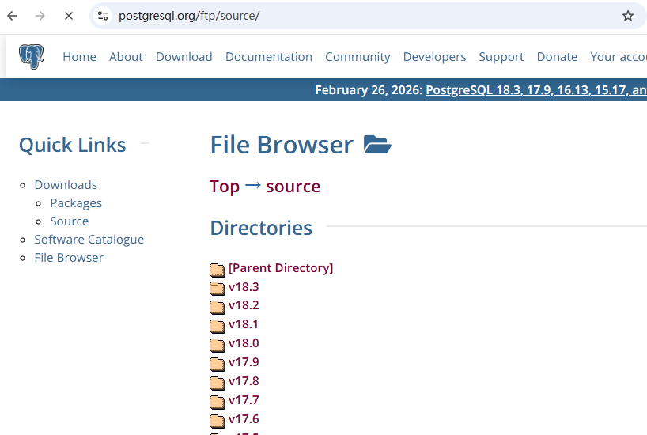
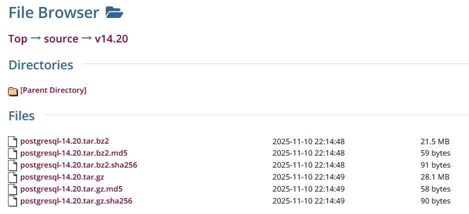

### PostgreSQL
PostgreSQL（简称PgSQL）是由加州大学伯克利分校开发的对象-关系型数据库管理系统，起源于1986年伯克利分校POSTGRES 4.2项目，基于该版本开发形成现有系统。支持SQL和JSON数据格式，广泛应用于Web、移动及地理空间数据分析领域。其具有事务完整性、多版本并发控制（MVCC）及ACID特性，可通过自定义数据类型、函数和插件架构实现功能扩展。
系统核心技术包括客户端-服务器架构、进程与共享内存管理机制，以及基于WAL的预写日志技术保障数据可靠性。PostgreSQL提供PostGIS扩展支持地理空间数据处理，通过并行查询和多种索引类型（B-Tree、GiST、GIN等）优化复杂查询性能。
类型：关系型数据库管理系统（RDBMS）

特点：
* 高级特性：支持大部分的SQL标准，并提供了很多其他现代特性，如复杂查询、外键、触发器、视图、事务完整性、多版本并发控制等高级特性
* 扩展性强：支持多种扩展，如全文搜索、地理空间数据处理等。
* 可定制性：高度可定制，支持用户自定义数据类型和函数。
* ACID事务支持：强一致性和事务支持。
* 开源：社区活跃，文档丰富。

适用场景：
* 复杂查询：需要执行复杂查询和分析的场景。
* 大数据量：适合处理大规模数据集。如物联网和大数据场景
* 企业级应用：需要高可靠性和一致性的企业级应用。适用于金融系统，可以确保数据的一致性和完整性
* 地理信息系统：支持地理空间数据处理，适合GIS应用。


### 安装包
本次安装版本为：postgresql-14.20.tar.gz
CentOS Linux release 7.9.2009 (Core)

```
下载地址：
linux 
https://www.postgresql.org/ftp/source/

window
https://www.enterprisedb.com/downloads/postgres-postgresql-downloads
```


安装文件说明：


* postgresql-14.20.tar.gz：源代码安装包，可用于手动编译和安装。
* postgresql-14.20.tar.gz.md5：用于验证下载文件的完整性，可以使用md5sum工具验证文件的md5值
* postgresql-14.20.tar.gz.sha256：用于验证下载文件的完整性，可以使用sha256sum工具验证文件的SHA-256值


### 安装过程


```
# 安装文件目录 /usr/local/src/postgresql-14.20.tar.gz
[root@localhost src]# tar -zxvf postgresql-14.20.tar.gz
[root@localhost src]# cd postgresql-14.20

# 安装依赖包
[root@localhost src]# yum install -y readline-devel
[root@localhost src]# 
[root@localhost src]# 
[root@localhost src]# 
```
可选依赖包

* perl-ExtUtils-Embed：这个包用于嵌入Perl代码到C程序中。在PostgreSQL中，它可能被用于某些与Perl相关的扩展或自定义脚本功能。
* readline-devel：这是readline库的开发版本，提供了命令行编辑和历史记录的功能。对于PostgreSQL，它使得使用交互式命令行工具（如psql）更加方便。
* zlib-devel：这是zlib压缩库的开发版本，用于数据压缩和解压缩。在PostgreSQL中，它用于优化数据存储和传输。
* pam-devel：这是Pluggable Authentication Modules（PAM）的开发包，用于集成多种认证技术。在PostgreSQL中，PAM可以用于用户认证。
* libxml2-devel：这是libxml2库的开发版本，它提供了XML的支持。在PostgreSQL中，它用于处理XML数据格式的功能。
* libxslt-devel：这是libxslt库的开发版本，用于XSLT转换。在PostgreSQL中，可能用于转换XML数据。
* openldap-devel：这是OpenLDAP的开发包，用于LDAP协议的支持。在PostgreSQL中，它可以用于集成LDAP-based的用户认证。
* python-devel：这是Python语言的开发包，可能用于支持Python编写的数据库脚本或扩展。
* gcc-c++：这是GNU C++编译器，用于编译C++代码。它可能用于编译PostgreSQL中的某些C++编写的部分或扩展。
* openssl-devel：这是OpenSSL库的开发版本，提供加密和SSL/TLS支持。在PostgreSQL中，它用于确保数据传输的安全性。
* cmake：这是一个跨平台的安装（构建）系统，用于控制软件编译和测试的过程。在某些PostgreSQL的扩展或自定义安装中可能会用到。


```
# 默认安装路径 /usr/local/pgsql
# 可以通过 --prefix=/指定路径
[root@localhost src]# ./configure
[root@localhost src]# 
# 如果报错 configure: error: readline library notfound
# 安装依赖
[root@localhost src]# yum install -y readline-devel
# 或者不安装
[root@localhost src]# ./configure --without-readline
[root@localhost src]# 
[root@localhost src]# make && make install
```


创建用户
```
[root@localhost src]# groupadd postgres
[root@localhost src]# useradd -g postgres postgres
[root@localhost src]# id postgres
    uid=1000(postgres) gid=1000(postgres) groups=1000(postgres)

```

创建数据目录
```
[root@localhost src]# cd /usr/local/pgsql
[root@localhost src]# mkdir data
[root@localhost src]# chown postgres:postgres data
```

配置环境变量
```
[root@localhost src]# cd /home/postgres
[root@localhost src]# ls -la
    drwx------. 2 postgres postgres   103 Apr 24 02:02 .
    drwxr-xr-x. 3 root     root        22 Apr 23 23:23 ..
    -rw-r--r--. 1 postgres postgres    18 Mar 31  2020 .bash_logout
    -rw-r--r--. 1 postgres postgres   299 Apr 24 01:59 .bash_profile
    -rw-r--r--. 1 root     root     12288 Apr 23 23:35 .bash_profile.swp
    -rw-r--r--. 1 postgres postgres   231 Mar 31  2020 .bashrc
    -rw-------. 1 postgres postgres   717 Apr 24 02:02 .viminfo
[root@localhost src]# vim .bash_profile
    export PATH
    export PGHOME=/usr/local/pgsql
    export PGDATA=/usr/local/pgsql/data
    export PATH=$PATH:/usr/local/pgsql/bin
[root@localhost src]# source .bash_profile
```

initdb初使化
```
#切换用户
[root@localhost src]# su postgres
[root@localhost src]# initdb
[root@localhost src]# cd /usr/local/pgsql/data
[root@localhost src]# ll
    drwx------. 5 postgres postgres    41 Apr 24 02:00 base
    drwx------. 2 postgres postgres  4096 Apr 24 02:17 global
    drwx------. 2 postgres postgres     6 Apr 24 02:00 pg_commit_ts
    drwx------. 2 postgres postgres     6 Apr 24 02:00 pg_dynshmem
    -rw-------. 1 postgres postgres  4822 Apr 24 02:02 pg_hba.conf
    -rw-------. 1 postgres postgres  1636 Apr 24 02:00 pg_ident.conf
    drwx------. 4 postgres postgres    68 Apr 24 02:22 pg_logical
    drwx------. 4 postgres postgres    36 Apr 24 02:00 pg_multixact
    drwx------. 2 postgres postgres     6 Apr 24 02:00 pg_notify
    drwx------. 2 postgres postgres     6 Apr 24 02:00 pg_replslot
    drwx------. 2 postgres postgres     6 Apr 24 02:00 pg_serial
    drwx------. 2 postgres postgres     6 Apr 24 02:00 pg_snapshots
    drwx------. 2 postgres postgres     6 Apr 24 02:17 pg_stat
    drwx------. 2 postgres postgres    63 Apr 24 03:41 pg_stat_tmp
    drwx------. 2 postgres postgres    18 Apr 24 02:00 pg_subtrans
    drwx------. 2 postgres postgres     6 Apr 24 02:00 pg_tblspc
    drwx------. 2 postgres postgres     6 Apr 24 02:00 pg_twophase
    -rw-------. 1 postgres postgres     3 Apr 24 02:00 PG_VERSION
    drwx------. 3 postgres postgres    60 Apr 24 02:00 pg_wal
    drwx------. 2 postgres postgres    18 Apr 24 02:00 pg_xact
    -rw-------. 1 postgres postgres    88 Apr 24 02:00 postgresql.auto.conf
    -rw-------. 1 postgres postgres 28793 Apr 24 02:16 postgresql.conf
    -rw-------. 1 postgres postgres    59 Apr 24 02:17 postmaster.opts
    -rw-------. 1 postgres postgres    80 Apr 24 02:17 postmaster.pid
    -rw-rw-r--. 1 postgres postgres  1718 Apr 24 02:19 serverlog
[root@localhost src]# 

```


配置参数
```
[root@localhost src]# cd /usr/local/pgsql/data
[root@localhost src]# vim postgresql.conf
    listen_addresses = '*'
    port = 5432
[root@localhost src]# vim pg_hba.conf 
    local   replication     all                                     trust
    host    replication     all             127.0.0.1/32            trust
    host    replication     all             ::1/128                 trust
    host    all             all             0.0.0.0/0               trust
[root@localhost src]# 
[root@localhost src]# 
```


开机自启
PostgreSQL的开机自启动脚本位于PostgreSQL源码目录的contrib/start-scripts路径下。linux文件即为linux系统上的启动脚本。需切换为root用户。
```
[root@localhost src]# cd /usr/local/src/postgresql-14.20/contrib/start-scripts
[root@localhost src]# cp linux /etc/init.d/postgresql
[root@localhost src]# chmod +x /etc/init.d/postgresql
[root@localhost src]# vim  /etc/init.d/postgresql 

[root@localhost src]# 
[root@localhost src]# service postgresql start
    Starting PostgreSQL: ok
[root@localhost src]# systemctl status firewalld
[root@localhost src]# systemctl stop firewalld
[root@localhost src]# systemctl disable firewalld
```


### pgsql模式
SCHEMA是一个表的集合，一个模式可以包含视图、索引、数据类型、函数和操作符等，相同的对象名称可以被用于不同的模式而不会冲突。
* 允许多个用户使用一个数据库且不会干扰
* 将数据库对象组织成逻辑组以便管理
* 第三方应用的对象可以放在独立的模式中，不会与其他对象的名称发生冲突。
```
CREATE SCHEMA myschema (

);


DROP SCHEMA myschema;


DROP SCHEMA myschema CASCADE;
```


### pgAdmin
pgAdmin 是一个开源的 PostgreSQL 数据库管理工具，提供了图形化的界面来简化数据库的管理与操作。

pgAdmin 是 PostgreSQL 官方推荐的管理工具，支持从简单的查询到复杂的数据库管理任务，适合开发者和数据库管理员使用。

主要功能
数据库管理：支持创建、修改和删除数据库、表、视图、索引等。
SQL 查询：内置 SQL 查询编辑器，支持代码高亮、自动补全和查询历史。
数据导入与导出：支持 CSV、Excel、SQL 等多种格式的数据导入导出。
备份与恢复：提供数据库的备份和恢复工具，支持全量和增量备份。
可视化设计：支持 ER 图的可视化展示，帮助理解数据库结构。
多版本支持：支持 PostgreSQL 的多个版本。
远程连接：支持对远程数据库进行管理，方便跨区域的数据库维护。


pgAdmin 官方网站：https://www.pgadmin.org/。
pgAdmin Github 源码地址：https://github.com/pgadmin-org/。
pgAdmin 4 是对 pgAdmin 的完全重写，基于 Python、ReactJS 和 JavaScript 构建。
pgAdmin 4支持两种运行模式：
桌面模式：通过 Electron 打包，可独立运行，适合个人使用。
Web 模式：可部署在 Web 服务器上，支持多用户通过浏览器访问。


pgsql帮助手册
https://www.runoob.com/postgresql/postgresql-syntax.html