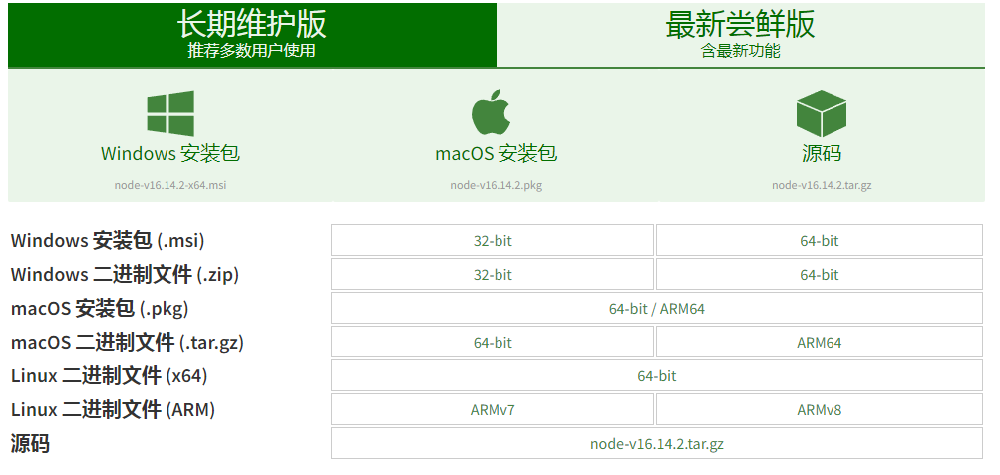

# 编译大概需要半小时左右

1. 下载安装包
    以下两个地址都可以下载
    * [https://npm.taobao.org/mirrors/node/](https://npm.taobao.org/mirrors/node/)
    * [https://nodejs.org/zh-cn/download/](https://nodejs.org/zh-cn/download/)

    
    
2. 解压
tar -xvf node-v11.0.0.tar.gz

3. 安装gcc
  如果之前安装过的就不需要在安装了，  
  yum install gcc gcc-c++

4. 编译安装
    
    ```
    cd node-v11.0.0
    ./configure
    make && make install
    node -v
    ```
    
    
    
5. 安装成功


6. 

1. 修改地址
    npm config set registry https://registry.npm.taobao.org


6. // 配置后可通过下面方式来验证是否成功
    npm config get registry
    // 或
    npm info express


### 二进制包安装配置

```
tar -xvf node-v11.0.0-linux-x64.tar.xz
cd /usr/local/nodejs

vim  /etc/profile
	export PATH=$PATH:/usr/local/nodejs/bin
source /etc/profile

方式二：软链接方式（推荐）
ln -s /usr/local/nodejs/bin/npm /usr/local/bin/
ln -s /usr/local/nodejs/bin/node /usr/local/bin/

node -v
npm -v
```

