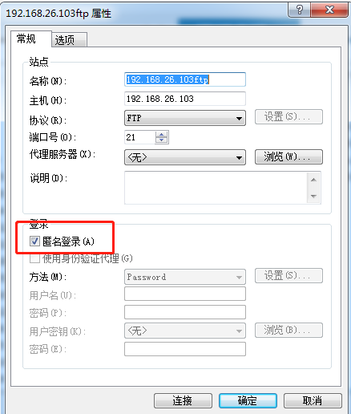

### 安装源
    vsftpd-3.0.2-25.el7.x86_64.rpm
    http://mirror.centos.org/centos/7/os/x86_64/Packages/vsftpd-3.0.2-25.el7.x86_64.rpm
```
   #检查是否已经安装了vsftp
    [root@localhost ~]# rpm -qa | grep vsftpd
    #上面查询有结果，则删除上面的结果
    [root@localhost ~]# rpm -e vsftpd
```
关闭防火墙或放开21端口

### 安装配置
1. 安装ftp
```
    [root@localhost ~]# rpm -ivh vsftpd-3.0.2-25.el7.x86_64.rpm
        警告：vsftpd-3.0.2-25.el7.x86_64.rpm: 头V3 RSA/SHA256 Signature, 密钥 ID f4a80eb5: NOKEY
        准备中...                          ################################# [100%]
        正在升级/安装...
        1:vsftpd-3.0.2-25.el7              ################################# [100%]
    #检查是否安装成功
    [root@localhost ~]# rpm -qa | grep vsftpd
        vsftpd-3.0.2-25.el7.x86_64
    #开机启动    
    [root@localhost ~]# chkconfig vsftpd on
```

2. 添加ftp用户
```
    #添加用户组
    [root@localhost ~]# groupadd ftp
    [root@localhost ~]# mkdir -p /var/www/ftp
    #表示不能让用户登录系统，只能登录ftp  。如果多用户，则添加多个用户
    [root@localhost ~]# useradd -d /var/www/ftp -g ftp -s /sbin/nologin ftpuser
    [root@localhost ~]# passwd ftpuser
    [root@localhost ~]# chown ftpuser:ftp /var/www/ftp

    groupadd
    groupdel
    useradd 添加用户属性
    usermod 修改用户属性
    userdel 删除用户 

```
为了测试ftp是否可用，目前什么配置都不配，启动vsftp可以匿名登录
```
    #启动vsftp
    [root@localhost src]# service vsftpd start
        Redirecting to /bin/systemctl start  vsftpd.service
    #查看是否启动成功
    [root@localhost ~]# ps aux|grep vsftpd
        root      15322  0.0  0.0  53260   572 ?        Ss   19:58   0:00 /usr/sbin/vsftpd /etc/sftpd/vsftpd.conf
    #查看21端口
    [root@localhost ~]#  netstat -nltp | grep 21
```
匿名登录成功
    

2. 配置ftp
```
    #配置
    [root@localhost ~]# vim /etc/vsftpd/vsftpd.conf
        #禁止匿名登录 设置为NO代表不允许匿名
        anonymous_enable=NO
        #限制防问 所有用户限制在主目录
        chroot_local_user=YES
        #加上这行解决了无法登陆的问题
        allow_writeable_chroot=YES
    [root@localhost ~]# service vsftpd restar
        Redirecting to /bin/systemctl restart  vsftpd.service
    #安装ftp客户端测试 
    [root@localhost ~]# yum install ftp -y
    [root@localhost ~]# ftp 127.0.0.1 
        Connected to 127.0.0.1 (127.0.0.1).
        220 (vsFTPd 3.0.2)
        Name (127.0.0.1:root): ftpuser
        331 Please specify the password.
        Password:
        230 Login successful.
        Remote system type is UNIX.
        Using binary mode to transfer files.
        ftp> 
    #以上登录成功，可以用ftp客户端测试了
    [root@localhost ~]# 

```

### 常用命令
```

    #启动
    service vsftpd start

    #停止
    service vsftpd stop

    #重启
    service vsftpd restart

    #设置开机自启动
    chkconfig vsftpd on

    #关闭防火墙
    systemctl stop firewalld

    #开机禁用
    systemctl disable firewalld
```

### 常用配置
```
    [root@localhost]# vim /etc/vsftpd/vsftpd.conf 

    #默认的根目录为
    #local_root=/var/ftp

    #设置为NO代表不允许匿名
    anonymous_enable=NO
    
    #设定本地用户可以访问，主要是虚拟宿主用户，如果设为NO那么所欲虚拟用户将无法访问。
    local_enable=YES
    
    #可以进行写的操作
    write_enable=YES
    
    #设定上传文件的权限掩码
    local_umask=022
    
    #禁止匿名用户上传
    anon_upload_enable=NO
    
    #禁止匿名用户建立目录
    anon_mkdir_write_enable=NO
    
    # 设定开启目录标语功能
    dirmessage_enable=YES
    
    # 设定开启日志记录功能
    xferlog_enable=YES
    
    #设定端口20进行数据连接
    connect_from_port_20=YES
    
    #设定禁止上传文件更改宿主
    chown_uploads=NO
    
    #设定vsftpd服务日志保存路劲。注意：改文件默认不纯在，需手动touch，且由于这里更改了vsftpd服务的宿主用户为手动建立的vsftpd，则必
    须注意给予该用户对日志的读取权限否则服务启动失败。
    xferlog_file=/var/log/vsftpd.log      //这个文件在后面步骤中会提及
    
    #设定日志使用标准的记录格式
    xferlog_std_format=YES
    
    #设定空闲链接超时时间，这里使用默认/秒。
    #idle_session_timeout=600
    
    #设定最大连接传输时间，这里使用默认，将具体数值留给每个用户具体制定，默认120/秒
    data_connection_timeout=3600
    
    #设定支撑vsftpd服务的宿主用户为手动建立的vsftpd用户。注意：一旦更改宿主用户，需一起与该服务相关的读写文件的读写赋权问题.
    nopriv_user=vsftpd
    
    #设定支持异步传输的功能
    #async_abor_enable=YES
    
    #设置vsftpd的登陆标语
    ftpd_banner=hello 欢迎登陆
    
    #是否将所有用户限制在主目录,YES为启用 NO禁用.(该项默认值是NO,即在安装vsftpd后不做配置的话，ftp用户是可以向上切换到要目录之外的)
    chroot_local_user=NO //如果设置成YE会导致你用java代码创建文件夹时失败，因为他被限制在了宿主目录


    #禁止用户登出自己的ftp主目录
    chroot_list_enable=NO
    
    #禁止用户登陆ftp后使用ls -R 命令。该命令会对服务器性能造成巨大开销，如果该项运行当多个用户使用该命令会对服务器造成威胁。
    ls_recurse_enable=NO
    
    #设定vsftpd服务工作在standalone模式下。所谓standalone模式就是该服务拥有自己的守护进程，在ps -A可以看出vsftpd的守护进程名。如果
    不想工作在standalone模式下，可以选择SuperDaemon模式，注释掉即可，在该模式下vsftpd将没有自己的守护进程，而是由超级守护进程Xinetd全权代理，>与此同时，vsftpd服务的许多功能，将得不到实现。
    listen=YES
    
    #设定userlist_file中的用户将不能使用ftp
    userlist_enable=YES
    
    
    #设定pam服务下的vsftpd验证配置文件名。因此，PAM验证将参考/etc/pam.d/下的vsftpd文件配置。
    pam_service_name=vsftpd
    
    #设定支持TCPwrappers
    tcp_wrappers=YES
    
    #################################################以下是关于虚拟用户支持的重要配置项目，默认.conf配置文件中是不包含这些项目的，需手动添加。
    #启用虚拟用户功能
    guest_enable=YES
    
    #指定虚拟的宿主用户    
    guest_username=virtusers    //virtusers就是我们上面创建的系统用户，作为我们的虚拟用户组使用
    #设定虚拟用户的权限符合他们的宿主用户 
    virtual_use_local_privs=YES 

    #设定虚拟用户个人vsftp的配置文件存放路劲。这个被指定的目录里，将被存放每个虚拟用户个性的配置文件，注意的地方是：配置文件名必须 和虚拟用户名相同。 
    user_config_dir=/etc/vsftpd/vconf           //这是个目录，是为每一个虚拟用户配置单独的权限使用，这里我们主要配置每个用户的单独根目录 

    #开启每个虚拟用户有独立的根目录
    chroot_local_user=YES

    #禁止反向域名解析，若是没有添加这个参数可能会出现用户登陆较慢，或则客户链接不上ftp的现象
    reverse_lookup_enable=NO

    /etc/vsftpd/vsftpd.conf //主配置文件，核心配置文件

    /etc/vsftpd/ftpusers //黑名单，这个里面的用户不允许访问FTP服务器

    /etc/vsftpd/user_list //白名单，允许访问FTP服务器的用户列表


    #多用户
    chroot_list_file=/etc/vsftpd/chroot_list
    /etc/vsftpd下建立chroot_list文件，内容为用户列表，每个用户一行
　　ftpuser1
　　ftpuser2

```


### 常见错误 
```
error 553 could not create file
	getsebool -a|grep ftp
	关闭selinux
	getenforce
	setenforce 0 监时关闭
	永久关闭
	vim /etc/selinux/config
	SELINUX=disabled
    reboot

    不关闭selinux方法	
    getsebool -a|grep ftp
    setsebool -P ftpd_full_access on
    setsebool -P tftp_anon_write on
    setsebool -P sftpd_anon_write on

    setsebool -P ftp_home_dir on
    setenforce 0


500 OOPS: vsftpd: refusing to run with writable root inside chroot()
    Login failed.
    allow_writeable_chroot=YES

550 Remove directory operation failed.
    汉字乱码，删除文件不存在

530 Login incorrect.
    Login failed.
    密码不对，核识密码或直接改密码

ftp连接太慢
    reverse_lookup_enable=NO

230 Login successful.
    Remote system type is UNIX.
    Using binary mode to transfer files.


ftp: connect :连接被拒绝
    服务没启动

500 OOPS: cannot open user list file
    不存在文件“/etc/vsftpd.user_list”或文件中不存在该帐户

530 Permission denied. Login failed.
    /etc/vsftpd.user_list 文件中不存在当前登陆用户

500 OOPS: cannot open chroot() user list file Login failed.
    不存在文件“/etc/vsftpd.chroot_list”

500 OOPS: missing value in config file
    Connection closed by remote host.
    =等号前值有问题，或只有一个空格

500 OOPS: bad bool value in config file
    Connection closed by remote host.
    =等号后值有问题
    
500 OOPS: unrecognised variable in config file
    Connection closed by remote host.
    参数前有空格

确认存在“local_enable=YES”，但本地用户无法登陆
    添加“pam_service_name=vsftpd”


500 OOPS: chdir
500 OOPS: child died
    Connection closed by remote host.
    用户主目录没有权限或没有主目录    
```

