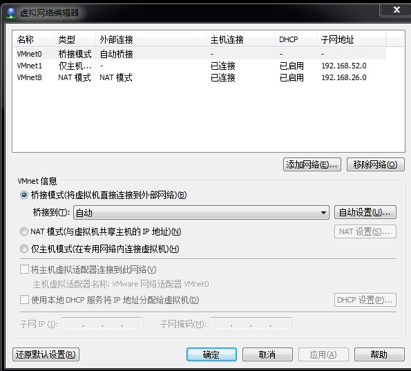
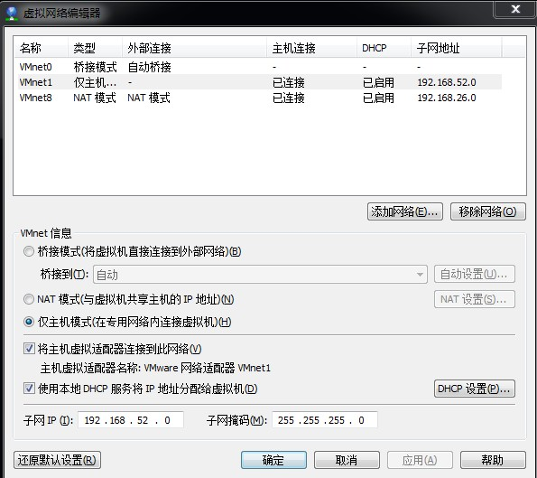
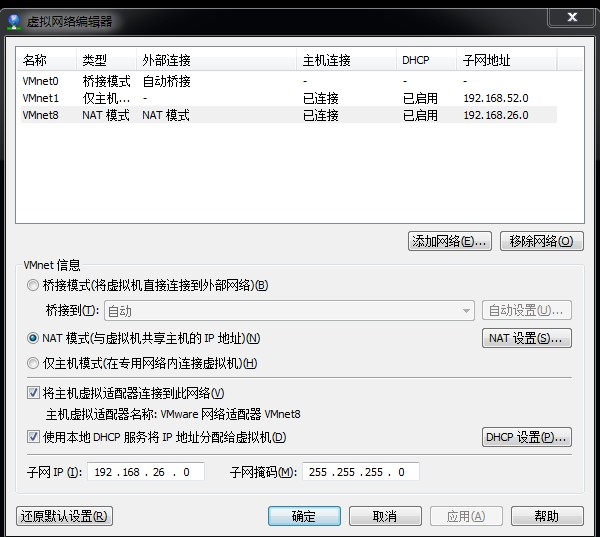
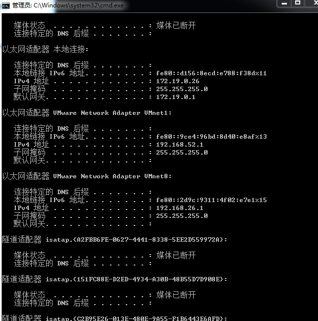
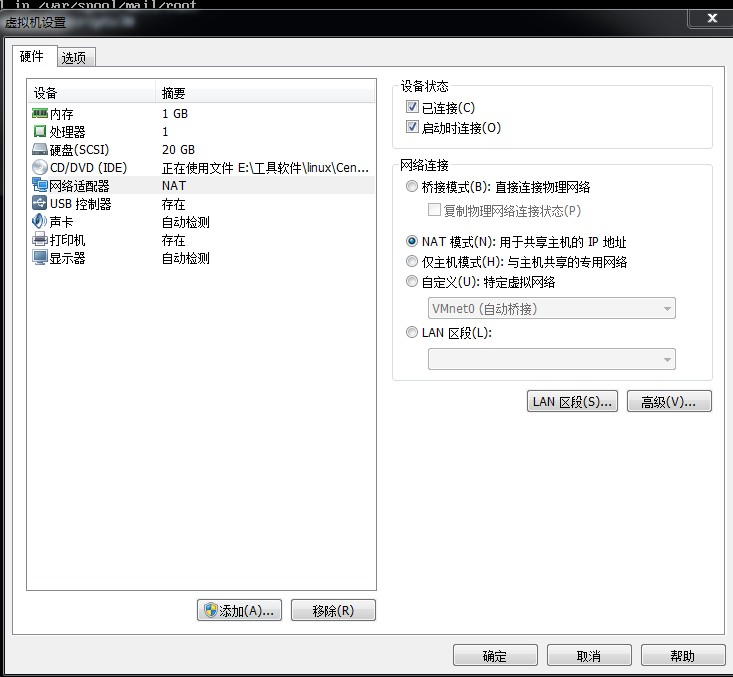
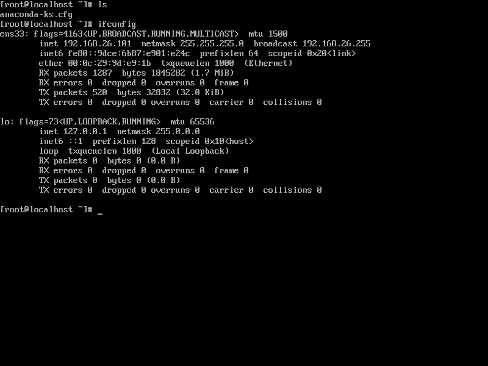

http://www.xitongcheng.com/jiaocheng/xtazjc_article_38955.html

### VMware安装虚机ip配置

```

虚拟机配置IP
TYPE=Ethernet
BOOTPROTO=static
DEFROUTE=yes
PEERDNS=yes
PEERROUTES=yes
IPV4_FAILURE_FATAL=no
IPV6INIT=yes
IPV6_AUTOCONF=yes
IPV6_DEFROUTE=yes
IPV6_PEERDNS=yes
IPV6_PEERROUTES=yes
IPV6_FAILURE_FATAL=no
NAME=eno16777736
UUID=350b77f6-5d40-4fa1-950c-33c962230f11
DEVICE=eno16777736
ONBOOT=yes
IPADDR=192.168.26.103
NETMASK=255.255.255.0
GATEWAY=192.168.26.2
DNS1=192.168.26.2
```






