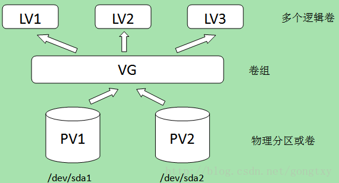

//TODO 增加分区容量移除

* 物理卷（Physical Volume,PV）：就是指硬盘分区，也可以是整个硬盘或已创建的软RAID，是LVM的基本存储设备。
* 卷组（Volume Group,VG）：是由一个或多个物理卷所组成的存储池，在卷组上能创建一个或多个逻辑卷。
* 逻辑卷（Logical Volume,LV）：类似于非LVM系统中的硬盘分区，它建立在卷组之上，是一个标准的块设备，在逻辑卷之上可以建立文件系统。


## 常用命令
* lsblk：查看block device,也就是逻辑磁盘大小。
* df -h：查看file system, 也就是文件系统层的磁盘大小。
* fdisk -l：
* fdisk /dev/sdb：格式化磁盘。


## 新增硬盘扩容centos-root
1. 挂载新硬盘
    ```
    #查看新挂硬盘 假设这里是sde
    [root@localhost ~]# fdisk -l
    ```
    
2. 分区硬盘
    ```
    #如果硬盘超过3TB则使用parted格式化操作
    [root@localhost ~]# fdisk /dev/sde
	    n --创建新分区
        p --创建主分区
        <回车> --默认分区编号
        <回车> --默认起始扇区位置。
        <回车> --默认结束扇区位置。
        w --写入分区表        
	```

3. 创建pv	
    ```
    [root@localhost ~]# pvcreate /dev/sde1
        Physical volume "/dev/sde1" successfully created.
    ```

3. 扩展centos vg
    ```
    #查看vg
    [root@localhost ~]# vgs
        VG        #PV #LV #SN Attr   VSize   VFree   
        centos      1   2   0 wz--n- <24.70g  204.00m
    #扩展vg
    [root@localhost ~]# vgextend centos /dev/sde1
        Volume group "centos" successfully extended  
    #查看vg  
    [root@localhost ~]# vgs
        VG        #PV #LV #SN Attr   VSize  VFree   
        centos      2   2   0 wz--n- 19.70g    4.00m
    #centos pv数由扩展前1个变到2个
    #vgcreate 创建  vgremove删除
    ```

4. 扩展centos lv
    ```
    #查看lv信息 lvs 或lvdisplay
    root@localhost ~]# lvs
        LV    VG        Attr       LSize   Pool Origin Data%  Meta%  Move Log Cpy%Sync Convert
        root  centos    -wi-ao----  14.11g                                                    
        swap  centos    -wi-ao---- <10.39g                                                    
    #扩展lv
    [root@localhost ~]# lvextend -L +4.8G /dev/mapper/centos-root 
        Rounding size to boundary between physical extents: 4.80 GiB.
        Size of logical volume centos/root changed from 9.31 GiB (2384 extents) to 14.11 GiB (3613 extents).
        Logical volume centos/root successfully resized.
    #系统重新读取大小
    [root@localhost ~]# xfs_growfs /dev/mapper/centos-root  
    ```

5. 扩容完成
    ```
    #查看扩容后容量
    [root@localhost ~]# df -h
        Filesystem                   Size  Used Avail Use% Mounted on
        /dev/mapper/centos-root       15G  1.8G   13G  13% /
        devtmpfs                     476M     0  476M   0% /dev
        tmpfs                        488M     0  488M   0% /dev/shm
    ```
6. 常见问题
    可能是vgextend未执行，直接执行lvextend，或者lvextend扩展的大小大于实际硬盘大小。
    Insufficient free space: extents needed, but only 1 available

## home分区转移至centos-root分区
操作前最好备份home分区的文件
1. 卸载centos-home分区
    ```
    #卸载home分区
    [root@localhost ~]# umount /home
    #如果报错device is busy,
    [root@localhost ~]# fuser -m /home
        /home: 10278c 10279c 10280c     
    命令：kill -9 pid
    #或者 强行解除挂载
    [root@localhost ~]# fuser -m /home
    [root@localhost ~]# fuser -kvm /home 
    [root@localhost ~]# umount -l /home 
    ```

2. 从新设定centos-home的大小
    ```
    [root@localhost ~]# resize2fs -p /dev/mapper/centos-home 50G
    # e2fsck是检查ext2、ext3、ext4等文件系统的正确性
    [root@localhost ~]# e2fsck -f /dev/mapper/centos-home 
    #检查是否成功
    [root@localhost ~]# mount /home
    [root@localhost ~]# df -h

    ```
3. 将home逻辑分区减小到指定大小
    ```
    [root@localhost ~]# lvreduce -L 50G /dev/mapper/centos-home 
    ```
4. 增加centos-root分区的大小
    ```
    #将可用的空间添加到centos-root分区上面
    [root@localhost ~]# lvextend -L +5G /dev/mapper/centos-root 
    #从新设定该分区的大小
    [root@localhost ~]# resize2fs -p /dev/mapper/centos-root
    ``
5. 完成操作
    [root@localhost ~]# df -h
