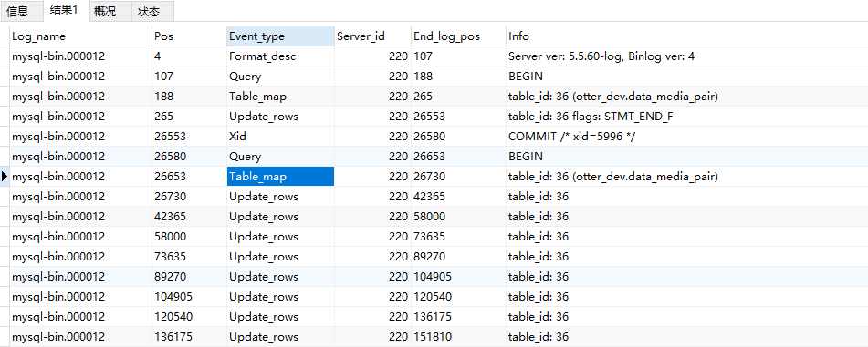

binlog是二进制文件，普通文件查看器cat、more、vi等都无法打开，必须使用自带的mysqlbinlog命令查看。    
在MySQL5.5以下版本使用mysqlbinlog命令时如果报错，就加上 “--no-defaults”选项。   
### mysqlbinlog查看

    # /usr/local/mysql/bin/mysqlbinlog /usr/local/mysql/data/mysql-bin.00003
    #截取日志内容
    '/*!*/;
    # at 2716447
    #180723 12:29:05 server id 220  end_log_pos 2716569 CRC32 0xdac8cdf7 	Table_map: `suc_user`.`user_student_ext` mapped to number 3295
    # at 2716569
    #180723 12:29:05 server id 220  end_log_pos 2724482 CRC32 0xd4e467c5 	Write_rows: table id 3295 flags: STMT_END_F
    BINLOG '
    kVlVWxPcAAAAegAAAJlzKQAAAN8MAAAAAAEACHN1Y191c2VyABB1c2VyX3N0dWRlbnRfZXh0ABUI……
* server id 220     数据库主机的服务号；
* end_log_pos 2716569 pos点
* thread_id=11    线程号

### show bing命令
使用mysqlbinlog读出的binlog日志全文内容较多，不容易分辨查看post点信息，使用show binlog命令查看。

    show binlog events [IN 'log_name'] [FROM pos] [LIMIT [offset,] row_count];
    选项解析：
    IN 'log_name'   指定要查询的binlog文件名(不指定就是第一个binlog文件)
    FROM pos        指定从哪个pos起始点开始查起(不指定就是从整个文件首个pos点开始算)
    LIMIT [offset,] 偏移量(不指定就是0)
    row_count       查询总条数(不指定就是所有行)

    show master logs;
    show binlog events IN 'mysql-bin.000003' 
查看指定日志文件，结果如下图     
 

字段说明：
* Log_name: 查询的binlog日志文件名
* Pos: pos起始点
* Event_type: 事件类型：Update_rows
* Server_id: 标识是由哪台服务器执行的
* End_log_pos: pos结束点:11308(即：下行的pos起始点)
* Info: 执行的sql语句

常用查询 
* 查询第一个(最早)的binlog日志：
    mysql> show binlog events; 

* 指定查询 mysql-bin.000021 这个文件：
    mysql> show binlog events in 'mysql-bin.000003';

* 指定查询 mysql-bin.000003 这个文件，从pos点:104开始查起，偏移2行，查询10条：
    mysql> show binlog events in 'mysql-bin.000003' from 104  limit 2,10;

### 日志字段说明
* Log_name:  查询的binlog日志文件名。
* Pos:  pos起始点。
* Event_type:  事件类型：Query。
* Server_id:  标识是由哪台服务器执行的。
* End_log_pos:   pos结束点:11308(即：下行的pos起始点)。
* Info:  执行的sql语句。