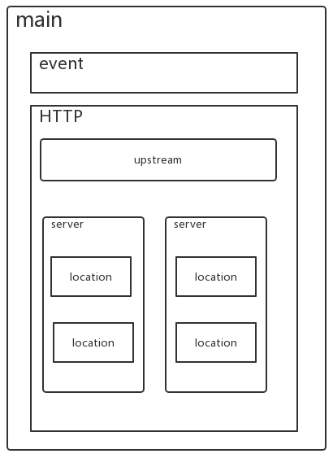

### conf目录
* nginx.conf：nginx基本配置文件
* mime.types：MIME类型关联的扩展文件
* fastcgi.conf：与fastcgi相关的配置文件
* proxy.conf：与proxy相关的配置
* sites.conf：配置nginx提供的网站，包括虚拟主机


```
    ...              #全局块
    events {         #events块
    ...
    }
    http      #http块
    {
        ...   #http全局块
        server        #server块
        { 
            ...       #server全局块
            location [PATTERN]   #location块
            {
                ...
            }
            location [PATTERN] 
            {
                ...
            }
        }
    }
```

1、全局块：配置影响nginx全局的指令。一般有运行nginx服务器的用户组，nginx进程pid存放路径，日志存放路径，配置文件引入，允许生成worker process数等。
2、events块：配置影响nginx服务器或与用户的网络连接。有每个进程的最大连接数，选取哪种事件驱动模型处理连接请求，是否允许同时接受多个网路连接，开启多个网络连接序列化等。
3、http块：可以嵌套多个server，配置代理，缓存，日志定义等绝大多数功能和第三方模块的配置。如文件引入，mime-type定义，日志自定义，是否使用sendfile传输文件，连接超时时间，单连接请求数等。
4、server块：配置虚拟主机的相关参数，一个http中可以有多个server。
5、location块：配置请求的路由，以及各种页面的处理情况。

* main：用于nginx全局信息的配置。
* events：用于nginx工作模式的配置。
* http：http协议信息的配置。
* server：用于服务器访问信息的配置。
* location：用于访问路由路径的配置。
* upstream：用于进行负载均衡的配置。

### main


### event


### http

### server

### location

### upstream