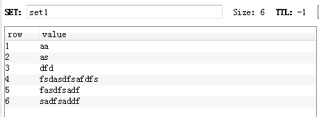
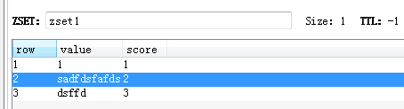

### String字符
string 是 redis 最基本的类型，可以包含任何数据。比如jpg图片或者序列化的对象。值最大能存储 512MB。


#### 常用命令
```
#设置指定 key 的值
set key value

#获取指定 key 的值。
get key

#删除key
del key

#设置key的过期时间 秒
expire key second

#查看剩余有效时间 -1永久不失效
ttl key 

#返回 key 中字符串值的子字符
getrange key start end

#将给定 key 的值设为 value ，并返回 key 的旧值(old value)。
getset key value

#对 key 所储存的字符串值，获取指定偏移量上的位(bit)。
getbit key offset

#获取所有(一个或多个)给定 key 的值。
mget key1 [key2..]

#对 key 所储存的字符串值，设置或清除指定偏移量上的位(bit)。
setbit key offset value

#将值 value 关联到 key ，并将 key 的过期时间设为 seconds (以秒为单位)。
setex key seconds value

#只有在 key 不存在时设置 key 的值。
setnx key value

#用 value 参数覆写给定 key 所储存的字符串值，从偏移量 offset 开始。
setrange key offset value

#返回 key 所储存的字符串值的长度。
strlen key

#同时设置一个或多个 key-value 对。
mset key value [key value ...]

#同时设置一个或多个 key-value 对，当且仅当所有给定 key 都不存在。
msetnx key value [key value ...]

#这个命令和 setex 命令相似，但它以毫秒为单位设置 key 的生存时间，而不是像 setex 命令那样，以秒为单位。
psetex key milliseconds value

#将 key 中储存的数字值增一。
incr key

#将 key 所储存的值加上给定的增量值（increment） 。
incrby key increment

#将 key 所储存的值加上给定的浮点增量值（increment） 。
incrbyfloat key increment

#将 key 中储存的数字值减一。
decr key

#key 所储存的值减去给定的减量值（decrement） 。
decrby key decrement

#如果 key 已经存在并且是一个字符串， append 命令将指定的 value 追加到该 key 原来值（value）的末尾。
append key value

```


### hash哈希
hash 是一个键值对集合。是一个string类型的field和value的映射表，hash特别适合用于存储对象。每个 hash 可以存储 232 - 1 键值对（40多亿）。

按添加顺序，key不允许重复。
Hash 是一个 string 类型的 fifield 和 value 的映射表，hash 特别适合用于存储对象，后续操作的时候，你可以直接仅仅修改这个对象中的某个字段的值。 比如我们可以Hash数据结构来存储用户信息，商品信息等等。

#### 常用命令
```
hget,hset,hgetall 

#删除key
del key

#删除一个或多个哈希表字段
hdel key field1 [field2]

#查看哈希表 key 中，指定的字段是否存在。
hexists key field

#获取存储在哈希表中指定字段的值。
hget key field

#获取在哈希表中指定 key 的所有字段和值
hgetall key

#为哈希表 key 中的指定字段的整数值加上增量 increment 。
hincrby key field increment

#为哈希表 key 中的指定字段的浮点数值加上增量 increment 。
hincrbyfloat key field increment

#获取所有哈希表中的字段
hkeys key

#获取哈希表中字段的数量
hlen key

#获取所有给定字段的值
hmget key field1 [field2]

#同时将多个 field-value (域-值)对设置到哈希表 key 中。
hmset key field1 value1 [field2 value2 ]

#将哈希表 key 中的字段 field 的值设为 value 。
hset key field value

#只有在字段 field 不存在时，设置哈希表字段的值。
hsetnx key field value

#获取哈希表中所有值。
hvals key

#迭代哈希表中的键值对。
hscan key cursor [match pattern] [count count]
```


### list列表
列表是简单的字符串列表，按照插入顺序排序。你可以添加一个元素导列表的头部（左边）或者尾部（右边）。一个列表最多可以包含 232 - 1 个元素 (4294967295, 每个列表超过40亿个元素)。

有序按添加顺序，允许重复。

list 就是链表，Redis list 的应用场景非常多，也是Redis最重要的数据结构之一，比如微博的关注列表，粉丝列表，消息列表等功能都可以用Redis的 list 结构来实现。Redis list 的实现为一个双向链表，即可以支持反向查找和遍历，更方便操作，不过带来了部分额外的内存开销。另外可以通过 lrange 命令，就是从某个元素开始读取多少个元素，可以基于 list 实现分页查询，这个很棒的一个功能，基于 redis 实现简单的高性能分页，可以做类似微博那种下拉不断分页的东西（一页一页的往下走），性能高。

#### 常用命令
```
 lpush,rpush,lpop,rpop,lrange


lindex key index
通过索引获取列表中的元素

linsert key before|after pivot value
在列表的元素前或者后插入元素

llen key
获取列表长度

lpop key
移出并获取列表的第一个元素

#将一个或多个值插入到列表头部
lpush key value1 [value2]

#将一个值插入到已存在的列表头部
lpushx key value

#获取列表指定范围内的元素
lrange key start stop

#移除列表元素
lrem key count value

#通过索引设置列表元素的值
lset key index value

#对一个列表进行修剪(trim)，就是说，让列表只保留指定区间内的元素，不在指定区间之内的元素都将被删除。
ltrim key start stop

#移除列表的最后一个元素，返回值为移除的元素。
rpop key

#移除列表的最后一个元素，并将该元素添加到另一个列表并返回
rpoplpush source destination

#在列表中添加一个或多个值
rpush key value1 [value2]

#为已存在的列表添加值
rpushx key value

blpop key1 [key2 ] timeout
移出并获取列表的第一个元素， 如果列表没有元素会阻塞列表直到等待超时或发现可弹出元素为止。

brpop key1 [key2 ] timeout
移出并获取列表的最后一个元素， 如果列表没有元素会阻塞列表直到等待超时或发现可弹出元素为止。

brpoplpush source destination timeout
从列表中弹出一个值，将弹出的元素插入到另外一个列表中并返回它； 如果列表没有元素会阻塞列表直到等待超时或发现可弹出元素为止。
```

### set集合
的Set是string类型的无序集合。集合成员是唯一的，这就意味着集合中不能出现重复的数据。集合是通过哈希表实现的，所以添加，删除，查找的复杂度都是O(1)。

不允许重复数据，无序。
set 对外提供的功能与list类似是一个列表的功能，特殊之处在于 set 是可以自动排重的。当你需要存储一个列表数据，又不希望出现重复数据时，set是一个很好的选择，并且set提供了判断某个成员是在一个set集合内的重要接口，这个也是list所不能提供的。可以基于 set 轻易实现交集、并集、差集的操作。比如：在微博应用中，可以将一个用户所有的关注人存在一个集合中，将其所有粉丝存在一个集合。Redi可以非常方便的实现如共同关注、共同粉丝、共同喜好等功能。sinterstore key1 key2 key3    //将交集存在key1中

set 是string类型的无序集合。集合是通过hashtable实现的，概念和数学中个的集合基本类似，可以交集，并集，差集等等，set中的元素是没有顺序的。所以添加，删除，查找的复杂度都是O(1)。


#### 常用命令
```
sadd,spop,smembers,sunion

#向集合添加一个或多个成员
sadd key member1 [member2]

#获取集合的成员数
scard key

#返回第一个集合与其他集合之间的差异。
sdiff key1 [key2]

#返回给定所有集合的差集并存储在 destination 中
sdiffstore destination key1 [key2]

#返回给定所有集合的交集
sinter key1 [key2]

#返回给定所有集合的交集并存储在 destination 中
sinterstore destination key1 [key2]

#判断 member 元素是否是集合 key 的成员
sismember key member

#返回集合中的所有成员
smembers key

#将 member 元素从 source 集合移动到 destination 集合
smove source destination member

#移除并返回集合中的一个随机元素
spop key

#返回集合中一个或多个随机数
srandmember key [count]

#移除集合中一个或多个成员
srem key member1 [member2]

#返回所有给定集合的并集
sunion key1 [key2]

#所有给定集合的并集存储在 destination 集合中
sunionstore destination key1 [key2]

#迭代集合中的元素
sscan key cursor [match pattern] [count count]
```


### zset集合
zset 和 set 一样也是string类型元素的集合,且不允许重复的成员。不同的是每个元素都会关联一个double类型的分数。redis正是通过分数来为集合中的成员进行从小到大的排序。zset的成员是唯一的,但分数(score)却可以重复。集合是通过哈希表实现的，所以添加，删除，查找的复杂度都是O(1)。 集合中最大的成员数为 232 - 1 (4294967295, 每个集合可存储40多亿个成员)。


和set相比，sorted set增加了一个权重参数score，使得集合中的元素能够按score进行有序排列。举例： 在直播系统中，实时排行信息包含直播间在线用户列表，各种礼物排行榜，弹幕消息（可以理解为按消息维度的消息排行榜）、时间顺序等信息，适合使用 Redis 中的 SortedSet 结构进行存储。
#### 常用命令
```
#向有序集合添加一个或多个成员，或者更新已存在成员的分数
zadd key score1 member1 [score2 member2]

#获取有序集合的成员数
zcard key

#计算在有序集合中指定区间分数的成员数
zcount key min max

#有序集合中对指定成员的分数加上增量 increment
zincrby key increment member

#计算给定的一个或多个有序集的交集并将结果集存储在新的有序集合 key 中
zinterstore destination numkeys key [key ...]

#在有序集合中计算指定字典区间内成员数量
zlexcount key min max

#通过索引区间返回有序集合指定区间内的成员
zrange key start stop [withscores]

#通过字典区间返回有序集合的成员
zrangebylex key min max [limit offset count]

#通过分数返回有序集合指定区间内的成员
zrangebyscore key min max [withscores] [limit]

#返回有序集合中指定成员的索引
zrank key member

#移除有序集合中的一个或多个成员
zrem key member [member ...]

#移除有序集合中给定的字典区间的所有成员
zremrangebylex key min max

#移除有序集合中给定的排名区间的所有成员
zremrangebyrank key start stop

#移除有序集合中给定的分数区间的所有成员
zremrangebyscore key min max

#返回有序集中指定区间内的成员，通过索引，分数从高到低
zrevrange key start stop [withscores]

#返回有序集中指定分数区间内的成员，分数从高到低排序
zrevrangebyscore key max min [withscores]

#返回有序集合中指定成员的排名，有序集成员按分数值递减(从大到小)排序
zrevrank key member

#返回有序集中，成员的分数值
zscore key member

#计算给定的一个或多个有序集的并集，并存储在新的 key 中
zunionstore destination numkeys key [key ...]

#迭代有序集合中的元素（包括元素成员和元素分值）
zscan key cursor [match pattern] [count count]
```


#### 数据结构

（1）String 字符串
int：8个字节的长整型。
embstr：小于等于44个字节的字符串。
raw：大于44个字节的字符串。
Redis会根据当前值的类型和长度决定使用哪种内部编码实现。

（2）Hash 哈希
ziplist(压缩列表)：当哈希类型元素个数小于hash-max-ziplist-entries 配置(默认512个)、同时所有值都小于hash-max-ziplist-value配置(默认64 字节)时，Redis会使用ziplist作为哈希的内部实现，ziplist使用更加紧凑的 结构实现多个元素的连续存储，所以在节省内存方面比hashtable更加优秀。
hashtable(哈希表)：当哈希类型无法满足ziplist的条件时，Redis会使 用hashtable作为哈希的内部实现，因为此时ziplist的读写效率会下降，而hashtable的读写时间复杂度为O(1)。

（3）list 列表
ziplist(压缩列表)：当列表的元素个数小于list-max-ziplist-entries配置 (默认512个)，同时列表中每个元素的值都小于list-max-ziplist-value配置时 (默认64字节)，Redis会选用ziplist来作为列表的内部实现来减少内存的使用。
linkedlist(链表)：当列表类型无法满足ziplist的条件时，Redis会使用 linkedlist作为列表的内部实现。quicklist ziplist和linkedlist的结合以ziplist为节点的链表(linkedlist)

（4）set 集合
intset(整数集合)：当集合中的元素都是整数且元素个数小于set-max- intset-entries配置(默认512个)时，Redis会选用intset来作为集合的内部实现，从而减少内存的使用。
hashtable(哈希表)：当集合类型无法满足intset的条件时，Redis会使用hashtable作为集合的内部实现。

（5）zset 有序集合
ziplist(压缩列表)：当有序集合的元素个数小于zset-max-ziplist- entries配置(默认128个)，同时每个元素的值都小于zset-max-ziplist-value配 置(默认64字节)时，Redis会用ziplist来作为有序集合的内部实现，ziplist 可以有效减少内存的使用。
skiplist(跳跃表)：当ziplist条件不满足时，有序集合会使用skiplist作 为内部实现，因为此时ziplist的读写效率会下降。