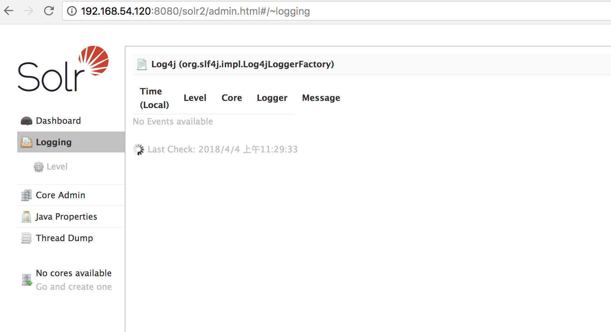

centos安装solr5.0

## solr版本下载
http://archive.apache.org/dist/lucene/solr/

## 下载solr5.0
下戴 solr-5.5.0.zip，保存到指定目录（随意）/usr/local/src/solr-5.5.0.zip
解压 unzip solr-5.5.0.zip
    cd /usr/local/src/
    wget http://archive.apache.org/dist/lucene/solr/5.5.0/solr-5.5.0.zip
    unzip solr-5.5.0.zip
    
## solr安装依赖
solr运行需要依赖jdk和tomcat，自已安装，这里就不介绍了。
tomcat我安装在usr/local/apache-tomcat/ 目录,如果不一样。下面的命令中涉及tomcat路径请修改成你本地路径。

## 正式安装solr
    考虑到有些新手，本文所有命令文件路径都是根目录，从而保证命令不管在哪个目录都能执行。高手请忽略。
### solr文件复制到tomcat
1. 将solr webapp站点复制到tocmat的webapps/solr
     cp -R /usr/local/src/solr-5.5.0/server/solr-webapp/webapp/ /usr/local/apache-tomcat/webapps/solr
2. 将solr log4j.properties复制到tocmat的webapps/solr/WEB-INF/classes/
    cp /usr/local/src/solr-5.5.0/server/resources/log4j.properties /usr/local/apache-tomcat/webapps/solr/WEB-INF/classes
3. 将solr server/lib/ext/目录下的所有jar文件tocmat的webapps/solr/WEB-INF/lib/中，这是一些日志用的jar包，不然启动报错。
    cp -R /usr/local/src/solr-5.5.0/server/lib/ext/* /usr/local/apache-tomcat/webapps/solr/WEB-INF/lib
4. 新建/usr/local/solrHome 也就是solrCore的实例存放位置。
    mkdir -p /usr/local/solrHome
5. 修改tocmat的webapps/solr/WEB-INF/web.xml
    vi /usr/local/apache-tomcat/webapps/solr/WEB-INF/web.xml 
    <env-entry>
       <env-entry-name>solr/home</env-entry-name>
       <env-entry-value>/usr/local/solrHome</env-entry-value>
       <env-entry-type>java.lang.String</env-entry-type>
    </env-entry>
    修改后wq退出保存
### 新建solrCore的实例
1. 新建solrCore目录
    mkdir /usr/local/solrHome/core1
2. 将solr.xml复制到solrHome目录下
    cp /usr/local/src/solr-5.5.0/server/solr/solr.xml /usr/local/solrHome2
3. 将solr的实例配置复制到core
    cp -R /usr/local/src/solr-5.5.0/server/solr/configsets/sample_techproducts_configs/conf/ /usr/local/solrHome2/core1/
### 启动tomcat，打开solor
    /usr/local/apache-tomcat/bin/startup.sh
    //关闭
    /usr/local/apache-tomcat/bin/shutdown.sh  
    将127.0.0.1改成你的ip，保证防火墙没有限制8080
    http://127.0.0.1:8080/solr2/admin.html#/~cores
安装成功

## 安装ikanalyzer分词器
1. 下载ikanalyzer分词器
    cd /usr/local/src/
    wget http://central.maven.org/maven2/com/janeluo/ikanalyzer/2012_u6/ikanalyzer-2012_u6.jar
2. 复制到tomcat/webapp/solr/WEB-INF/lib里面
    cp /usr/local/src/ikanalyzer-2012_u6.jar /usr/local/apache-tomcat/webapps/solr/WEB-INF/lib/
3. 修改配置
    vi /usr/local/solrHome/core1/conf/managed-schema 
    在最后添加节点
    <fieldType name="text_ik" class="solr.TextField">
        <analyzer type="index" useSmart="false" class="org.wltea.analyzer.lucene.IKAnalyzer" />
        <analyzer type="query" useSmart="true" class="org.wltea.analyzer.lucene.IKAnalyzer" />
    </fieldType>
有问题 配置ikanalyzer-2012_u6会报错。

    https://www.cnblogs.com/zhuxiaojie/p/5764680.html#autoid-2-1-0
    https://www.cnblogs.com/xuyiqing/p/8707966.html