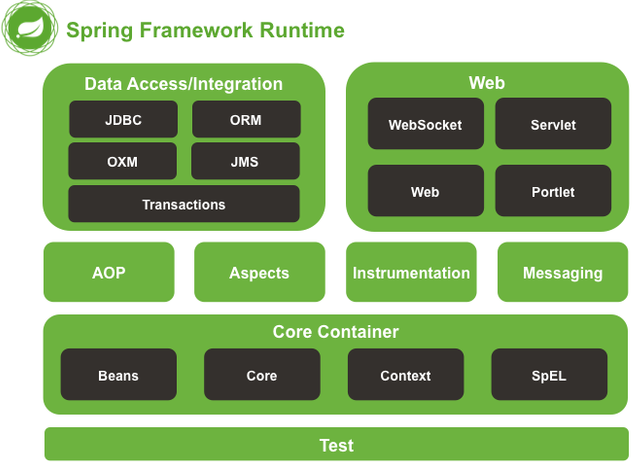

spring源码

IOC：控制反转

DI：依赖注入

Bean的生命周期

创建对象的方式：new factory 反射

```
Class clazz=Class.forName("xxx.xx");
Class clazz=对象.getClass();
Class clazz=类.class;


System.getenv();
System.getProperties();

```

blog.csdn.net/qq_41701956/article/details/116354268