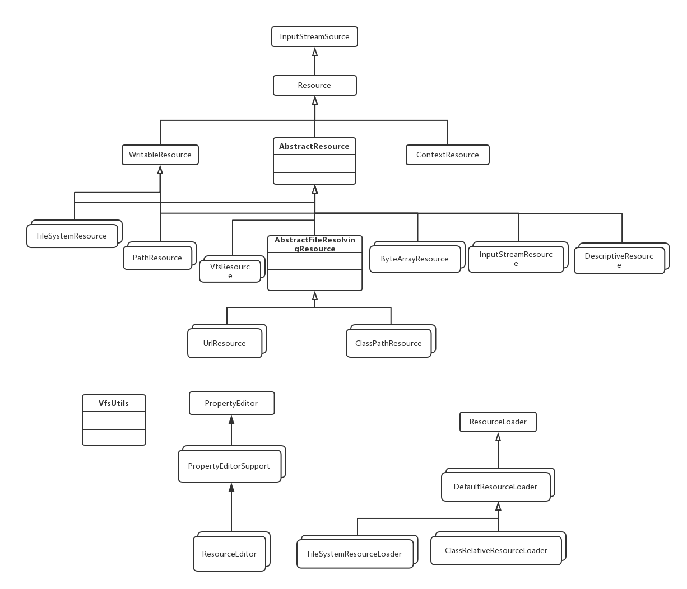

#### Resource接口

Resource接口实现类有以下

* WritableResource
* ContextResource
* UrlResource
* FileUrlResource
* FileSystemResource
* ClassPathResource
* ByteArrayResource
* InputStreamResource

Resource接口基本方法

```
//文件是否存在
boolean exists();

//是否可读
boolean isReadable();

//资源是否被一个inputstream打开，如果已被打开，则不允许其他流再打开
boolean isOpen();

//获取资源url路径，当不能以url描述时抛出ioException异常
URL getURL() throws IOException;

//获取资源uri路径，当不能以url描述时抛出ioException异常
URI getURI() throws IOException;

//获取file，file在IO流中仅仅是一个指向作用
File getFile() throws IOException;

//资源的字节长度，可以拿来算资源的大小
long contentLength() throws IOException;

//资源最后修改时间
long lastModified() throws IOException;

//根据资源相对路径创建资源
Resource createRelative(String relativePath) throws IOException;

//返回文件名
String getFilename();

//资源描述
String getDescription();
```

AbstractResource实现了Resource接口的基本功能

```


```

