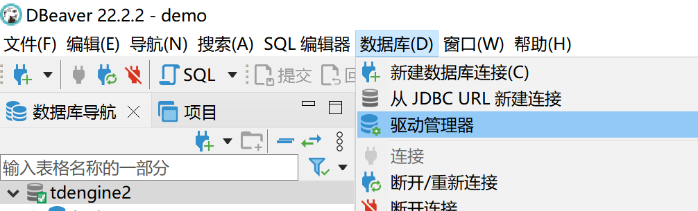
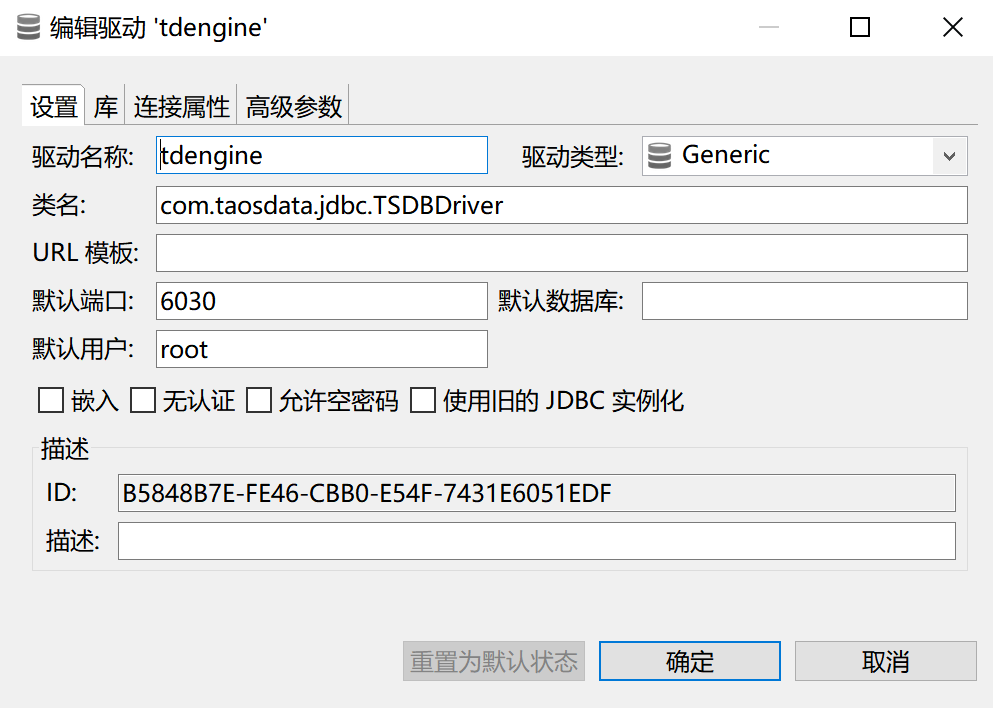
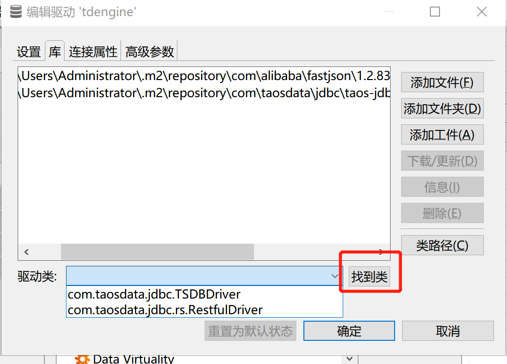
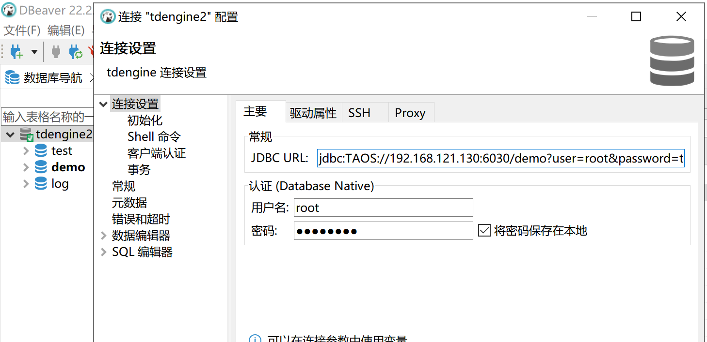
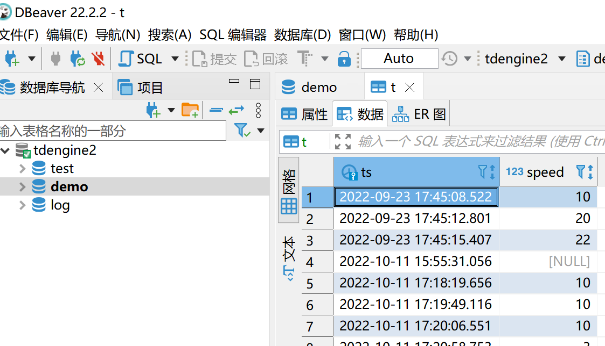

dbeaver-ce-22.2.2-x86_64-setup.exe








本次使用的是tcp连接，如果使用rest连，服务端要开启6041端口
systemctl start taosadapter

客户端功能有限，只有做查询操作

```

com.taosdata.jdbc.TSDBDriver


jdbc:TAOS://192.168.121.130:6030/demo?user=root&password=taosdata

```