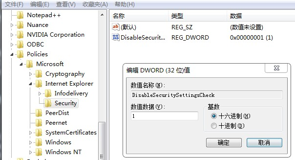

#  关闭当前安全设置使计算机面临风险

### 方法一

1. 点击 开始→运行→输入gpedit.msc 打开组策略编辑器。
2. 依次点击 计算机配置→管理模板→Windows组件→Internet Explorer 在右边找到“关闭安全设置检查功能”。
3. 双击“关闭安全设置检查功能”进行设置，选择“已启用”单击确定。 
4. 重启ie

如果组策略里没有该选项请看方法二

### 方法二

1. 开始-运行-regedit
2. HKEY_LOCAL_MACHINE\Software\Policies\Microsoft\Internet Explorer\Security键下，如果这些键不存在，自己新建，在新建过程中注意大小写。
3. 在上面的键下面新建一个双字（DWORD）型值项（Value Entry）：DisableSecuritySettingsCheck，赋于键值：1
