## 插件安装
### sonar-l10n-zh-plugin
由于sonarQube默认是英文，可以通过安装汉化插件，使平台以中文的方式展示。     
附件sonar-l10n-zh-plugin-1.26.jar

### sonar-pmd-plugin
sonar-pmd是sonar官方的支持pmd的插件，检查java源文件中的潜在问题。主要包括：空try/catch/finally/switch语句块、未使用的局部变量、参数和private方法、空if/while语句、过于复杂的表达式，如不必要的if语句、复杂类等。  
附件：sonar-pmd-plugin-2.7-SNAPSHOT.jar
### checkstyle-sonar-plugin
checkstyle主要检查源文件、关注格式、检查Java源文件是否与代码规范相符。    
附件：checkstyle-sonar-plugin-4.17.jar

以上插件可以在线安装或离线安装，如果离线安装直接放入服务器/sonarqube/extensions/plugins／目录中，重启服务生效。在线安装如下图所示。
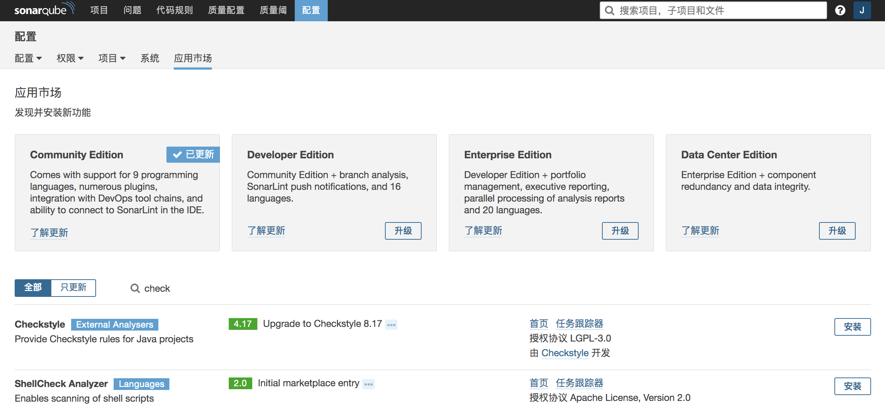

## sonarQube配置
### 用户管理
sonarQube默认所有的用户都可以提交分析代码，这样十分不安全建议关闭该权限。可以根据实际需要新建用户、组群并分配相关权限。在项目绑定时不建议使用用户名和密码绑定，而使用token令牌访问，集成在maven中进行校验分析。
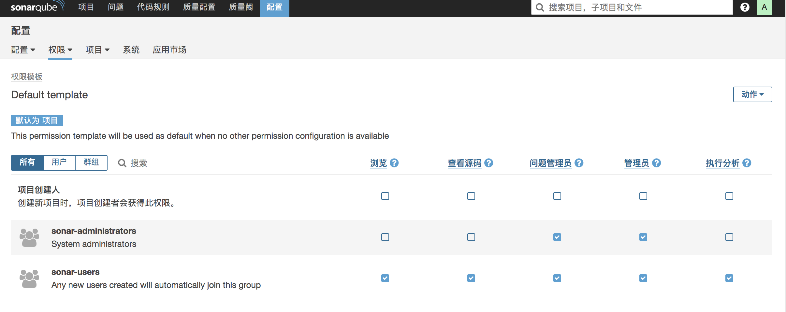

### 用户令牌
用户令牌是由管理员根据账号生成的令牌，相比于用户名密码配置更安全，而令牌只能生成一次，重新生成时上次的令牌就会失效。    
生成令牌由管理员分配，管理员进入系统 配置->权限->用户->用户列表->令牌->生成
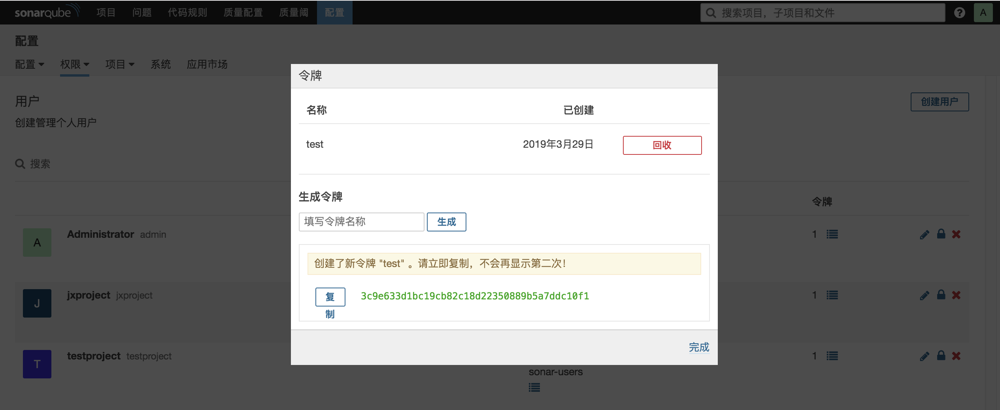

### 项目管理
默认的项目是公共项目，所有用户都可以查看，建议新建项目为私有项目，项目名称与projectKey保持一致。并分配相关应的用户权限和token这样就可以通过mvn sonar:sonar进行代码分析。
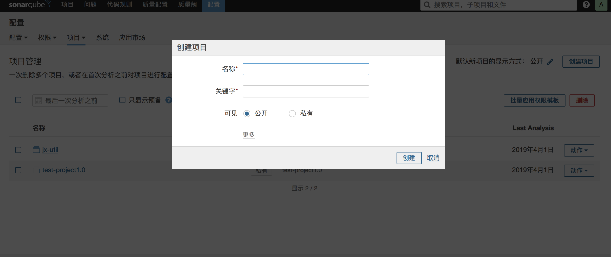

## maven项目集成soanrQube
### 方法一pom.xml文件配置
    <profile>
      <id>sonar</id>
      <activation>
        <activeByDefault>true</activeByDefault>
      </activation>
      <properties>
        <sonar.host.url>http://127.0.0.1:9000</sonar.host.url>
        <sonar.login>用户令牌token</sonar.login>
        <sonar.projectKey>test-project1.0</sonar.projectKey>
        <sonar.projectName>test-project1.0</sonar.projectName>
      </properties>
    </profile>
pom.xml配置针对每个项目单独配置，可以根据不同的项目配置不同的sonar。
* sonar.host.url:sonar服务地址
* sonar.projectKey:项目唯一名称
* sonar.projectName:项目名称
### 方法二settings.xml配置
    <profile>
      <id>sonar</id>
      <activation>
        <activeByDefault>true</activeByDefault>
      </activation>
      <properties>
        <sonar.login>f831dd5dd77ff1b8c925cd6b926082560a012946</sonar.login>
        <sonar.host.url>http://127.0.0.1:9000</sonar.host.url>
      </properties>
    </profile>

通过配置本机maven源的setting.xml可以全局配置sonar，本机所有的项目都根据setting配置的sonar。以后新建项目不需要在单独配置。

### 多模块项目配置
在父目录或根目录下配置和执行mvn sonar:sonar命令 

### 执行分析操作
选中指定的项目，如果是多模块项目选中父项目执行 mvn sonar:sonar命令  
sonarQube默认是所有用户都可以创建项目、分析项目。建议关闭该权限。根据不同的项目分配不同的token。
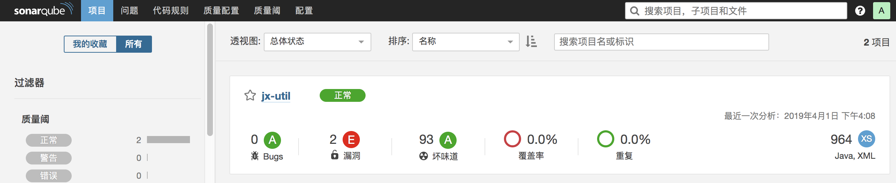
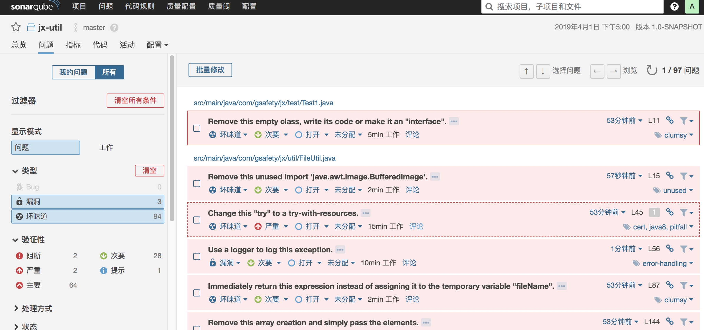

#### 单元测试覆盖率

    <plugin>
        <groupId>org.jacoco</groupId>
        <artifactId>jacoco-maven-plugin</artifactId>
        <version>0.7.8</version>
        <executions>
            <execution>
            <goals>
                <goal>prepare-agent</goal>
                <goal>report</goal>
            </goals>
            </execution>
        </executions>
    </plugin>

    mvn clean test sonar:sonar
    先要执行test生成jacoco.exec文件

### sonar可以从以下七个维度检测代码质量
* 不遵循代码标准 
    sonar可以通过PMD,CheckStyle,Findbugs等等代码规则检测工具规范代码编写。
* 潜在的缺陷 
    sonar可以通过PMD,CheckStyle,Findbugs等等代码规则检测工具检 测出潜在的缺陷。
* 糟糕的复杂度分布 
    文件、类、方法等，如果复杂度过高将难以改变，这会使得开发人员 难以理解它们, 且如果没有自动化的单元测试，对于程序中的任何组件的改变都将可能导致需要全面的回归测试。
* 重复 
    显然程序中包含大量复制粘贴的代码是质量低下的，sonar可以展示 源码中重复严重的地方。
* 注释不足或者过多 
    没有注释将使代码可读性变差，特别是当不可避免地出现人员变动 时，程序的可读性将大幅下降 而过多的注释又会使得开发人员将精力过多地花费在阅读注释上，亦违背初衷。
* 缺乏单元测试 
    sonar可以很方便地统计并展示单元测试覆盖率。
* 糟糕的设计 
    通过sonar可以找出循环，展示包与包、类与类之间的相互依赖关系，可以检测自定义的架构规则 通过sonar可以管理第三方的jar包，可以利用LCOM4检测单个任务规则的应用情况， 检测耦合。

### 常见代码审查问题

* Resources should be closed2
    资源未关闭，打开发现有两处用到的IO流没有关闭
* Conditions should not unconditionally evaluate to "TRUE" or to "FALSE"
if/else判断里出现了重复判断，比如在if(a>10)的执行体里面又判断if(a<0)，而后者肯定不会是true
* Exception handlers should preserve the original exception
    处理异常的时候应该保留原始的异常情况，不要直接来个catch(Exception e)了事
* Throwable.printStackTrace(...) should not be called
    不应该直接调用e.printStackTrace()，而是用Loggers来处理（就是打Log）。
* Loggers的优势是：Users are able to easily retrieve the logs.
    The format of log messages is uniform and allow users to browse the logs easily.
* nstance methods should not write to "static" fields
    不要用实例方法改变静态成员，理想情况下，静态变量只通过同步的静态方法来改变
* "public static" fields should be constant1
    公共静态成员应该加上final，也就是public static final 一般不分家
* Thread.run() and Runnable.run() should not be called directly
    不应该直接调用Thread和Runnaale对象的run方法，直接调用run会使得run方法执行在当前线程，失去了开启新线程的意义。但有时候可能会这样做，下面有个例子。
* Class variable fields should not have public accessibility
    类变量不要设置为public，而是设为private，再提供get和set方法。
* Sections of code should not be "commented out"
    不要再注释中出现大量的代码段，会使代码可读性变差
* Utility classes should not have public constructors
    工具类不应该有公共的构造器，也就是说至少要有一个private的构造器，如果没有，默认的构造器是public的。
* The diamond operator ("<>") should be used
    在定义集合的时候，等号右边的<>内不需要再写上元素类型，直接空着就行。
* Lambdas and anonymous classes should not have too many lines
    Lambdas表达式和匿名内部类不要写太多行，一般最多写20行。
* Anonymous inner classes containing only one method should become lambdas
    只包含一个方法的匿名内部类应该写成Lambdas表达式的形式，增强代码可读性
* Methods should not be empty
    不要写空方法，除非这种情况：An abstract class may have empty methods, in order to provide default implementations for child classes.
* Source files should not have any duplicated blocks
    源文件中不要出现任何重复的代码段或行或字符串等。
* "switch case" clauses should not have too many lines
    "switch case" 每个case里面的代码不要太长，太长的话可以考虑写个方法代替，主要是为了增强代码可读性
* "TODO" tags should be handle   
    TODO标签要及时处理，该做的事情不要忘了做

## sonarLint插件
 SonarLint:一个扩展插件，可以安装在idea与eclipse等开发工具中，我们可以通过插件的方式进行本地静态检测，然后确保不会把低质量的代码提交检测，因为sonarqube是线上服务，每次检测数据都向服务端保存，而sonarlint插件是本地静态检测效率更高。待本地检测完后，再执行服务端检测。

### 安装
#### 在线安装
打开intellij idea开发工具，选择File->settings->plugins搜索sonarLint点击安装。 
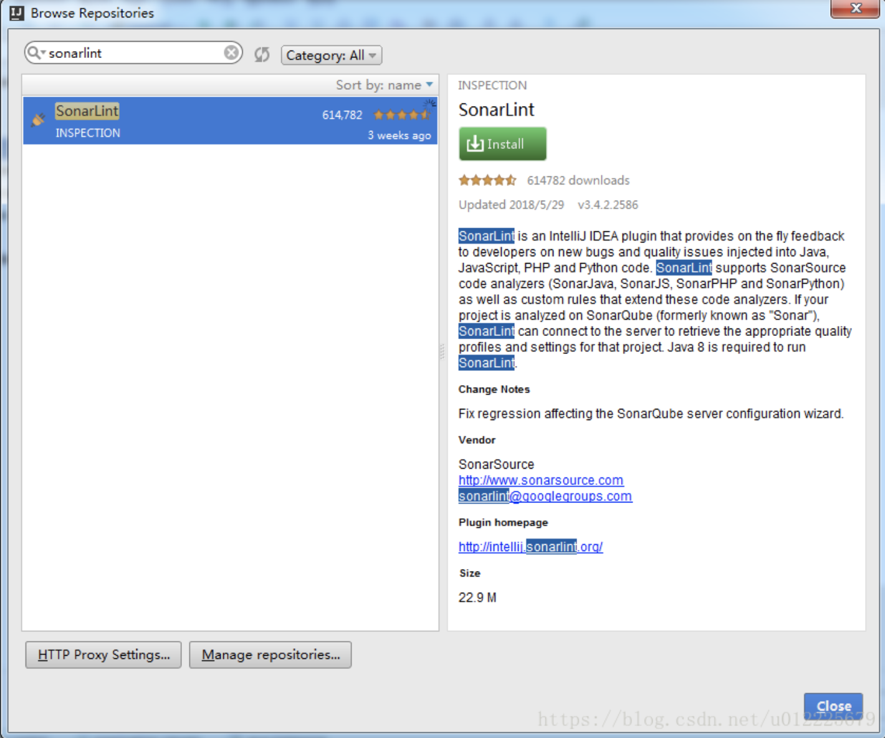

#### 离线安装
https://plugins.jetbrains.com/plugin/7973-sonarlint 下载相应版本的插件。然后
打开intellij idea开发工具，选择File->settings->plugins->Install plugin from disk从本地硬盘安装。
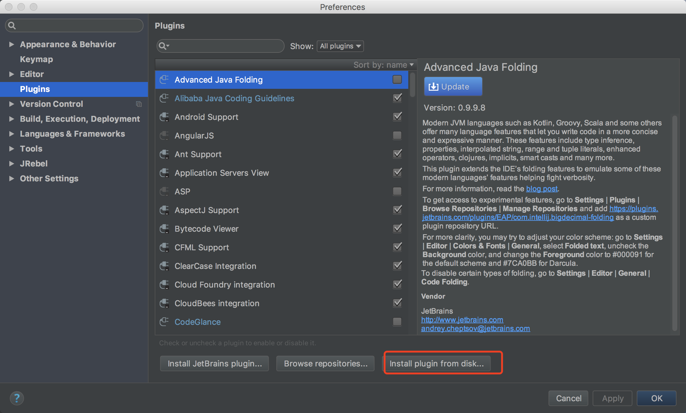

### 分析
选中需要分析的项目，右击Analyze->Analyze with SOnarLint，如下图所示
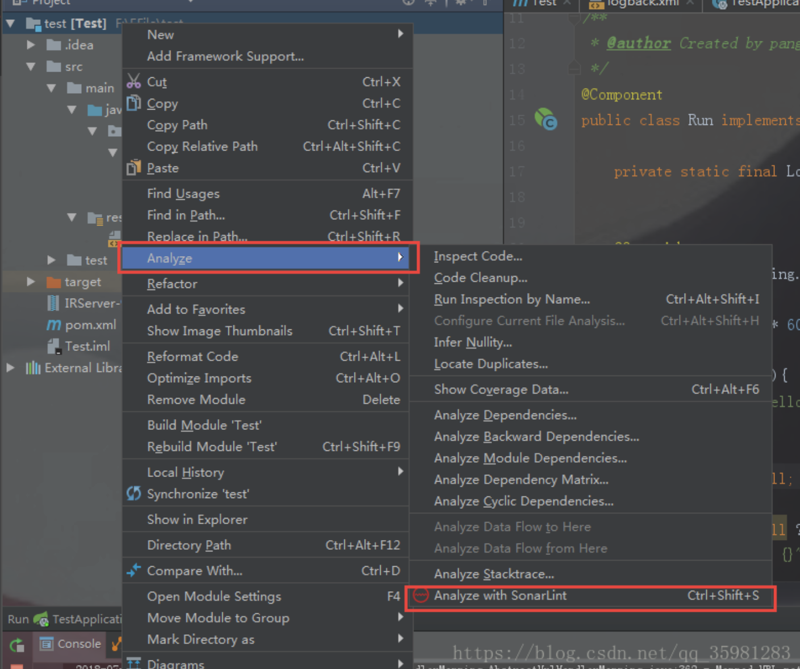

分析结果如下，可以根据提示性有针对性的修改，将问题修改完再提交sonar服务端检测。
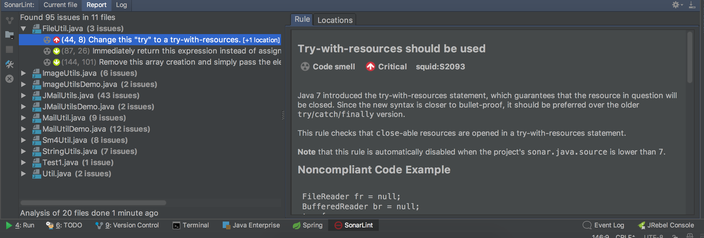

## Alibaba Java Code Guidelines插件
### 安装
安装分为在线安装和离线安装，安装方法参考上面。下载地址：https://github.com/alibaba/p3c/tree/master/idea-plugin
插件安装好后重启生效。  

### 分析
Guidelines插件可以实时检测代码规范，并给出提示。也可以执行分析操作。具体规范可以参考《阿里巴巴Java开发手册》
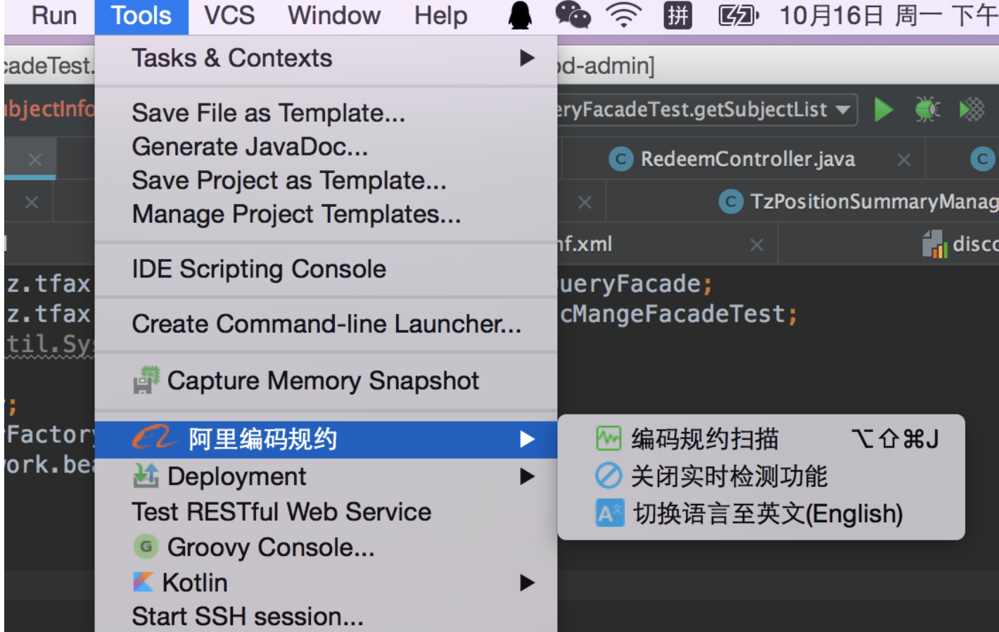

附件：Alibaba Java Coding Guidelines-1.0.3.zip