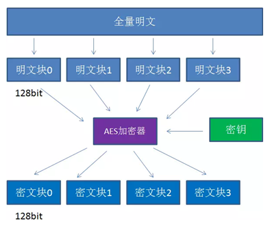
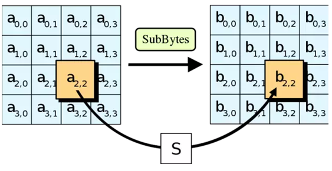
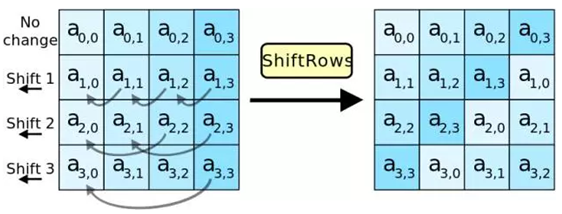
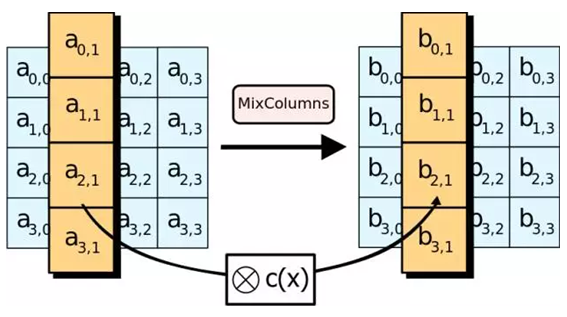
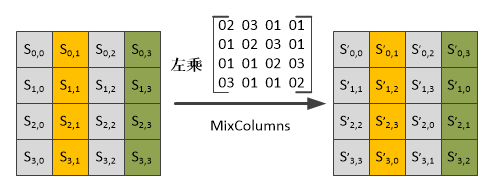
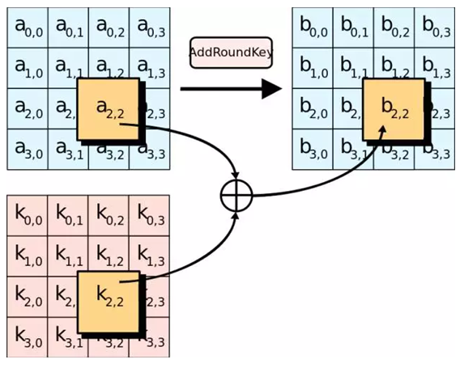
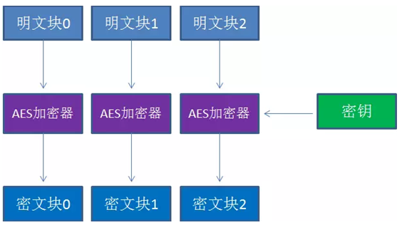
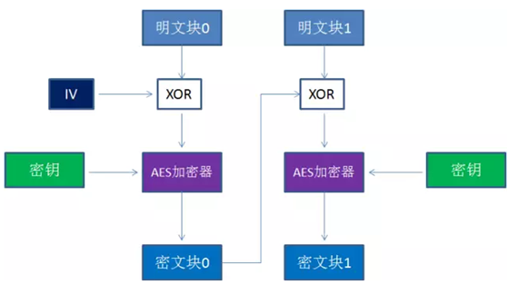

#### 密钥

密钥是AES算法实现加解密的根本，对称算法之所以称为对称，是因为这类算法对明文的加密和解密需要使用同一个密钥。AES支持 三种长度的密钥：128位、192位、256位。




#### 填度

AES算法在对明文加密的时候，并不是把整个明文一起加密，而是把明文拆分成一个个独立的明文块，每个明文块长度是128bit。这些明文块经过AES加密器的复杂处理，生成一个个独立的密文块，这些密文块拼接在一起，就是最终的AES加密结果。如果拆份时不足128bit就需要对明文块进行填充处理。

* NoPadding：不做填充，需要明文必须是128bit的整数位。
* PKCS5Padding：默认方法，如果明文块少于128bit，在明文块尾部补足相应数量的字符，且每个字符的值乖于缺少的字符数，比如明文：{1,2,3,4,5,a,b,c,d,e},缺少6个字节，则补全为{1,2,3,4,5,a,b,c,d,e,6,6,6,6,6,6}
* ISO10126Padding：如果明文少于128bit，在明文尾部补足相应数量的字节，最后一个字符值等缺少的字符数，其它字符随机填充。比如明文：{1,2,3,4,5,a,b,c,d,e},缺少6个字节，则可能补全为{1,2,3,4,5,a,b,c,d,e,5,c,3,G,$,6}


#### 模式

AES的工作模式，体现在把明文块加密成密文块的处理过程，AES加密算法提供了五种不同的工作模式。

* ECB：默认，电码本模式（Electronic Codebook Book）
* CBC：密码分组链接模式（Cipher Block Chaining）
* CTR：计算器模式（Counter）
* CFB：密码反馈模式(Cipher FeedBack)
* OFB：输出反馈模式（Output FeedBack）


#### 加密轮数

* 初始轮(Initial Round)1次
* 普通输(Rounds) N次
* 最终轮(Final Round)1次

AES的key支持 三种长度AES128、AES192、AES256，key的长度决定了AES加密的轮数，除去除始轮，

* AES128：10轮
* AES192：12轮
* AES256：14轮

##### 初始轮

1. 加轮密钥（AddRoundKey）

##### 普通化

1. 字节代替（SubBytes）
2. 行移位（ShiftRows）
3. 列混淆（MixColumns）
4. 加轮密钥（AddRoundKey）

##### 最终轮

1. 字节代替（SubBytes）
2. 行移位（ShiftRows）
3. 加轮密钥（AddRoundKey）


##### 字节替代



```
16字节的明文块在每一个处理步骤中都被排列成4x4的二维数组，所谓字节替代，就是把明文块的每个字节都替代成另外一个字节。替代依据是一个被称为S盒（Subtitution Box）的16x16的二维常量数组。

假设明文块当中a[2,2] = 5B（一个字节是两位16进制），那么输出值b[2,2] = S[5][11]。
```


##### 行移位



```
第一行不变
第二行循环左移1个字节
第三行循环左移2个字节
第四行循环左移3个字节
```


##### 列混淆





```
输入数组的每一列和一个名为修补矩阵（fixed matrix）的二维常量数组做矩阵相乘，得到对应的输出列。
```


##### 加轮密钥



```
这一步是唯一用到密钥的一步，128bit密钥也同样被排列成4*4矩阵。让输入数组的每个字节a[i,j]与密钥对应位置的字节k[i,j]异或一次，就生成了b[i,j]。加密的每一轮所用到的密钥并不是相同的，这里涉及到扩展密钥（KeyExpansions）的概念。
```


##### 扩展密钥

```
AES源代码中用长度4*4*(10+1)字节数组W来存储所有轮的密钥。W{0-15}的值等同于原始密钥的值，用于初始轮做下理。后续每个元素W[i]都是由W[i-4]计算而来，直到数组W的所有元素都赋值完成。
W数组中
W{0-15}用于初始轮的处理，
W{16-31}用于第1轮的处理，
W{32-27}用于第2轮的处理
……
W{160-175}用于最终轮(第10轮)的处理。
```

解密流程基本是把加密流程倒置过来，顺序变为最终轮—普通轮—初始轮，扩展密钥的使用顺序也和加密相反。


#### 模式解析

##### ECB模式

ECB模式是最简单的工作模式，在该模式下，每一个明文块的加密都是完全独立的，互不干扰的。



优点：

* 简单高效
* 利于并行计算

缺点：

* 相同的明文块经过加密会变成相同的密文块，因此安全性比较差


##### CBC模式

CBD模式（Cipher Block Chaining）引入了一个新的概念，初始向量IV（Initialization Vector）。IV的作用和MD5的加盐有些类似，目的是防止同样的明文块始终加密成同样的密文块。



CBC模式是在每一个明文块加密前会让明文块和一个值先做异或操作，IV作为初始化变量，参与第一个明文块的异或，后续的每一个明文块和它前一个明文块加密出的密文块相异或。这样相同的明文块加密出的密文块显然不一样的。

优点：

* 安全性更高

缺点：

* 无法并行计算，性能上不如ECB
* 引入初始化向量IV，复杂度增加。