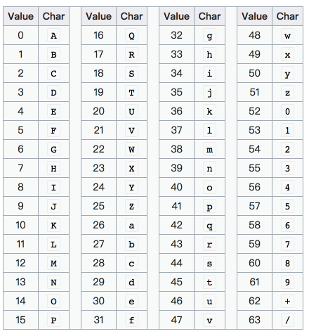

### ASCII编码

### UTF-8编码

### Unicode编码

### Hex编码

一个字节存在8个bit可以表示256个字符，而ASCII码只能表示0-127种字符，为了能完整地表示一个字节，可以将二进制数据转换为十六进制数据的方式。所以Hex编码也被称为Base64编码，相比于原来的8位表示一个字节，Hex编码能够只用2位表示一个字节。Hex编码最常用于二进制文件查看时展示的编码。

### Base64编码

Base64编码是通过64个字符来表示二进制数据，64个字符表示二进制数据只能表示6位，所以他可以通过4个Base64的字符来表示3个字节。

