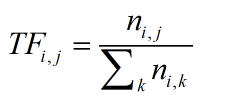
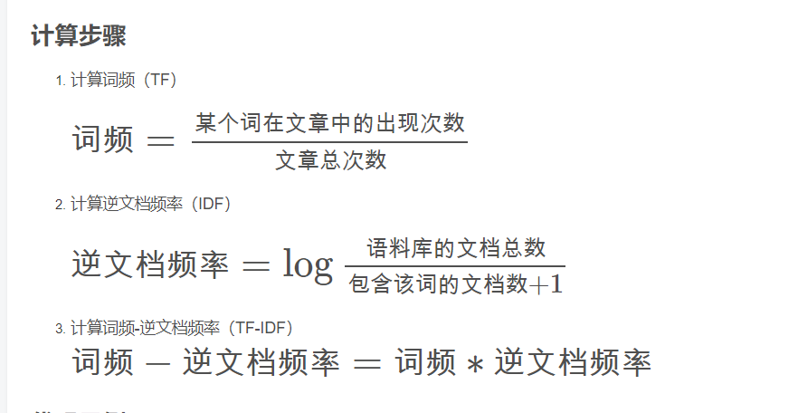

## TF-IDF(term frequency-inverse document frequency)
是一种用于信息检索与数据挖掘的常用的加权技术。TF是词频的意思（term frequcency），IDF是逆文本频率指数。  
TF-IDF是一种统计方法，用以评估一个字词对于一个文件集或一个语料库中其中一份文件的重要程度，字词的重要性随着它在文件中出现的次数成正比增加，但同时会随着它在语料库中出的频率成反比下降。TF-IDF加权各种形式常被搜索引擎应用，作为文件与用户查询之间相关程度的度量或评级。

## TF-IDF主要思想
如果一个词在一篇文章中出现的频率FT高，并且在其它文章中很少出现，则认为此词或者短语具有很好的类别区分能力。适合用来分类。TF-IDF实际上是TF*IDF，TF词频表示词条在文档D中出现的频率，IDF逆向文件频率，如包含的词条T的文档越少，也就是n越小，IDF越大，则说明词条T具有很好的类别区分能力。

## TF-IDF计算方法
TF-IDF实际上是TF*IDF，两个计算值的乘积，用来衡量一个词库中的词对每一篇文档的重要程度。

### TF(Term Frequency)
是某个关键词出现的频率，具体来讲，就是词库中某个词在当前文章中出现的频率

比如，一篇文章中共有100个词汇，其中机器学习一共出现了10次，那么TF=10/100=0.1;
如果使用TF来评估关键词的重要性忽略了常用词的干扰，常用词就是指那些文章中大量用到的，但是不能反映文章性质的那种词，比如：因为、所以、因此等连词。在英文文章中and the of等。但这些词往往拥有有较高的TF，所以仅仅用TF来衡量一个词的关键性是不够的。这里需要使用IDF。

### IDF(Inverse Document Frequency)
反文档频率。文档频率DF就是一个词在整个文库词典中出现的频率，如果100篇文章中，共有10篇文章包含“机器学习”这个词，那么它的文档频率就是10/100=0.1。反文档频率IDF就是这个值的倒数，即10。

    IDF(i)：词语i的反文档频率

　　|D|：语料库中的文件总数

　　|j:t(i)属于d(j)|出现词语i的文档总数

　　+1是为了防止分母变0。
假设100篇文档中有10000个词，研究某篇500词文章，“机器学习”出现了20次，“而且”出现了20次，那么他们的TF都是20/500/0.04，再来看IDF，对于语料库的100篇文章，每篇都出现了“而且”因此它的IDF就是log1=0，它的TF*IDF=0。而”机器学习“出现了10篇，那么它的IDF就是log10=1它的TF*IDF=0.04>0显然“机器学习”比“而且”更加重要。

https://baike.baidu.com/item/tf-idf?fr=aladdin
http://www.cnblogs.com/HolyShine/p/6033368.html