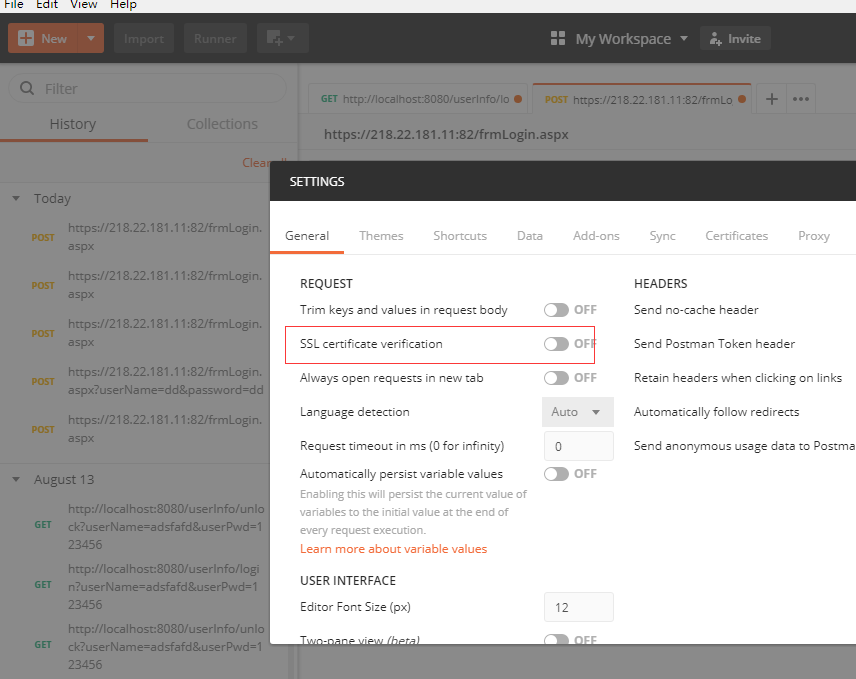

```
Could not get any response
There was an error connecting to https://218.22.181.11:82/frmLogin.aspx.
Why this might have happened:
The server couldn't send a response:
Ensure that the backend is working properly
Self-signed SSL certificates are being blocked:
Fix this by turning off 'SSL certificate verification' in Settings > General
Proxy configured incorrectly
Ensure that proxy is configured correctly in Settings > Proxy
Request timeout:
Change request timeout in Settings > General
```


File->Setting->General，关闭“SSL certificate verification

