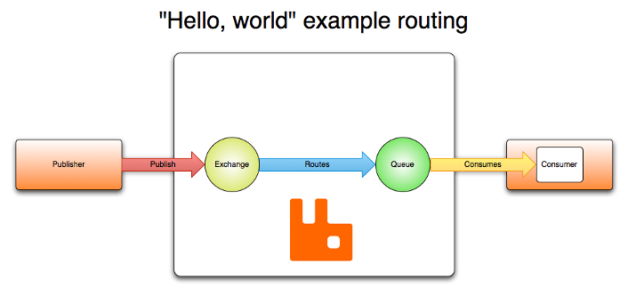

### AMQP
AMQP(Advanced Message Queuing Protocol)高级消息队列协议是一个网格协议，它支持符合要求的客户端和消息中间件代理之间进行通信。是应用层协议的一个开放标准，为面向消息的中间件设计。消息中间件主要用于组件之间的解耦，消息的发送者无需知道消息使用者的存在，反之亦然。 AMQP的主要特征是面向消息、队列、路由（包括点对点和发布/订阅）、可靠性、安全。

AMQP是一个可编程协议，AMQP的实体和路由规则是由应用本身定义，而不是消息代理定义，包括声明队列和交换机，定义他们之前的绑定，订阅队列等等关于协议本身的操作。

### Exchange
交换机用来发送消息的AMQP实体，交换机拿到一个消息之后将它路由给队列。使用哪种路由算法是由交换机类型和绑定的规则所决定的。
* Direct exchange（直连交换机） (Empty string) and amq.direct
* Fanout exchange（扇型交换机） amq.fanout
* Topic exchange（主题交换机） amq.topic
* Headers exchange（头交换机） 	amq.match (and amq.headers in RabbitMQ)

Exchange属性
* Name
* Durability：消息代理重启后，交换机是否还存在。
* Auto-delete：当所有与之绑定的消息队列都完成了对此交换机的使用后，删除它。
* Arguments：依赖代理本身。
Exchange有两个状态：持久(durable)、暂存(transient)。
* 持久化的交换机会在消息代理重启后依然存在。
* 暂存的交换机则不会，需要在代理上线后重新被声明。然而并不是所有的应用场景都需要持久化的交换机。

#### 直连交换机 direct exchange
直连交换机是根据消息携带的路由键(routing key)将消息投递给对应的队列。直连交换机用来处理消息的单播路由。
1. 将一队列绑定到某个交换机上，同时赋予该绑定的一个路由键。
2. 当一个携带路由键为R的消息被发送给直连交换机时，交换机会把它路由给绑定值同样为R的队列。 

直连交换机经常用来循环分发任务给多个工作者(workers)。消息的负载均衡是发生在消费者之前，而不是队列之间的。

#### 扇型交换机 fanout exchange
扇型交换机将消息路由给绑定到它身上的所有队列，而不理会绑定的路由键。如果N个队列绑定到某个扇型交换机上，当有消息发送到此扇型交换机时，交换机会交消息的拷贝分别发送给这所有的N个队列。扇型用来交换机处理消息的广播路由。

* 大规模多用户在线(MMO)游戏可以使用它来处理排行榜更新等全局事件。
* 分发系统使用它来广播各种状态和配置更新。

#### 主题交换机 topic exchange
主题交换机通过消息的路由键和队列到交换机的绑定模式之间的匹配，将消息路由给一个或多个队列。主题交换机经常用来实现各种分发/订阅模式。

* 分发特定地理位置的数据。
* 由多个工作者完成的后台任务，每个工作者负责处理某些特定的任务。
* 涉及到分类或者标签的新闻更新。

#### 头交换机 header exchange
有时消息的路由操作会涉及到多个属性，此时使用消息头就比用路由键更容易表达。头交换机使用多个消息属性来代替路由键建立的路由规则。通过判断消息头的值能否与指定的绑定匹配来确定路由规则。    

头交换机可以视为直连交换机的另一种表现形式。头交换机能够像直连交换机一样工作，不同之处在于头交换机的路由规则是建立在头属性值之上，而不是路由键。路由键必须是一个字符串，而头属性值则没有这个约束，它们甚至可以是整数或者哈希值（字典）等。

### 队列 queue
AMQP中的队列与其它消息队列或任务队列中的队列很相似，它们存储着即将被应用消费掉的消息。队列跟交换机共享某些属性，但是队列也有一些另外的属性。
* Name
* Durable（消息代理重启后，队列依旧存在）
* Exclusive（只被一个连接（connection）使用，而且当连接关闭后队列即被删除）
* Auto-delete（当最后一个消费者退订后即被删除）
* Arguments（一些消息代理用他来完成类似与TTL的某些额外功能）

队列在声明后才能被使用，如果一个队列尚不存在，声明一个队列会创建它。

#### 队列名称
队列的名字可以由应用（application）来取，也可以让消息代理（broker）直接生成一个。队列的名字可以是最多255字节的一个utf-8字符串。若希望AMQP消息代理生成队列名，需要给队列的name参数赋值一个空字符串：在同一个通道（channel）的后续的方法（method）中，我们可以使用空字符串来表示之前生成的队列名称。之所以之后的方法可以获取正确的队列名是因为通道可以默默地记住消息代理最后一次生成的队列名称。  
以"amq."开始的队列名称被预留做消息代理内部使用。如果试图在队列声明时打破这一规则的话，一个通道级的403 (ACCESS_REFUSED)错误会被抛出。

#### 队列持久化
持久化队列（Durable queues）会被存储在磁盘上，当消息代理（broker）重启的时候，它依旧存在。没有被持久化的队列称作暂存队列（Transient queues）。并不是所有的场景和案例都需要将队列持久化。    

持久化的队列并不会使得路由到它的消息也具有持久性。倘若消息代理挂掉了，重新启动，那么在重启的过程中持久化队列会被重新声明，无论怎样，只有经过持久化的消息才能被重新恢复。    

#### 绑定
绑定是交换机将消息路由给队列所需遵循的规则，如果要指示交换机E将消息路由给队列Q，那么Q就需要与E进行绑定。绑定操作需要定义一个可选的路由键属性给某些类型的交换机。路由键的意义在于从发送给交换机的众多消息中选择出某些消息，将其路由给绑定的队列。    
拥有了交换机这个中间层，很多由发布者直接到队列难以实现的路由方案能够得以实现，并且避免了应用开发者的许多重复劳动。

#### 消费者
* 将消息投递给应用 ("push API")
* 应用根据需要主动获取消息 ("pull API")
使用push API，应用（application）需要明确表示出它在某个特定队列里所感兴趣的，想要消费的消息。如是，我们可以说应用注册了一个消费者，或者说订阅了一个队列。一个队列可以注册多个消费者，也可以注册一个独享的消费者（当独享消费者存在时，其他消费者即被排除在外）。

每个消费者（订阅者）都有一个叫做消费者标签的标识符。它可以被用来退订消息。消费者标签实际上是一个字符串。

#### 消息确认

消费者应用（Consumer applications） - 用来接受和处理消息的应用 - 在处理消息的时候偶尔会失败或者有时会直接崩溃掉。而且网络原因也有可能引起各种问题。这就给我们出了个难题，AMQP代理在什么时候删除消息才是正确的？AMQP 0-9-1 规范给我们两种建议：

当消息代理（broker）将消息发送给应用后立即删除。（使用AMQP方法：basic.deliver或basic.get-ok）
待应用（application）发送一个确认回执（acknowledgement）后再删除消息。（使用AMQP方法：basic.ack）
前者被称作自动确认模式（automatic acknowledgement model），后者被称作显式确认模式（explicit acknowledgement model）。在显式模式下，由消费者应用来选择什么时候发送确认回执（acknowledgement）。应用可以在收到消息后立即发送，或将未处理的消息存储后发送，或等到消息被处理完毕后再发送确认回执（例如，成功获取一个网页内容并将其存储之后）。

如果一个消费者在尚未发送确认回执的情况下挂掉了，那AMQP代理会将消息重新投递给另一个消费者。如果当时没有可用的消费者了，消息代理会死等下一个注册到此队列的消费者，然后再次尝试投递。

#### 消息属性和有效载荷（消息主体）
AMQP模型中的消息（Message）对象是带有属性（Attributes）的。有些属性及其常见，以至于AMQP 0-9-1 明确的定义了它们，并且应用开发者们无需费心思思考这些属性名字所代表的具体含义。例如：

* Content type（内容类型）
* Content encoding（内容编码）
* Routing key（路由键）
* Delivery mode (persistent or not)
* 投递模式（持久化 或 非持久化）
* Message priority（消息优先权）
* Message publishing timestamp（消息发布的时间戳）
* Expiration period（消息有效期）
* Publisher application id（发布应用的ID）
有些属性是被AMQP代理所使用的，但是大多数是开放给接收它们的应用解释器用的。有些属性是可选的也被称作消息头（headers）。他们跟HTTP协议的X-Headers很相似。消息属性需要在消息被发布的时候定义。

AMQP的消息除属性外，也含有一个有效载荷 - Payload（消息实际携带的数据），它被AMQP代理当作不透明的字节数组来对待。消息代理不会检查或者修改有效载荷。消息可以只包含属性而不携带有效载荷。它通常会使用类似JSON这种序列化的格式数据，为了节省，协议缓冲器和MessagePack将结构化数据序列化，以便以消息的有效载荷的形式发布。AMQP及其同行者们通常使用"content-type" 和 "content-encoding" 这两个字段来与消息沟通进行有效载荷的辨识工作，但这仅仅是基于约定而已。

消息能够以持久化的方式发布，AMQP代理会将此消息存储在磁盘上。如果服务器重启，系统会确认收到的持久化消息未丢失。简单地将消息发送给一个持久化的交换机或者路由给一个持久化的队列，并不会使得此消息具有持久化性质：它完全取决与消息本身的持久模式（persistence mode）。将消息以持久化方式发布时，会对性能造成一定的影响（就像数据库操作一样，健壮性的存在必定造成一些性能牺牲）。

#### 连接
AMQP连接通常是长连接。AMQP是一个使用TCP提供可靠投递的应用层协议。AMQP使用认证机制并且提供TLS（SSL）保护。当一个应用不再需要连接到AMQP代理的时候，需要优雅的释放掉AMQP连接，而不是直接将TCP连接关闭。

#### 通道
有些应用需要与AMQP代理建立多个连接。无论怎样，同时开启多个TCP连接都是不合适的，因为这样做会消耗掉过多的系统资源并且使得防火墙的配置更加困难。AMQP 0-9-1提供了通道（channels）来处理多连接，可以把通道理解成共享一个TCP连接的多个轻量化连接。

在涉及多线程/进程的应用中，为每个线程/进程开启一个通道（channel）是很常见的，并且这些通道不能被线程/进程共享。

一个特定通道上的通讯与其他通道上的通讯是完全隔离的，因此每个AMQP方法都需要携带一个通道号，这样客户端就可以指定此方法是为哪个通道准备的。

#### 虚拟主机
为了在一个单独的代理上实现多个隔离的环境（用户、用户组、交换机、队列 等），AMQP提供了一个虚拟主机（virtual hosts - vhosts）的概念。这跟Web servers虚拟主机概念非常相似，这为AMQP实体提供了完全隔离的环境。当连接被建立的时候，AMQP客户端来指定使用哪个虚拟主机。