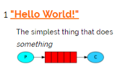
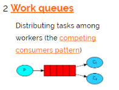
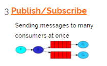
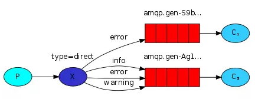
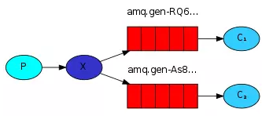
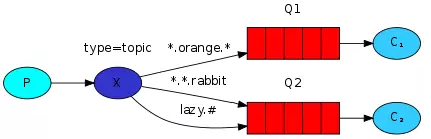
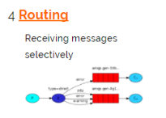
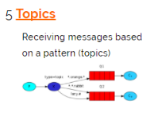
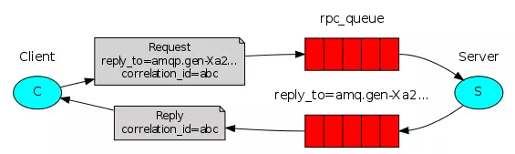

### 基本模式

一个生产者，一个消费者。实质上是一个大的消息缓冲区。这种队列实际不常用，队列不会只等一个消费者去消费，一般情况下都是多消费端消费。

### work模式

一个生产者，多个消费者，每个消费者获取的消息唯一。主要思想就是避免执行耗时的任务时，必须等待它执行完成。让多个消费绑定一个队列，共同消息队列的消息，队列中的消息一旦消费就会消失，因此任务是不会被重复消费的。

消息消费有两种模式
* 自动模式：消费者从消息队列获取消息后，服务端就认为该消息已经成功消费。
* 手动模式：消费者从消息列列获取消息后，服务端并没有标记为成功消费，消费者成功消费后需要将状态返回服务器。

### 订阅模式

一个生产者发送的消息会被多个消费者获取。    
生产者：可以将消息发送到队列或者交换机。 
消费者：只能从队列中获取消息。
每个消费者都有自己的一个队列，生产者不会将消息发送到队列，而是发送到交换机，每个队都要绑定交换机，生产者发送的消息，经过交换机到达队列，实现一个消息被多个消费者获取。

#### Exchange类型
生产者将消息发送给Queue中，实际上生产者将消息发送到Exchange，由Exchange将消息路由到一个或多个Queue中。
Exchange分发消息时根据类型的不同分发策略也不同，目前共有四种类型：direct、fanout、topic、heads。headers匹配AMQP消息的header而不是路由键，此外headers交换器和direct交换器完全一致，但性能差很多，目前用不到。
1. direct定向，把消息交给符合指定routing key 的队列

    消息中的路由键如果和binding key一致。交换器就将消息发送到对应的队列中。路由键与队列名完全匹配，如果一个队列绑定到交换机要求路由键是order，则只转发路由键标记为order的消息。

2. fanout广播，将消息交给所有绑定到交换机的队列
    
    每个发送到fanout类型交换器的消息都会分到所有绑定的队列上去，fanout交换器不处理路由键，只是简单的将队列绑定到交换器上，每个发送到交换器的消息都会被转到该交换器绑定的队列上。 fanout 类型转发消息是最快的 。

3. topic通配符，把消息交给符合routing pattern（路由模式） 的队列

    topic交换器通过模式匹配分配消息路由键属性，将路由键和某个模式进行匹配，此时队列需要绑定到一个模式上，它将路由键和绑定键的字符串切分成单词，这些单词同样用点隔开。它同样也会识别两个通配符：符号“#”和符号“”。#匹配0个或多个单词，匹配不多不少一个单词。

### 路由模式

生产者：发送消息到交换机并且要指定路由key。 
消费者：将队列绑定到交换机时需要指定路由key。
是一种完全匹配，只有匹配到消费者才能消费消息。

### 通配符模式

topic交换机通过模式匹配分配消息的路由键属性，将路由和某个模式进行匹配。此时队列需要绑定到一个模式上，它将路由键和绑定键的字符串切分成单词，这些单词之间用点隔开。它同样也会识别两个通配符。

### RPC模式

MQ本身是基于异步的消息处理，前面的示例中所有的生产者（P）将消息发送到RabbitMQ后不会知道消费者（C）处理成功或者失败（甚至连有没有消费者来处理这条消息都不知道）。 但实际的应用场景中，我们很可能需要一些同步处理，需要同步等待服务端将我的消息处理完成后再进行下一步处理。这相当于RPC（Remote Procedure Call，远程过程调用）。在RabbitMQ中也支持RPC。