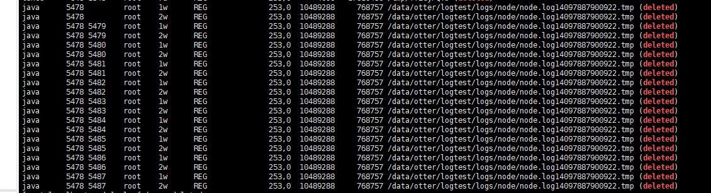

## logback在高并发写日志文件时按大小或时间滚动时会产生deleted文件导致硬盘空间不释放。

```java
    //测试用例
    for (int i = 0; i < 1000 *1000; i++) {
        if (i % 100000 == 0) {
            try {
                Thread.sleep(1000 * 10);
            } catch (InterruptedException e) {
                e.printStackTrace();
            }
        }
        logger.info(i + "ffffffffasfsdffdsdfsdfsdf--   " + (new Date()));
    }

```xml
    //logback配置文件
    <appender name="TASK-ROOT" class="ch.qos.logback.classic.sift.SiftingAppender">
		<discriminator>
			<Key>otter</Key>
			<DefaultValue>node</DefaultValue>
		</discriminator>
		<sift>
			<appender name="FILE-${otter}" class="ch.qos.logback.core.rolling.RollingFileAppender">
				<File>./logs/${otter}/${otter}.log</File>
				<!--<File>d:/logs/${otter}/${otter}.log</File>-->
				<rollingPolicy class="ch.qos.logback.core.rolling.TimeBasedRollingPolicy">
					<!-- rollover daily -->
					<fileNamePattern>./logs/${otter}/%d{yyyy-MM-dd}/${otter}-%d{yyyy-MM-dd}-%i.log.gz</fileNamePattern>
					<!--<fileNamePattern>d:/logs/${otter}/%d{yyyy-MM-dd}/${otter}-%d{yyyy-MM-dd}-%i.log.gz</fileNamePattern>-->
					<timeBasedFileNamingAndTriggeringPolicy class="ch.qos.logback.core.rolling.SizeAndTimeBasedFNATP">
						<!-- or whenever the file size reaches 100MB -->
						<maxFileSize>5MB</maxFileSize>
					</timeBasedFileNamingAndTriggeringPolicy>
					<maxHistory>60</maxHistory>
				</rollingPolicy>
				<encoder>
					<pattern>
						%d{yyyy-MM-dd HH:mm:ss.SSS} [%thread] %-5level %logger{56} - %msg%n
					</pattern>
				</encoder>
			</appender>
		</sift>
	</appender>

## 定位问题
经过大量测试分析定位是由于SiftingAppender配置节点导致。
SiftingAppender提供过滤筛选日志的功能。你可以通过用户的sessions的数据来筛选日志，然后分发到不同日志文件。

```xml
    <appender name="TASK-ROOT"  class="ch.qos.logback.core.rolling.RollingFileAppender">
        <File>./logs/otter/otter.log</File>
        <!--<File>d:/logs/otter/otter.log</File>-->
        <rollingPolicy class="ch.qos.logback.core.rolling.TimeBasedRollingPolicy">
            <!-- rollover daily -->
            <fileNamePattern>./logs/otter/%d{yyyy-MM-dd}/otter-%d{yyyy-MM-dd}-%i.log.gz</fileNamePattern>
            <!--<fileNamePattern>d:/logs/otter/%d{yyyy-MM-dd}/otter-%d{yyyy-MM-dd}-%i.log.gz</fileNamePattern>-->
            <timeBasedFileNamingAndTriggeringPolicy class="ch.qos.logback.core.rolling.SizeAndTimeBasedFNATP">
                <!-- or whenever the file size reaches 100MB -->
                <maxFileSize>5MB</maxFileSize>
            </timeBasedFileNamingAndTriggeringPolicy>
            <maxHistory>60</maxHistory>
        </rollingPolicy>
        <encoder>
            <pattern>
                %d{yyyy-MM-dd HH:mm:ss.SSS} [%thread] %-5level %logger{56} - %msg%n
            </pattern>
        </encoder>
    </appender>