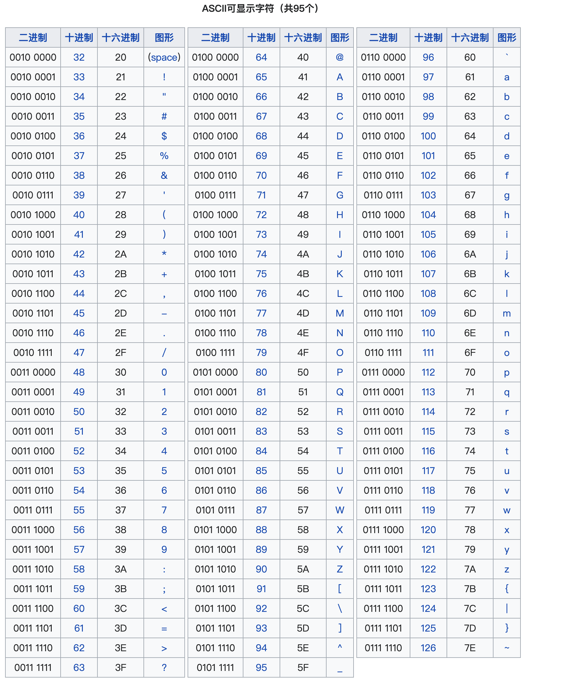

**BCD码**

BCD码（Binary-Coded Decimal‎），用4位二进制数来表示1位十进制数中的0~9这10个数码，是一种二进制的数字编码形式，用二进制编码的十进制代码。BCD码这种编码形式利用了四个位元来储存一个十进制的数码，使二进制和十进制之间的转换得以快捷的进行。这种编码技巧最常用于会计系统的设计里，因为会计制度经常需要对很长的数字串作准确的计算。相对于一般的浮点式记数法，采用BCD码，既可保存数值的精确度，又可免去使计算机作浮点运算时所耗费的时间。此外，对于其他需要高精确度的计算，BCD编码亦很常用。


**CRC校验码**

循环冗余校验码（Cyclic Redundancy Check， CRC），是一种根据网络报文或计算机文件等数据产生简短固定位数校验码的一种信道编码技术。主要用来检测或校验数据传输保存后可能出现的错误，它利用除法及余数的原理来作错误侦测的。

是数据通信领域中最常用的一种查错校验码，其特征是信息字段和校验字段的长度可以任意选定。循环冗余检查（CRC）是一种数据传输检错功能，对数据进行多项式计算，并将得到的结果附在帧的后面，接收设备也执行类似的算法，以保证数据传输的正确性和完整性。

CRC 算法的基本思想是将传输的数据[M(X)] 当做一个位数很长的数。将这个数除以另一个数[G(X)] ,得到的余数[R(X)] 作为校验数据附加到原数据后面,组成循环校验码。

* M(X) 代表待编码的有效信息 
* G(X) 代表约定好的多项式
* R(X) 代表代表检验位

```
CRC的结构 = 信息位(N位) + 校验位(K位)
CRC编码 = M(X) + R(X)
```


**奇偶校验**


**海明码校验**


### ASCII码

