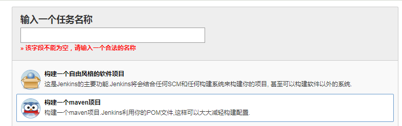
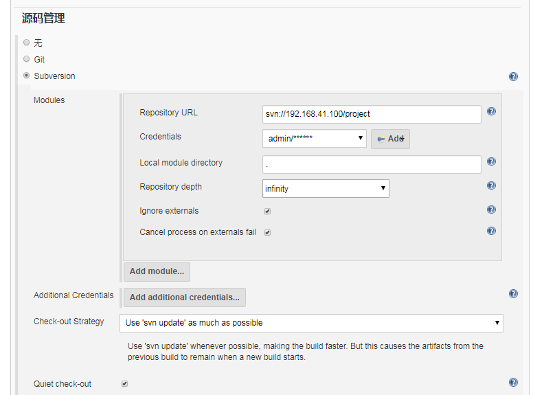
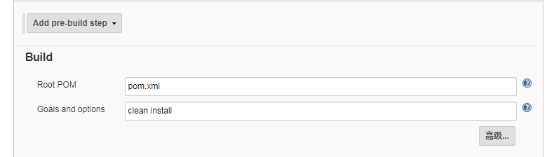
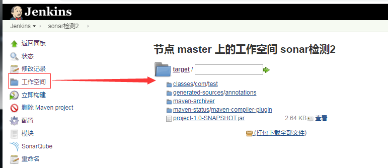

### 新建任务
[新建任务] - [输入一个任务名称] -[构建一个maven项目]
前置条件：安装配置好maven和	Maven 相关插件


### 获取源码管理
获管管理选择git或Subversion并配置添加账号


### maven Build
指定项目的pom.xml文件或maven打包命令
* Root POM：pom.xml文件的相对路径，如果是多模块则填写父模块的pom。
* Goals and options：执行的maven打包命令。
    * clean install
    * clean install -Dprofiles.active=dev
    * clean install -pl  ../jx-web/ -am -amd -Dmaven.test.skip -Dprofiles.active=dev：打包指定的模块
    


### 执行构建操作
[立即构建]
```
    [INFO] Installing /var/lib/jenkins/workspace/sonar检测2/pom.xml to /var/lib/jenkins/.m2/repository/com/test/project/1.0-SNAPSHOT/project-1.0-SNAPSHOT.pom
    [INFO] ------------------------------------------------------------------------
    [INFO] BUILD SUCCESS
    [INFO] ------------------------------------------------------------------------
    [INFO] Total time:  6.507 s
    [INFO] Finished at: 2019-06-24T19:35:16+08:00
    [INFO] ------------------------------------------------------------------------
    Waiting for Jenkins to finish collecting data
    [JENKINS] Archiving /var/lib/jenkins/workspace/sonar检测2/pom.xml to com.test/project/1.0-SNAPSHOT/project-1.0-SNAPSHOT.pom
    [JENKINS] Archiving /var/lib/jenkins/workspace/sonar检测2/target/project-1.0-SNAPSHOT.jar to com.test/project/1.0-SNAPSHOT/project-1.0-SNAPSHOT.jar
    channel stopped
    Finished: SUCCESS
```

### 工作空间查看代码包
[工作空间]-[target]
