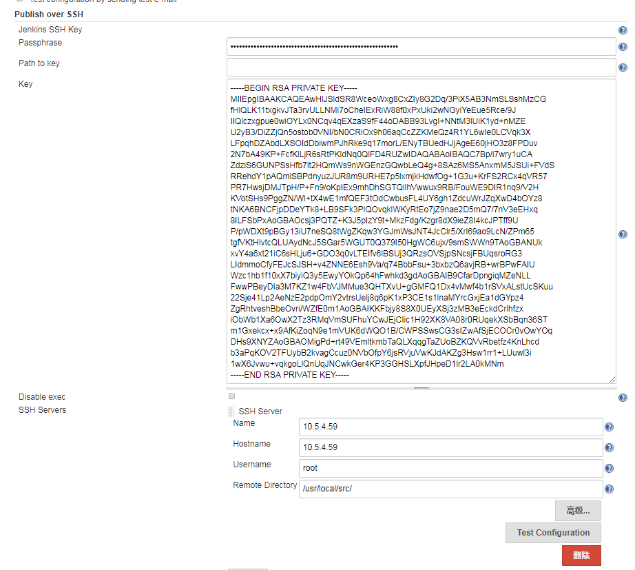
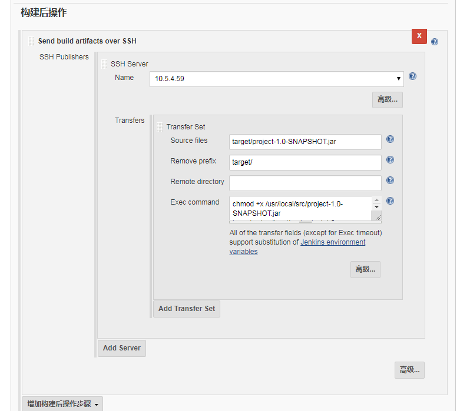

基于上一遍基本构建操作后，需要将构建包布署到指定服务器

### 前置条件
1. Publish Over SSH、SSH plugin插件安装
2. Publish over SSH配置
3. 服务器之前ssh免密登录

### 1.配置ssh免密登录
1. jenkins服务器生成ssh key
```
    [root@localhost ~]# ssh-keygen -t rsa
    Generating public/private rsa key pair.
    Enter file in which to save the key (/root/.ssh/id_rsa): 
    Created directory '/root/.ssh'.
    Enter passphrase (empty for no passphrase): 
    Enter same passphrase again: 
    Your identification has been saved in /root/.ssh/id_rsa.
    Your public key has been saved in /root/.ssh/id_rsa.pub.
    The key fingerprint is:
    SHA256:zSn0JSboG+wEGyqVuNSV87jxFKVlyIWFmaIKkQtXuIM root@localhost.localdomain
    The key's randomart image is:
    +---[RSA 2048]----+
    | . o..o X*       |
    |+.+..+ X+        |
    |o*oo+ *.+ o .    |
    |Eooo O + * +     |
    |+ o.. X S =      |
    | o   + + .       |
    |      o          |
    |                 |
    |                 |
    +----[SHA256]-----+

```
2. 复制公钥到目标服务器
```
    [root@localhost ~]# ssh-copy-id root@10.5.4.1
    /usr/bin/ssh-copy-id: INFO: Source of key(s) to be installed: "/root/.ssh/id_rsa.pub"
    The authenticity of host '10.5.4.58 (10.5.4.58)' can't be established.
    ECDSA key fingerprint is SHA256:yyBd72+TfCRj0wCoWSYSW4qsFwoKpow4d/7iN/T+kJc.
    ECDSA key fingerprint is MD5:67:1e:32:79:e1:30:01:6d:c7:f9:xx:xx:xx:xx:xx:xx.
    Are you sure you want to continue connecting (yes/no)? yes
    /usr/bin/ssh-copy-id: INFO: attempting to log in with the new key(s), to filter out any that are already installed
    /usr/bin/ssh-copy-id: INFO: 1 key(s) remain to be installed -- if you are prompted now it is to install the new keys
    root@10.5.4.1's password: 

    Number of key(s) added: 1

    Now try logging into the machine, with:   "ssh 'root@10.5.4.58'"
    and check to make sure that only the key(s) you wanted were added.

```
3. 建立免密ssh连接
```
    #无密连接成功
    [root@localhost ~]# ssh root@10.5.4.58
    Last login: Wed Jun 19 16:46:24 2019 from 172.19.0.26

```
4. 查看本地密钥信息
```
    [root@localhost ~]# cd /root/.ssh/
    [root@localhost .ssh]# ls
    id_rsa  id_rsa.pub  known_hosts

```
* id_rsa：私钥文件
* id_rsa.pub：公钥文件

### 配置jenkins SSH
[系统管理] - [系统设置] -[Publish over SSH]

* Jenkins SSH Key Passphrase：与生成ssh的一持，默认为空。
* Path to key：ssh私钥路径，/root/.ssh/id_rsa
* Key：ssh私钥信息，通过cat /root/.ssh/id_rsa查看填入。
* SSH Server：远程服务器
    * Hostname：远程服务器地址
    * Username：用户名
    * Remote Directory：远程服务器路径
 	


### 项目配置
[项目配置]-[构建后操作]- [Send build artifacts over SSH] 

* Source files：需要布署的代码包相对路径，支持通配符。
* Remove prefix：去除的前缀。
* Remote directory：远程目录
* Exec command：需要执行的shell命令

### 项目构建
[立即构建]
布署到远程服务器代码包成功
```
[JENKINS] Archiving /var/lib/jenkins/workspace/sonar检测2/pom.xml to com.test/project/1.0-SNAPSHOT/project-1.0-SNAPSHOT.pom
[JENKINS] Archiving /var/lib/jenkins/workspace/sonar检测2/target/project-1.0-SNAPSHOT.jar to com.test/project/1.0-SNAPSHOT/project-1.0-SNAPSHOT.jar
channel stopped
SSH: Connecting from host [localhost.localdomain]
SSH: Connecting with configuration [10.5.4.59] ...
SSH: Disconnecting configuration [10.5.4.59] ...
SSH: Transferred 1 file(s)
Finished: SUCCESS
```



### 构建后执行shell
* 	Exec command：
    chmod +x /usr/local/src/project-1.0-SNAPSHOT.jar
    java -jar /usr/local/src/project-1.0-SNAPSHOT.jar
```
    [JENKINS] Archiving /var/lib/jenkins/workspace/sonar检测2/pom.xml to com.test/project/1.0-SNAPSHOT/project-1.0-SNAPSHOT.pom
    [JENKINS] Archiving /var/lib/jenkins/workspace/sonar检测2/target/project-1.0-SNAPSHOT.jar to com.test/project/1.0-SNAPSHOT/project-1.0-SNAPSHOT.jar
    channel stopped
    SSH: Connecting from host [localhost.localdomain]
    SSH: Connecting with configuration [10.5.4.59] ...
    SSH: EXEC: STDOUT/STDERR from command [chmod +x /usr/local/src/project-1.0-SNAPSHOT.jar
    java -jar /usr/local/src/project-1.0-SNAPSHOT.jar] ...
    SSH: EXEC: completed after 2,210 ms
    SSH: Disconnecting configuration [10.5.4.59] ...
    Finished: success
```