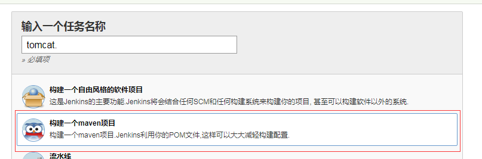
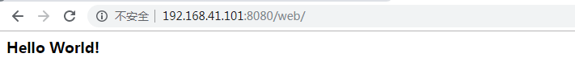

### 依赖插件
* Deploy to container Plugin
* maven插件

### 配置tomcat容器
1. 添加发布用户权限
```
    #修改tomcat/conf/tomcat-users.xml 
    <role rolename="manager-gui"/>
    <role rolename="manager-status"/>
    <role rolename="manager-script"/>
    <user username="tomcat" password="123456" roles="manager-gui, manager-script,manager-status"/>
```
2. 配置访问权限
allow：网络访问权限
```
    #修改tomcat/webapps/manager/META-INF/context.xml
      <!-- <Valve className="org.apache.catalina.valves.RemoteAddrValve"
         allow="127\.\d+\.\d+\.\d+|::1|0:0:0:0:0:0:0:1" />
  <Manager sessionAttributeValueClassNameFilter="java\.lang\.(?:Boolean|Integer|Long|Number|String)|org\.apache\.catalina\.filters\.CsrfPreventionFilter\$LruCache(?:\$1)?|java\.util\.(?:Linked)?HashMap"/>-->
  <Context antiResourceLocking="false" privileged="true" >
    <Valve className="org.apache.catalina.valves.RemoteAddrValve" allow="^.*$" />
    </Context>
```
3. 启动tomcat
```
    [root@localhost tomcat]# bin/startup.sh 
```

### 项目配置
1. 新建maven任务


2. 配置svn源码地址


3. Build
* Root POM：项目pom.xml文件相对路径
* Goals and options：打包命令，clean install

4. 构建后操作-Deploy war/ear to a container
[构建后操作]-[增加构建后操作步骤]-[Deploy war/ear to a container]

* WAR/EAR files：war相对路径，一般在target目录中。
* Context path：项目的根目录地址。
* Containers：tomcat目标容器
    * Credentials：发布账号
    * Tomcat URL：tomcat服务地址
### 构建项目
[立即构建]

```
[INFO] ------------------------------------------------------------------------
Waiting for Jenkins to finish collecting data
[JENKINS] Archiving /var/lib/jenkins/workspace/tomcat/pom.xml to com.test/web/1.0-SNAPSHOT/web-1.0-SNAPSHOT.pom
[JENKINS] Archiving /var/lib/jenkins/workspace/tomcat/target/web.war to com.test/web/1.0-SNAPSHOT/web-1.0-SNAPSHOT.war
channel stopped
Deploying /var/lib/jenkins/workspace/tomcat/target/web.war to container Tomcat 8.x Remote with context /web
  [/var/lib/jenkins/workspace/tomcat/target/web.war] is not deployed. Doing a fresh deployment.
  Deploying [/var/lib/jenkins/workspace/tomcat/target/web.war]
Finished: SUCCESS
```
