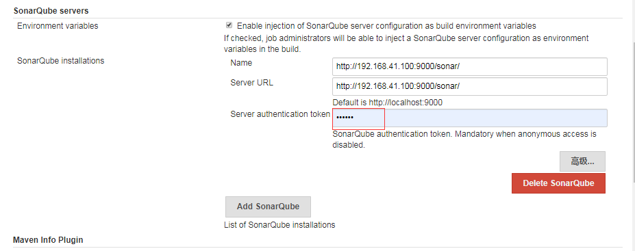
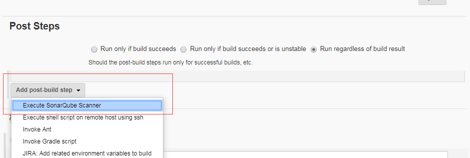
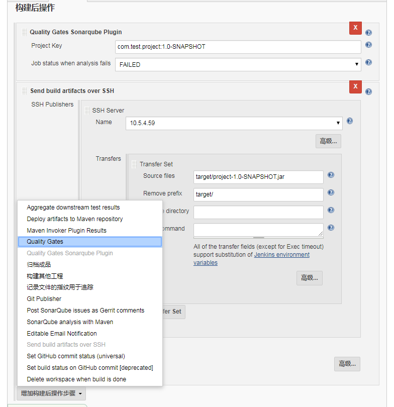

### 依赖插件
SonarQube Scanner	  2.8.1	
Sonar Quality Gates	 
Quality Gates	
SonarQube Plugin
Sonar Gerrit
怎么安装略过……

### 安装sonar-scanner
[sonar-scanner-cli-3.3.0.1492-linux.zip](./resources/sonar-scanner-cli-3.3.0.1492-linux.zip)
上传并安装到/usr/local/sonar-scanner
```
[root@localhost src]# unzip sonar-scanner-cli-3.3.0.1492-linux.zip 
[root@localhost src]# mv sonar-scanner-3.3.0.1492-linux/ /usr/local/
[root@localhost src]# mv sonar-scanner-3.3.0.1492-linux/ sonar-scanner
```
### 配置sonar-scanner
[系统管理]-[全局工具配置]-[SonarQube Scanner]   
SONAR_RUNNBER_HOME：/usr/local/sonar-scanner (安装的路径径) 


### 配置sonarqube-server
[系统管理]-[系统设置]-[SonarQube Servers]   
* Name：sonar名称
* Server URL：sonar服务地址
* Server authentication token：用户token，则sonar平台账号生成



### 配置项目源码地址


### Post Steps
[Post Steps]-add[Execute SonarQube Scanner]


sonar-scanner配置属性二选一。
* Path to project properties：sonar.properties的相对路径
* Analysis properties：
    sonar.projectKey=com.test.project:1.0-SNAPSHOT
    #sonar.projectName=测试项目  汉字乱码未解决，只能先用unicode编码
    sonar.projectName=\u6d4b\u8bd5\u9879\u76ee
    sonar.sources=.
    sonar.java.binaries=.
    sonar.sourceEncoding=UTF-8
    sonar.language=java


sonar.properties常用属性

* sonar.projectKey=项目key
* sonar.projectName=项目名称
* sonar.projectVersion=${VER} 项目版本，可以写死，也可以引用变量
* sonar.sourceEncoding=UTF-8 源文件编码
* sonar.language=java 源文件语言
* sonar.sources=src/main 源代码目录，如果多个使用","分割 例如：mode1/src/main,mode2/src/main
* sonar.tests=src/test 单元测试目录，如果多个使用","分割 例如：mode1/src/test,mode2/src/test
* sonar.exclusions=*/src/test/**/*  忽略的目录
* sonar.junit.reportsPath=target/surefire-reports  单元测试报告目录
* sonar.java.coveragePlugin=jacoco  代码覆盖率插件
* sonar.jacoco.reportPath=target/coverage-reports/jacoco.exec   jacoco.exec文件路径

### sonar扫描不通过不允许发布
Quality Gate Plugin
#### 1.前置条件    
[系统管理] - [系统设置] - [SonarQube servers] [Quality Gates - Sonarqube] [Quality Gates]都需要配置好。


#### 2.项目构建后配置
[项目配置]-[构建后操作]-[Quality Gates Sonarqube Plugin]


#### 3.执行构建操作
```
    #sonar扫描通过
    Has build IN_PROGRESS with id: AWuJFjB-TjIbq4sohFHu - waiting 10000 to execute next check. DEBUG:81
    Status => SUCCESS
    PostBuild-Step: Quality Gates plugin build passed: TRUE
    SSH: Connecting from host [localhost.localdomain]
    SSH: Connecting with configuration [10.5.4.59] ...
    SSH: Disconnecting configuration [10.5.4.59] ...
    SSH: Transferred 1 file(s)
    Finished: SUCCESS
```
```
    #sonar扫描不通过 会跳过发布动作
    INFO: ------------------------------------------------------------------------
    Has build PENDING with id: AWuJE72lTjIbq4sohFHf - waiting 10000 to execute next check. DEBUG:51
    Status => SUCCESS
    PostBuild-Step: Quality Gates plugin build passed: FALSE
    Build step 'Quality Gates Sonarqube Plugin' marked build as failure
    SSH: Current build result is [FAILURE], not going to run.
    Finished: FAILURE`
```
