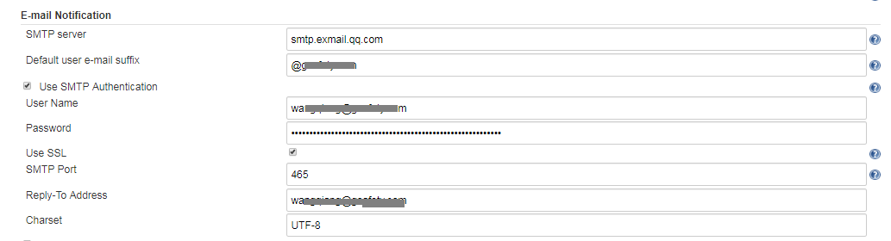
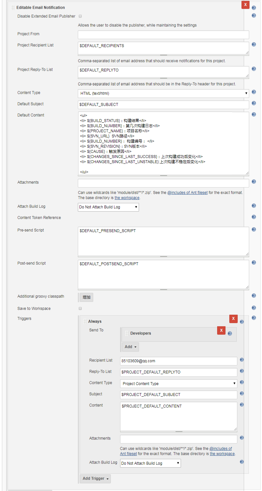

依赖插件
Email Extension Plugin插件

### 配置SMTP服务

[系统管理]-[系统设置]-[Jenkins Location]-[系统管理员邮件地址]
填写系统管理员邮箱地址


[系统管理]-[系统设置]-[Extended E-mail Notification]


* SMTP server：邮件服务地址
* Default user e-mail suffix：邮箱后缀，@qq.com;@163.com
* Use SMTP Authentication
    * User Name：邮箱认证用户名
    * Password：邮箱认证密码
    * Use SSL：使用ssl
    * SMTP por：常用465
    * Default Subject：默认邮件主题
    * Default Triggers：默认触发事件


* ${BUILD_STATUS}：构建结果
* ${BUILD_NUMBER}：第几次构建日志
* ${PROJECT_NAME}：项目名称
* ${SVN_URL}  SVN路径
* ${BUILD_NUMBER}： 构建编号  
* ${SVN_REVISION}：SVN版本
* ${CAUSE}：触发原因
* ${CHANGES_SINCE_LAST_SUCCESS}：上次构建成功后变化
* ${CHANGES_SINCE_LAST_UNSTABLE}:上次构建不稳定后变化
        

[系统管理]-[系统设置]-[E-mail Notification]




### 项目邮件配置
[构建后操作]-[Editable Email Notification]

* Disable Extended Email Publisher：勾选后，邮件就不发送，看自己的情况喽，如果你想调试某些东西，又不想发邮件出去就可以勾选这个。 
* Project Recipient List：收件人地址；多个收件人邮件地址用逗号进行分割；想使用全局默认配置的话，可以使用$DEFAULT_RECIPIENTS。 
* Project Reply-To List：允许回复人的地址；想使用系统设置中的默认值的话，可以使用$DEFAULT_REPLYTO； 
* Content Type：邮件文档的类型，可以设置HTML等格式； 
* Default Subject：默认主题，也就是邮件标题；同理可以使用$DEFAULT_SUBJECT 
* Default Content：默认邮件内容；这里是关键；我这里使用的是模板${SCRIPT, template="groovy-html.template"}；后面会讲；当然不想使用模板的话，可以通过使用jenkins自身提供的变量来自己定义； 
* Attach Build Log：发送的邮件是否包含日志； 

### 项目构建
邮件发送成功
```
    No changes for svn://192.168.41.100/project since the previous build
    No emails were triggered.
    SSH: Connecting from host [localhost.localdomain]
    SSH: Connecting with configuration [10.5.4.59] ...
    SSH: Disconnecting configuration [10.5.4.59] ...
    SSH: Transferred 4 file(s)
    Email was triggered for: Always
    Sending email for trigger: Always
    Sending email to: xxxxxxx@qq.com
    Finished: SUCCESS
```