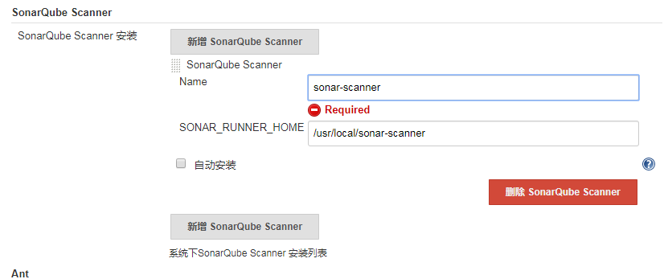
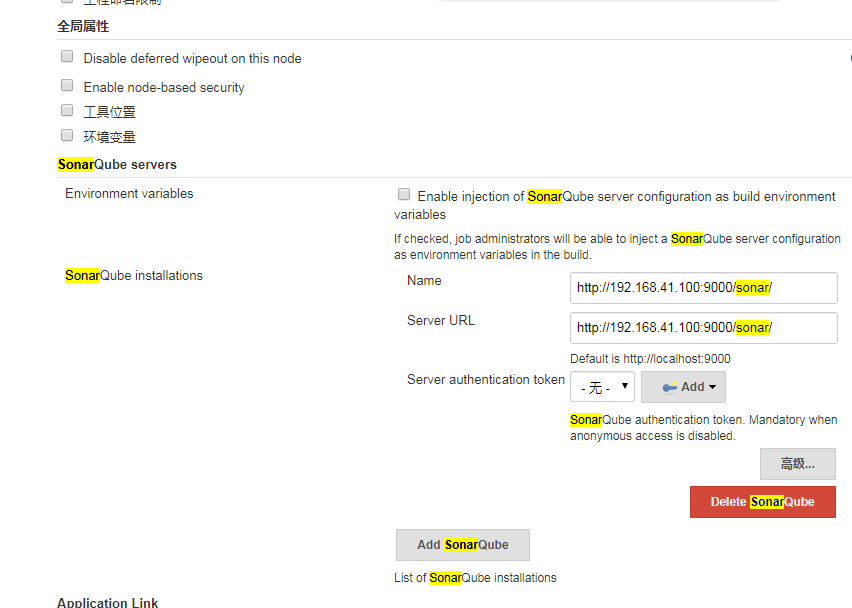
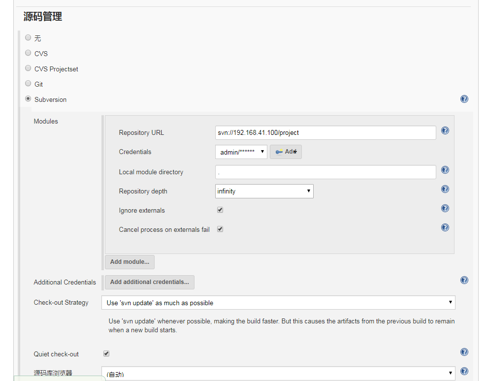
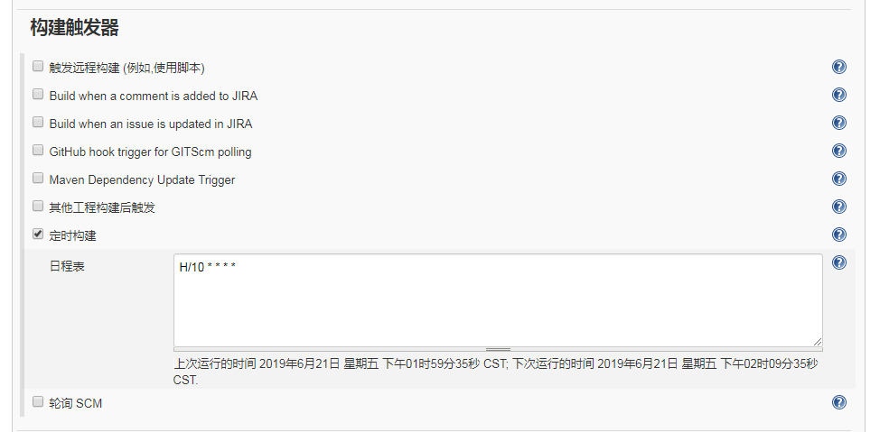
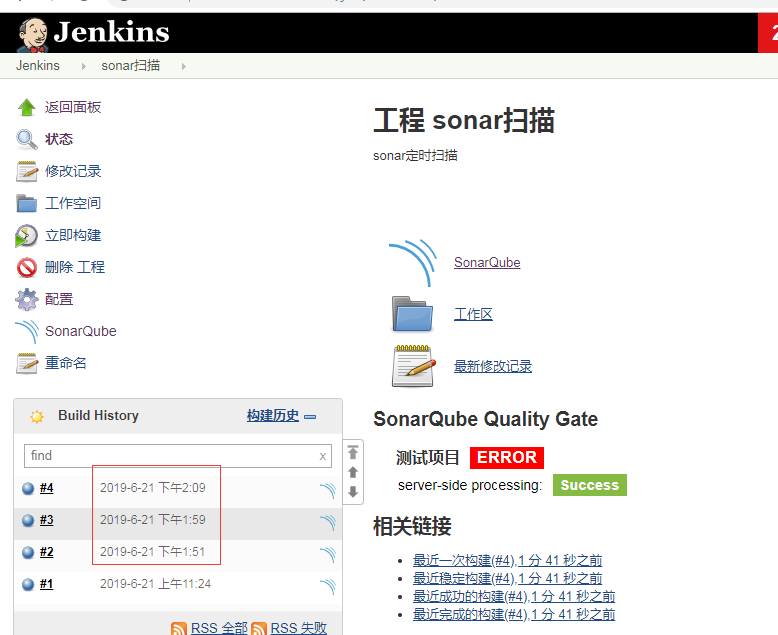

### 依赖插件
SonarQube Scanner	 
Sonar Quality Gates	 
Quality Gates	
怎么安装略过……

### 安装sonar-scanner
[sonar-scanner-cli-3.3.0.1492-linux.zip](./resources/sonar-scanner-cli-3.3.0.1492-linux.zip)
上传并安装到/usr/local/sonar-scanner
```
[root@localhost src]# unzip sonar-scanner-cli-3.3.0.1492-linux.zip 
[root@localhost src]# mv sonar-scanner-3.3.0.1492-linux/ /usr/local/
[root@localhost src]# mv sonar-scanner-3.3.0.1492-linux/ sonar-scanner
```
### 配置sonar-scanner
[系统管理]-[全局工具配置]-[SonarQube Scanner]   
SONAR_RUNNBER_HOME：/usr/local/sonar-scanner (安装的路径径) 



### 配置sonarqube-server
[系统管理]-[系统设置]-[SonarQube Servers]   




### 配置项目定位扫描



[构建触发器]-[定时构建]-[日程表]
* H/10 * * * * 每10分钟构建一次
* 0 8 * * *     每天8点构建一次
* 0 2 * * 5     每星期五两点构建一次



sonar-scanner配置属性二选一。
* Path to project properties：sonar.properties的相对路径
* Analysis properties：
    sonar.projectKey=com.test.project:1.0-SNAPSHOT
    #sonar.projectName=测试项目
    sonar.projectName=\u6d4b\u8bd5\u9879\u76ee
    sonar.sources=.
    sonar.java.binaries=.
    sonar.sourceEncoding=UTF-8
    sonar.language=java


自动扫描构建成功

