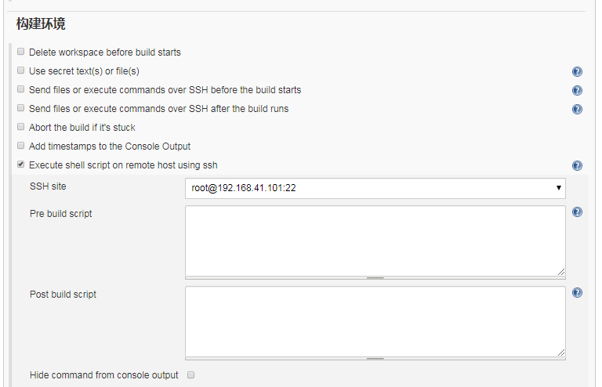
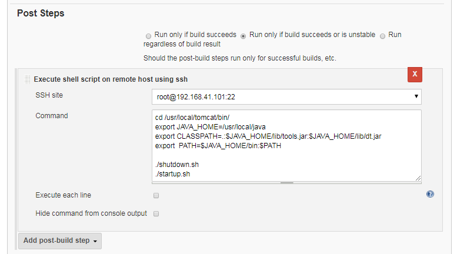

### 依赖插件
* ssh

### 配置ssh账号
[系统管理]-[系统设置]-[SSH remote hosts]


### 项目配置
1. [构建环境]- [Execute shell script on remote host using ssh]
* SSH site：ssh目标主机
* Pre build script：构建前执行脚本
* Post build script：构建后执行脚本


2. [Post Steps]-[Execute shell script on remote host using ssh]

* SSH site：ssh目标主机
* Command：shell脚本


```
    #重启tomcat脚本
    cd /usr/local/tomcat/bin/
    export JAVA_HOME=/usr/local/java
    export CLASSPATH=.:$JAVA_HOME/lib/tools.jar:$JAVA_HOME/lib/dt.jar
    export  PATH=$JAVA_HOME/bin:$PATH

    ./shutdown.sh
    ./startup.sh 
```