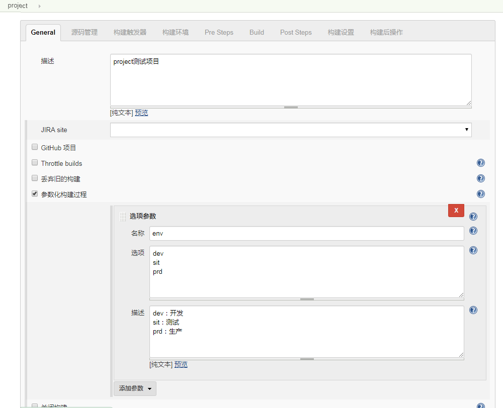
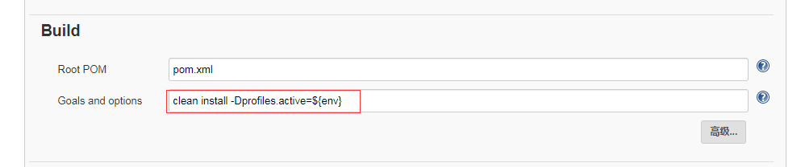
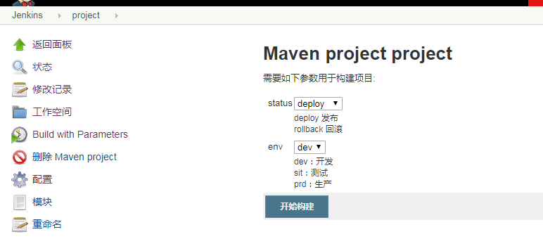
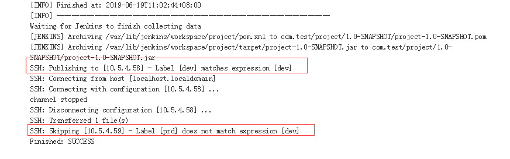

一次构建发布到指定的服务器环境

前置条件：配置好 Publish over SSH主机信息
### 依赖插件	
* Publish Over SSH	
* SSH Credentials Plugin	
* SSH Pipeline Steps	
* SSH plugin
* SSH Slaves plugin
### 参数化构建过程
```
    选项项目 配置
    [General]-[参数化构建过程]-[添加参数]-[选项参数]

    	名称：env
        选项：
            dev
            prd
        描述：
            dev：开发环境
            prd：生产环境

```


### 配置post steps - SSH Publishers
 
* 选择[post steps].
* 添加[send files or execute commands over ssh]，如果没有选项，则没有安装该插件.
* 添加[Add Server]　　　　　　
* 选择SSH Server 下拉选项，如果没选项，需要在系统管理-系统设置-Publish over SSH里添加。
* 选中server里的高级 填写lable信息，与上面定义选项参数
    dev：10.5.4.58
    prd：10.5.4.59

* 选中外层的高级 配置 参数化发布


### 参数化构建，指定mvn环境
源码必须指定maven的profile环境参数，然后在jenkins项目中 [Build] - [Goals and options] clean install -Dprofiles.active=${env}
```
    //pom.xml配置
    <profiles>
        <profile>
            <id>dev</id>
            <properties>
                <profiles.active>dev</profiles.active>
                <maven.test.skip>true</maven.test.skip>
                <name>env</name>
                <value>dev</value>
            </properties>
            <activation>
                <activeByDefault>true</activeByDefault>
            </activation>
        </profile>
        <profile>
            <id>prd</id>
            <properties>
                <profiles.active>test</profiles.active>
                <maven.test.skip>true</maven.test.skip>
                <name>env</name>
                <value>test</value>
            </properties>
        </profile>
    </profiles>
```




### 参数化构建，指定目标服务环境


查看控制台信息，构建成功
